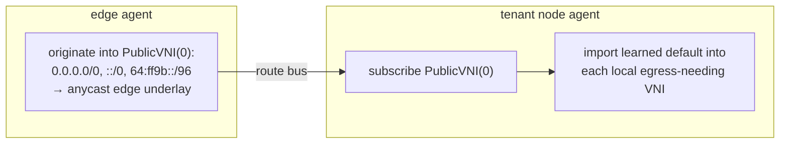

# North-South WAN edge

!!! warning "Status: Partial"
    Egress SNAT with the distributed return is validated end-to-end on the lab fabric. The
    internet→VIP ingress path is proven on the kind pseudo-edge; on real WAN hardware the edge
    role (native XDP, anycast underlay, BGP announcement) is deployment-gated.

The **WAN edge** bridges the tenant overlay to the internet. It gives overlay endpoints
north-south connectivity — **egress** (VM → internet, SNAT), **ingress** (internet → service, L4
load-balanced), and floating IPs — through a fleet of `flowplane` nodes running in an **edge role**.
The overriding requirement is that any edge node can be drained at any time with near-zero impact on
active connections, behind ECMP, **without cross-fleet state sync**. This is achieved by making
correctness **stateless in both directions**: conntrack is a cache, never required for correctness.

## The edge role

An edge node is `flowplane serve --role edge`. On top of a normal node's `uplink_rx` (which decaps
overlay → local guest), an edge additionally attaches **`wan_rx`** on the WAN-facing uplink for the
internet↔overlay return path:

```
uplink_rx  (fabric uplink)  — overlay egress decap, LB local-deliver, NAT return
wan_rx     (WAN uplink)     — internet → overlay: NAT-return re-encap, VIP ingress
```

An edge is started with a **`--wan-uplink`** and a unique control-plane loopback (`--edge-loopback`
/ `FLOWPLANE_EDGE_LOOPBACK`). The distinction between the datapath underlay and the loopback matters:
the edge's *datapath* underlay is an **anycast** `/128` shared by every edge in the fleet (so the
fabric ECMPs return traffic across edges), while its *control-plane* identity is a **unique**
loopback so replies to edge-originated control traffic return to the specific edge, not ECMP to a
sibling.


## Egress: distributed SNAT with a distributed return

Egress SNAT is **distributed onto the source node**, not centralized on the edge. The NATGateway
port-block allocator (in the hub controller) assigns each source overlay IP a deterministic
`(public-IP, port-block)` — the GCP Cloud NAT model. The block is stamped into the source NIC's
`CompiledNIC.NAT`, and the source node performs the SNAT locally on egress.

The **NAT block owner is the source NIC's underlay** (`netplane/agent/natreconcile.go`,
`NatBlock` carries the owning NIC's underlay). Each node announces the NAT blocks it owns on the
route bus so every other node — and the edge — can return-route to it. When a return packet arrives
from the WAN, the receiving edge maps `(public-IP, dst-port ∈ block) → source underlay` from that
distributed reverse map and re-encaps toward the owning source node. Because the mapping is a pure
function of the distributed allocation, **any** edge computes the same answer — the return does not
need to hit the same edge that handled egress, which is exactly what makes a drain safe.

## Public-VNI egress: default routes originated once

Rather than the edge enumerating which tenant VNIs need egress, the edge originates the external
default route **once** into a reserved **public VNI (`PublicVNI = 0`)**, and any node that needs
egress **imports** it into its own tenant VNI. `DesiredExternalRoutes`
(`netplane/agent/natreconcile.go`) returns nothing on a non-edge node; on an edge it returns the
defaults into the public VNI with the edge's own anycast underlay as nexthop:

```go
return []ExternalRoute{
    {Vni: PublicVNI, Prefix: "0.0.0.0/0",      Nexthop: underlay, External: true},
    {Vni: PublicVNI, Prefix: nat64WellKnownPrefix, Nexthop: underlay, External: true}, // 64:ff9b::/96
    {Vni: PublicVNI, Prefix: "::/0",           Nexthop: underlay, External: true},
}, nil
```

The public VNI is a **control-plane aggregation/subscription VNI, not a wire VNI** — it has no
corresponding dataplane table. A tenant node hosts no VNI-0 guests, so a learned VNI-0 route is
*recorded, not installed into a VNI-0 table*. Every node subscribes to the public VNI; a node
imports the learned default into a tenant VNI only when a local NIC in that VNI **needs egress** —
i.e. it has a NAT allocation (`CompiledNIC.NAT` non-empty) or is an LB backend (`CompiledNIC.LB`
non-empty), computed by `desiredEgressVNIs` (`netplane/agent/importreconcile.go`). This is the exact
import primitive that [VPC peering](./vpc-peering.md) generalizes from VNI 0 to arbitrary peer VNIs.



## Edge identity on the route bus

The edge advertises its identity as a **typed public-prefix record** on the route bus's PublicPrefix
channel (`netplane/agent/public.go`). An edge (`edgeLoopback != ""`) announces one `EDGE_UNDERLAY`
record mapping its **anycast datapath `/128`** to its **unique control-plane loopback** (the owner):

```go
recs = append(recs, PublicPrefix{
    Kind:          rbv1.PublicKind_PUBLIC_KIND_EDGE_UNDERLAY,
    Prefix:        r.underlay + "/128",   // anycast datapath /128
    OwnerUnderlay: r.edgeLoopback,        // unique control-plane loopback
})
```

Subscribers record the anycast → owner mapping in `learnedEdge`, which pins a flow's WAN return to
the specific edge that owns it rather than ECMP'ing the anycast `/128`. Source nodes learn the
(anycast) edge nexthop from this record, so the external default route's nexthop is **discovered,
not hardcoded** — new edges joining the anycast pool need no CRD edit.

## External load balancing

Internet → VIP ingress rides the same channel and the same edge. A `LoadBalancer`-backed NIC
announces an `LB_VIP` PublicPrefix (`netplane/agent/public.go`, `DesiredPublic`) carrying the VIP
and the backing NIC's underlay. **Only the edge** consumes `LB_VIP` records (`applyPublic`,
gated on `b.isEdge`) — east-west LB uses the plain anycast route, but the edge runs the Maglev
backend table and registers each backend via `AddLbBackend`:

```go
case rbv1.PublicKind_PUBLIC_KIND_LB_VIP:
    if !b.isEdge { return }         // only the edge runs maglev/backends
    // on ADD:    b.dp.AddLbBackend(ctx, vip, owner)
    // on WITHDRAW: b.dp.DelLbBackend(ctx, vip, owner)
```

On the wire the edge attaches a `vip_rx` path (sibling to `wan_rx`): a plain internet packet to a
registered VIP is Maglev-selected to a backend and encapped to that backend's underlay. The reply
is **DSR** — the backend node reverse-SNATs its source to the VIP so replies bypass the edge
entirely. Because Maglev backend selection is a pure function of the VIP + 5-tuple + the distributed
backend set, any edge picks the same backend, and the edge holds no ingress return state.

## Why it is drain-safe

No edge holds state required for correctness. Ingress backend selection (Maglev) and egress return
(the distributed `(public-IP, port-block) → source underlay` reverse map) are pure functions any
node computes from control-plane facts. Conntrack is a per-node cache; losing it on drain costs a
recompute, not a connection. Draining an edge withdraws its BGP/health, ECMP removes it, and
in-flight flows reshuffle to other edges that recompute the same mapping. BGP appears **only** at
the edge's northbound WAN announcement — internal reachability is the route bus, never BGP.

See the [clab + kind fabric](../guides/local-fabric.md) for the VyOS edge topology this runs on, and
the [runbook](../guides/runbook.md) for the edge dual-XDP-attach pinning caveat in SKB mode.
