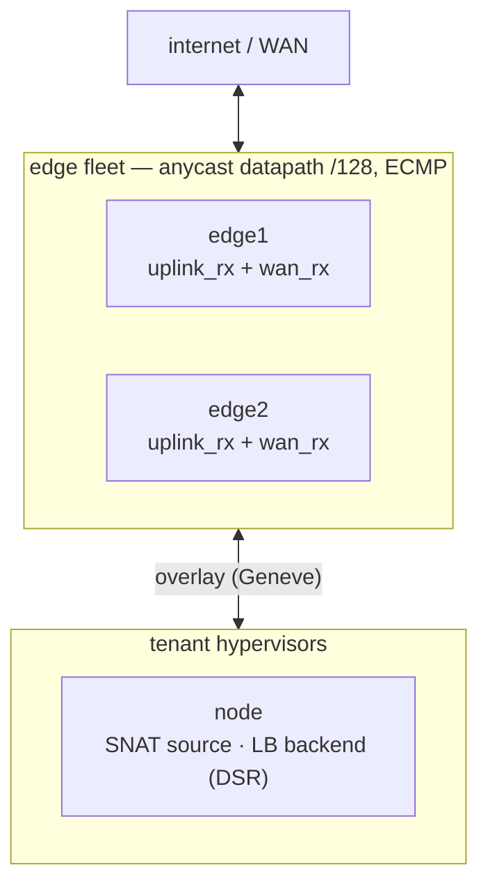
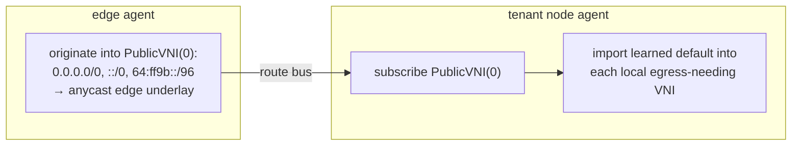

# North-South WAN edge

!!! warning "Status: Partial"
    Egress SNAT with the distributed return is validated end-to-end on the lab fabric, as is the
    internet→VIP ingress path **from intent alone**: applying a `LoadBalancer` programs both edges
    with no hand-driven gRPC, and a WAN client reaches the VIP on a real Pod backend
    (`TestLbFromIntentReachesTheWan`). On real WAN hardware the edge role (anycast underlay,
    BGP announcement) is deployment-gated. Not built here: **convergence gating** — an edge
    attracting its share of the anycast ECMP before it has programmed its VIPs will blackhole. The
    lever is aggregate-level readiness (withhold the prefix advertisement until the bus session has
    converged) and the protocol already carries the signal, `EndOfRIB`.

The WAN edge bridges the tenant overlay to the internet. It gives overlay endpoints north-south
connectivity — egress (VM → internet, SNAT), ingress (internet → service, L4 load-balanced), and
floating IPs — through a fleet of `flowplane` nodes running in an edge role. Any edge node can be
drained at any time with near-zero impact on active connections, behind ECMP, without cross-fleet
state sync, because correctness is stateless in both directions: conntrack is a cache, never
required for correctness.

## The edge role

An edge node is `flowplane serve --role edge`. On top of a normal node's `uplink_rx` (which decaps
overlay → local guest), an edge additionally attaches `wan_rx` on the WAN-facing uplink for the
internet↔overlay return path:

```
uplink_rx  (fabric uplink)  — overlay egress decap, LB local-deliver, NAT return
wan_rx     (WAN uplink)     — internet → overlay: NAT-return re-encap, VIP ingress
```

An edge is started with a `--wan-uplink` and a unique control-plane loopback (`--edge-loopback`
/ `FLOWPLANE_EDGE_LOOPBACK`). The datapath underlay and the loopback play distinct roles: the
edge's datapath underlay is an anycast `/128` shared by every edge in the fleet, so the fabric
ECMPs return traffic across edges, while its control-plane identity is a unique loopback so replies
to edge-originated control traffic return to the specific edge rather than ECMP to a sibling.



## Egress: distributed SNAT with a distributed return

Egress SNAT runs distributed onto the source node rather than centralized on the edge. The
NATGateway port-block allocator (in the dispatch controller) assigns each source overlay IP a
deterministic `(public-IP, port-block)` — the GCP Cloud NAT model. The block is stamped into the
source NIC's `CompiledNIC.NAT`, and the source node performs the SNAT locally on egress.

The NAT block owner is the source node's VTEP (`mesh/agent/natreconcile.go`,
`NatBlock` carries the owning node's underlay). Each node announces the NAT blocks it owns on the
route bus so every other node — and the edge — can return-route to it. When a return packet arrives
from the WAN, the receiving edge maps `(public-IP, dst-port ∈ block) → source underlay` from that
distributed reverse map and re-encaps toward the owning source node. Because the mapping is a pure
function of the distributed allocation, any edge computes the same answer, so the return need not
hit the same edge that handled egress, which is what makes a drain safe.

## Public-VNI egress: default routes originated once

Rather than the edge enumerating which tenant VNIs need egress, the edge originates the external
default route once into a reserved public VNI (`PublicVNI = 0`), and any node that needs egress
imports it into its own tenant VNI. `DesiredExternalRoutes`
(`mesh/agent/natreconcile.go`) returns nothing on a non-edge node; on an edge it returns the
defaults into the public VNI with the edge's own anycast underlay as nexthop:

```go
return []ExternalRoute{
    {Vni: PublicVNI, Prefix: "0.0.0.0/0",      Nexthop: underlay, External: true},
    {Vni: PublicVNI, Prefix: nat64WellKnownPrefix, Nexthop: underlay, External: true}, // 64:ff9b::/96
    {Vni: PublicVNI, Prefix: "::/0",           Nexthop: underlay, External: true},
}, nil
```

The public VNI is a control-plane aggregation/subscription VNI, not a wire VNI — it has no
corresponding dataplane table. A tenant node hosts no VNI-0 guests, so a learned VNI-0 route is
recorded, not installed into a VNI-0 table. Every node subscribes to the public VNI; a node
imports the learned default into a tenant VNI only when a local NIC in that VNI needs egress —
i.e. it has a NAT allocation (`CompiledNIC.NAT` non-empty) or is an LB backend (`CompiledNIC.LB`
non-empty), computed by `desiredEgressVNIs` (`mesh/agent/importreconcile.go`). This is the exact
import primitive that [VPC peering](./vpc-peering.md) generalizes from VNI 0 to arbitrary peer VNIs.



## Running an agent on an edge

An edge is a **router, not a Kubernetes node** — the same role it has in ironcore's dpservice. It
runs no pool chart, has no kubelet, and joins no cluster. But it still needs a mesh agent, because
everything above rides the route bus: without one, an edge announces no identity and no egress
defaults, and every `LB_VIP` record its backends announce is dropped fleet-wide.

So the agent has an **API-less edge mode**, selected by `--edge-loopback` with no `--kubeconfig`:

```
agent --node-id edge1 --underlay <anycast /128> --edge-loopback <control loopback>
      --reflector [<reflector>]:1338
      --dataplane unix:///run/flowplane/dataplane.sock
      --routebus-intermediate /etc/routebus
```

In that mode the reconciler is built without a Kubernetes client at all. `listCNICs` — the single
funnel to the API server — returns an empty list, so `Desired`, `DesiredPublic`, `desiredLB`,
`desiredEgressVNIs`, `desiredPeeringImports`, `ReconcileFirewall` and `ReconcileQoS` all degrade to
the no-guests case by construction, which is exactly what an edge is. `StampNodePrefix` is skipped:
there is no `Node` object to stamp, and nothing schedules onto an edge, so it is not a fence
coordinate. What remains is precisely what needs no API data — the `EDGE_UNDERLAY` record and the
external egress defaults, both derived from the flags above.

This is load-bearing rather than merely tidy. `Desired`'s `CompiledNIC` read used to abort the whole
reconcile tick on error, so an agent without an API server announced *nothing*.

### Edge identity without cert-manager

An edge cannot take a pool node's PKI path (`ProvisionNodeCert` creates a cert-manager
`Certificate` and waits for the `Secret`) — it has neither. Instead the whole edge **fleet** holds
one ordinary route-bus intermediate: a `RouteBusIdentity` named `edge`, with
`permittedUnderlayCIDRs` set to the edge loopback aggregate. No new CRD, no new kind, no signer
change — `pki.SignIntermediate` is already generic.

Each edge then mints its own leaf from that intermediate **in process** (`mesh/routebus/edgecert.go`),
with no cert-manager and no API server. Minting is local and free, so leaves are short-lived and
re-minted per handshake as they near expiry — which also re-reads the intermediate from disk, so an
externally rotated one is picked up without a restart.

What bounds this is not the minting code but the intermediate's **IP name constraint**: chain
verification on the reflector rejects a leaf whose IP SAN falls outside the edge aggregate, so a
compromised edge cannot forge a pool node's VTEP. `dispatch/test/edgecert_test.go` proves exactly
that, against the real signer.

Because the reflector authorizes an announce against the *exact* cert SAN, an edge whose anycast
underlay differs from its control loopback must carry **both** as IP SANs — the `EDGE_UNDERLAY`
record pairs the two. (In the lab they are the same address, so one SAN suffices.)

## Edge identity on the route bus

The edge advertises its identity as a typed public-prefix record on the route bus's PublicPrefix
channel (`mesh/agent/public.go`). An edge (`edgeLoopback != ""`) announces one `EDGE_UNDERLAY`
record mapping its anycast datapath `/128` to its unique control-plane loopback (the owner):

```go
recs = append(recs, PublicPrefix{
    Kind:          rbv1.PublicKind_PUBLIC_KIND_EDGE_UNDERLAY,
    Prefix:        r.underlay + "/128",   // anycast datapath /128
    OwnerUnderlay: r.edgeLoopback,        // unique control-plane loopback
})
```

Subscribers record the anycast → owner mapping in `learnedEdge`, which pins a flow's WAN return to
the specific edge that owns it rather than ECMP'ing the anycast `/128`. Source nodes learn the
(anycast) edge nexthop from this record, so the external default route's nexthop is discovered, not
hardcoded — new edges joining the anycast pool need no CRD edit.

## External load balancing

Internet → VIP ingress rides the same channel and the same edge. A `LoadBalancer`-backed NIC
announces an `LB_VIP` PublicPrefix (`mesh/agent/public.go`, `DesiredPublic`) carrying **both halves
of the load balancer**: the VIP with its service `ports`, and this backend's VTEP + overlay IP +
VNI. Carrying the ports is what lets a bus-only edge program the whole thing — an edge has no API
server, so a backend announcement is its only source for the service tuples.

Only the edge consumes `LB_VIP` records (`applyPublic`, gated on `b.isEdge`) — east-west LB uses
the plain anycast route, but the edge runs the Maglev backend table. It registers the load balancer
on first sight and then attaches the backend, in that order, because `add_lb_target` rejects an
unknown LB:

```go
case rbv1.PublicKind_PUBLIC_KIND_LB_VIP:
    if !b.isEdge { return }         // only the edge runs maglev/backends
    // on ADD:      AddLbVip(vip, vni=0, lbUnderlay=this edge, ports) if new, then AddLbBackend
    // on WITHDRAW: DelLbBackend — and DelLbVip once the last backend leaves
```

The dataplane is not idempotent here (`create_lb` rejects a duplicate id, `add_lb_target` a
duplicate backend) and the edge sees each record repeatedly — every backend of one VIP announces
the same ports, and the reflector replays the whole snapshot on reconnect — so `applyPublic` diffs
against per-edge bookkeeping rather than replaying blindly.

The edge's VIP set is therefore *derived from backend announcements*, not from an authoritative
list. A VIP with zero attached backends is never programmed at the edge. That is the correct
behaviour — an edge that Maglev-hashes to an empty backend set can only blackhole — but it does mean
a bring-your-own VIP is not reserved at the edge until something backs it.

On the wire `wan_rx` handles VIP ingress: a plain internet packet to a registered VIP is
Maglev-selected to a backend and encapped to that backend's underlay. The reply is DSR — the
backend node reverse-SNATs its source to the VIP so replies bypass the edge entirely. Because
Maglev backend selection is a pure function of the VIP + 5-tuple + the distributed backend set, any
edge picks the same backend, and the edge holds no ingress return state.

## Why it is drain-safe

No edge holds state required for correctness. Ingress backend selection (Maglev) and egress return
(the distributed `(public-IP, port-block) → source underlay` reverse map) are pure functions any
node computes from control-plane facts. Conntrack is a per-node cache; losing it on drain costs a
recompute, not a connection. Draining an edge withdraws its BGP/health, ECMP removes it, and
in-flight flows reshuffle to other edges that recompute the same mapping. BGP appears only at
the edge's northbound WAN announcement; internal reachability is the route bus, never BGP.

See the [clab + Talos fabric](../tutorials/local-fabric.md) for the VyOS edge topology this runs on,
including the per-edge bpffs `--pin-dir` split the co-located edge sidecars need.
