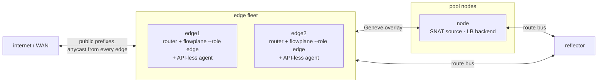
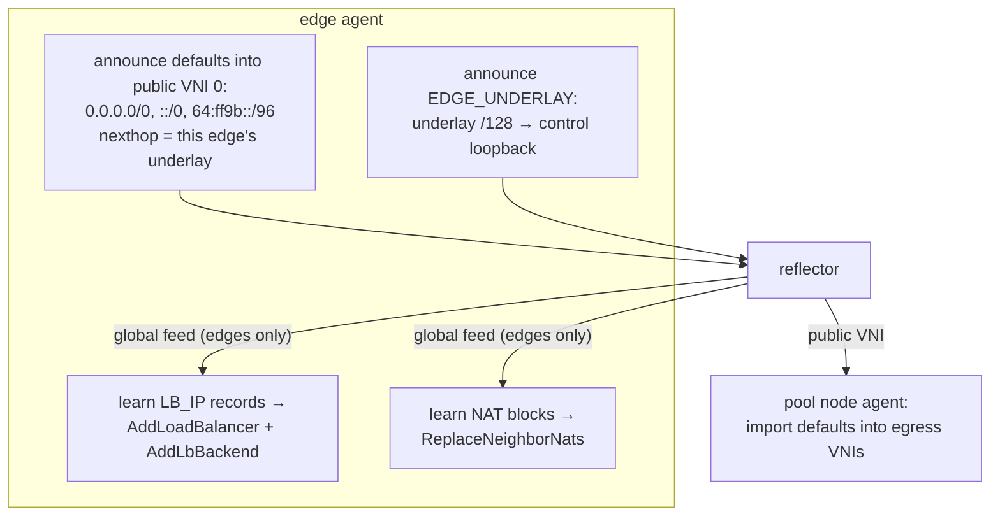

# WAN edge

The WAN edge connects the overlay to the internet. It carries two kinds of north-south traffic:
replies to [NAT](nat.md) egress, which it relays to the node that owns the port block, and inbound
[load-balancer](loadbalancer.md) traffic, which it Maglev-hashes to a backend. An edge holds no
per-flow state that correctness depends on, so any edge can serve any flow and an edge can be
drained behind ECMP.

## What an edge runs

An edge is a router, not a Kubernetes node: it joins no cluster, runs no pool chart and has no
kubelet. It runs two processes next to its routing stack:

- flowplane in the edge role, `flowplane serve --role edge --wan-uplink <if> --local-underlay
  <addr>`. On top of the normal `uplink_rx` on the Geneve device, it attaches `wan_rx` to the WAN
  uplink and registers its own underlay address as a local-deliver entry, so overlay traffic
  addressed to the edge is decapsulated and handed to the edge's kernel for the last hop to the WAN.
- An API-less mesh agent, `agent --edge-loopback <addr>` with no `--kubeconfig`. Everything the edge
  needs travels on the route bus, so the agent runs without a Kubernetes client.


```mermaid
flowchart LR
    wan["internet / WAN"]
    subgraph edges["edge fleet"]
      e1["edge1<br/>router + flowplane --role edge<br/>+ API-less agent"]
      e2["edge2<br/>router + flowplane --role edge<br/>+ API-less agent"]
    end
    subgraph pool["pool nodes"]
      n["node<br/>SNAT source · LB backend"]
    end
    refl["reflector"]
    wan <-->|"public prefixes,<br/>anycast from every edge"| edges
    edges <-->|"Geneve overlay"| n
    edges <-->|"route bus"| refl
    n <-->|"route bus"| refl
```

The edge has no CRD of its own. Its user-facing inputs are the public prefixes it advertises, which
`IPPool` objects of type `public` carve addresses out of for load balancers and NAT gateways:

```yaml
apiVersion: net.ectobase.dev/v1alpha1
kind: IPPool
metadata: {name: public-v4, namespace: tenant-a}
spec:
  type: public
  v4Prefix: 192.0.2.0/27        # inside a prefix the edges advertise to the WAN
```

See [`IPPool`](../reference/api/net.md#ippool) in the API reference.

## Edge-owned public prefixes

The edges own the public address space. Every edge advertises the same public prefixes toward the
WAN, so they are anycast: the WAN can send a packet for any public address to any edge, and each
edge forwards it correctly because Maglev selection and the NAT-return lookup give the same answer
everywhere. flowplane itself speaks no BGP; the edge's router advertises the prefixes. Inside the
fabric, overlay reachability is the [route bus](../architecture/route-bus.md), never BGP.

In the lab, the VyOS edges advertise `192.0.2.0/24` and `2001:db8:2b::/64` with static BGP `network`
statements, and the lab's WAN container routes both back through either edge. These are
documentation prefixes the lab host cannot route, so the WAN container masquerades them on its hop
to the host. That masquerade is lab plumbing: the edges and the fabric carry the real public source
address.

## How the edge learns what to forward

The edge agent announces two things and learns two things over the route bus.


```mermaid
flowchart TD
    subgraph edgeagent["edge agent"]
      d["announce defaults into public VNI 0:<br/>0.0.0.0/0, ::/0, 64:ff9b::/96<br/>nexthop = this edge's underlay"]
      id["announce EDGE_UNDERLAY:<br/>underlay /128 → control loopback"]
      lb["learn LB_IP records →<br/>AddLoadBalancer + AddLbBackend"]
      nat["learn NAT blocks →<br/>ReplaceNeighborNats"]
    end
    refl["reflector"]
    d --> refl
    id --> refl
    refl -->|"global feed (edges only)"| lb
    refl -->|"global feed (edges only)"| nat
    refl -->|"public VNI"| node["pool node agent:<br/>import defaults into egress VNIs"]
```

### Egress defaults in the public VNI

The edge does not need to know which VPCs want internet access. It originates the external default
routes once, into the reserved public VNI 0, with its own underlay as nexthop. Every node agent
subscribes to VNI 0. A node imports the defaults into a tenant VNI, marked external, only when a
local interface in that VNI needs egress: it has a NAT allocation or is a load-balancer backend.

VNI 0 is a control-plane aggregation VNI, not a wire VNI: there is no VNI-0 route table in the
datapath, and an imported default is delivered under the tenant's own VNI. [VPC
peering](vpc-peering.md) uses the same import mechanism with arbitrary peer VNIs.

When several edges announce the defaults, the reflector merges their nexthops into one sorted set
and each node programs the first one. Egress from the overlay therefore leaves through one edge at a
time, and moves to the next when that edge withdraws.

### Load balancers and NAT blocks

Load balancers and NAT blocks travel on the route bus's global channel, which only edges subscribe
to. The edge agent registers each load balancer from the `LB_IP` records its backends announce, and
installs the NAT blocks of each complete snapshot with one `ReplaceNeighborNats` call. The [load
balancing](loadbalancer.md) and [NAT](nat.md) pages describe both in full.

### Edge identity

An edge announces an `EDGE_UNDERLAY` record that pairs its datapath underlay `/128` with its
control-plane loopback. The two may differ, which is why the record pairs them and the edge's
certificate carries both. In the lab each edge's underlay is unique to that edge and equals its
loopback (`fd00:ffff::e1`, `fd00:ffff::e2`). Only edges take the global feed, so only edges receive
the record. They store the mapping, but no forwarding decision reads it yet.

The edge cannot use a pool node's certificate path, which needs cert-manager and an apiserver.
Instead the edge fleet shares one route-bus intermediate: a `RouteBusIdentity` named `edge` whose
`permittedUnderlayCIDRs` cover the edge loopbacks. Each edge agent reads it from
`--routebus-intermediate` and mints its own leaf in-process, with both the underlay and the loopback
as IP SANs. The intermediate's IP name constraint is the boundary: the reflector rejects a leaf
whose address lies outside it, so a compromised edge cannot claim a pool node's VTEP.

## Inbound packet handling on `wan_rx`

`wan_rx` decides each packet arriving from the WAN in a fixed order:

1. Load-balancer hit. A packet to a registered LB address and port is Maglev-selected, DSR-encoded
   and encapsulated to the backend's node.
2. NAT return. A packet to a public address and port inside a known NAT block is re-encapsulated to
   the block's owner, with the owner's VNI. An ICMP error is routed by the source port of the packet
   it quotes.
3. Otherwise the packet passes to the edge's own kernel.

Overlay traffic leaving for the WAN (NAT egress and load-balancer replies) reaches the edge's
underlay address, where `uplink_rx` decapsulates it and hands it to the kernel, which routes it out
the WAN uplink.

## Convergence gating

An edge attracts its share of WAN traffic as soon as it advertises the shared public prefixes.
Before the route bus has replayed the load balancers and NAT blocks, a cold edge has nothing to
forward with and drops that share.

The agent reports convergence on `/readyz` when started with `--health-addr`. It returns 200 once,
within one session, the agent has received the global snapshot's `EndOfGlobal` marker and an
`EndOfRIB` for every VNI it subscribed to, and 503 before. Readiness latches: a reflector reconnect
does not invalidate tables that are already programmed, and withdrawing the advertisement would
reshuffle every live WAN flow to fix nothing. A policy for withdrawing after a prolonged
disconnection is not decided.

!!! warning "Status: Partial"
    The north-south path works from intent alone: in the lab, edge agents run without an apiserver
    (`TestEdgeAgentsRunWithoutAnApiserver`), a `LoadBalancer` reaches the WAN
    (`TestLbFromIntentReachesTheWan`), and a `NATGateway` carries a pod's traffic to the WAN and
    back (`TestNatFromIntent`). Two parts are not built:

    - Nothing consumes `/readyz` yet. The lab advertises the public prefixes from static VyOS
      configuration, so a cold edge attracts traffic before it has converged.
    - There is no packaged deployment for edges. The lab runs flowplane and the agent as containers
      sharing each VyOS edge's network namespace; the Helm charts cover the dispatch and the pools
      only.

## Why an edge can be drained

No edge holds state that correctness depends on. Backend selection is a function of the LB address,
the 5-tuple and the backend set; NAT return is a lookup in a table every edge builds from the same
announcements. Conntrack is a per-node cache. Draining an edge withdraws its advertisement, ECMP
stops sending to it, and in-flight flows land on another edge that computes the same answer.

## Where to go next

- [Expose a service to the WAN](../guides/expose-to-wan.md)
- [Egress through NAT](../guides/nat-egress.md)
- [Load balancing](loadbalancer.md)
- [Bring up the lab](../guides/lab.md)
