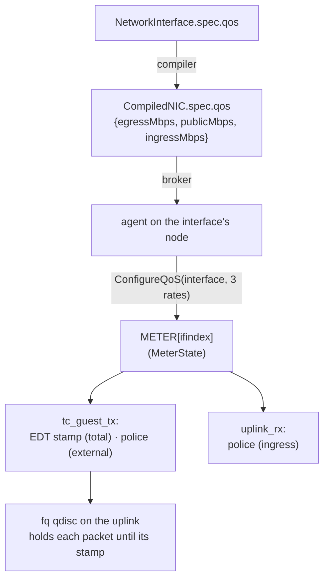

# QoS: shaping and policing

Per-interface QoS caps a workload's bandwidth in three independent lanes: total egress, external
egress and ingress. Total egress is shaped, meaning packets are delayed to the configured rate
rather than dropped, using the kernel's earliest-departure-time (EDT) model with the `fq` qdisc. The
other two lanes are policed with a token bucket, which drops what exceeds the rate.

## The API: NetworkInterface `spec.qos`

QoS is a field of the `NetworkInterface`; unset means unlimited.

| Field | Lane | Mechanism |
|---|---|---|
| `spec.qos.egress.rateMbps` | Total egress | EDT shaping at the uplink `fq` qdisc |
| `spec.qos.egress.publicMbps` | External egress (traffic on an external route) | Token-bucket policing |
| `spec.qos.ingress.rateMbps` | Ingress | Token-bucket policing |
| `spec.qos.egress.burstKB`, `spec.qos.ingress.burstKB` | — | Reserved; not programmed |

A rate of 0 means unlimited.

```yaml
apiVersion: net.ectobase.dev/v1alpha1
kind: NetworkInterface
metadata: {name: web-0, namespace: tenant-a}
spec:
  vpcRef: {name: blue}
  qos:
    egress: {rateMbps: 500, publicMbps: 100}
    ingress: {rateMbps: 200}
```

See [`InterfaceQoS`](../reference/api/net.md#interfaceqos) in the API reference.

## How a cap reaches the datapath

QoS follows the same compiled path as the firewall and NAT, so it follows the workload across pools
and reschedules.



The compiler flattens `spec.qos` into `CompiledNIC.spec.qos`, dropping the burst fields. The agent's
QoS reconciler selects the `CompiledNIC`s whose interface is attached locally, diffs the desired
caps against what it has applied, and calls `ConfigureQoS`. When the spec drops a lane, or the
interface goes away, the reconciler sets that lane back to unlimited.

All three lanes live in one `METER` entry per interface, keyed by ifindex. No entry means every lane
is unlimited.

## Shaping with EDT

Shaping needs the egress path to go through a qdisc, so it requires the tc/skb datapath; an XDP
redirect transmits through `ndo_xdp_xmit` and bypasses the qdisc. That is one reason the whole
forwarding path runs as tcx programs on skbs (see [programs and
hooks](../architecture/dataplane/programs.md)).

When a packet is headed for the wire (`tc_guest_tx` for IPv4, `tc_guest_egress_v6` for IPv6),
`edt_stamp` computes its departure time from the interface's egress rate and the inner frame length,
`skb->len` before the Geneve device encapsulates it. The outer header is not counted, so the rate on
the wire runs slightly above the cap. The simulator differs here: it adds the Geneve overhead to the
length. The datapath stamps it with `bpf_skb_set_tstamp(..., BPF_SKB_TSTAMP_DELIVERY_MONO)`. Setting
the tunnel key and redirecting to the Geneve device do not touch the timestamp, so the encapsulated
frame reaches the uplink's `fq` qdisc still carrying it, and `fq` holds the frame until then.

The scheduling function is pure and lives in `flowplane-core/src/meter.rs`:

```rust
/// The packet may leave no earlier than max(t_last, now); the schedule cursor then advances by
/// the packet's airtime (wire_len * 1e9 / rate_bps). rate_bps == 0 => unlimited.
pub fn edt_departure(rate_bps: u64, wire_len: u64, t_last: u64, now: u64) -> (u64, u64) {
    if rate_bps == 0 {
        return (now, now);
    }
    let delay = wire_len.saturating_mul(1_000_000_000) / rate_bps;
    let t_sched = if t_last > now { t_last } else { now };
    (t_sched, t_sched.saturating_add(delay))
}
```

The clock is a parameter, so eBPF passes `bpf_ktime_get_ns()` and the simulator passes a controlled
clock.

flowplane installs the qdisc itself: `ensure_fq_qdisc` runs `tc qdisc replace dev <if> root fq` on
the primary uplink, every `--extra-uplink`, and an edge's WAN uplink. If `tc` fails, flowplane logs
that egress shaping is disabled and carries on.

`fq` classifies the encapsulated traffic by its outer header, so its per-flow fairness becomes
per-destination-node fairness. EDT pacing honours the timestamp regardless of which bucket a packet
lands in, which is all shaping needs.

## Policing

The two policed lanes reuse one token-bucket function, `take`, which refills at the configured rate
(refill capped at one second's worth) and drops a packet when the bucket holds fewer tokens than its
length.

- `public_pass` runs in `tc_guest_tx` on traffic whose route is external, as a drop cap layered on
  top of the shaped total.
- `ingress_pass` runs in `uplink_rx` once the decapsulated frame has resolved to a local tap, keyed
  by that tap. Policing is a drop decision inside the program and needs no qdisc.

## Limits

- `publicMbps` and the ingress cap police IPv4 only. IPv6 has no public-lane check on egress and no
  ingress-lane check in the uplink path, so IPv6 traffic is shaped by `rateMbps` but never policed.
- Replies to NAT egress (NAT44 and NAT64) and same-node traffic bypass the ingress policer.
- NAT64 egress is not shaped; its program sets no departure time.
- Same-node traffic is never shaped. A packet to another interface on the same node takes the local
  fast path, redirecting tap to tap without crossing the uplink `fq`.
- Ingress is policed only; there is no ingress shaping.
- `burstKB` is reserved and not programmed in either direction.
- The qdisc is a single root `fq`. On a multi-queue NIC an `mq` root with per-queue `fq` leaves
  would scale better; that is not built.
- QoS is L4-agnostic: there is no DSCP marking, priority or L7 classification.
- The lab test (`TestQoSGuestToGuest`) programs the caps directly over gRPC and checks the
  qualitative contrast across clusters: with an egress cap the received rate lands near the cap with
  under 40% loss, with an ingress cap near the cap with over 40% loss. It does not measure pacing
  precision, and the intent path from `spec.qos` is covered by unit tests.
- tcx links need kernel 6.6 or later.

## Where to go next

- [Programs and hooks](../architecture/dataplane/programs.md)
- [Maps and state](../architecture/dataplane/maps.md)
- [The in-process sim](../contributing/testing/sim.md)
