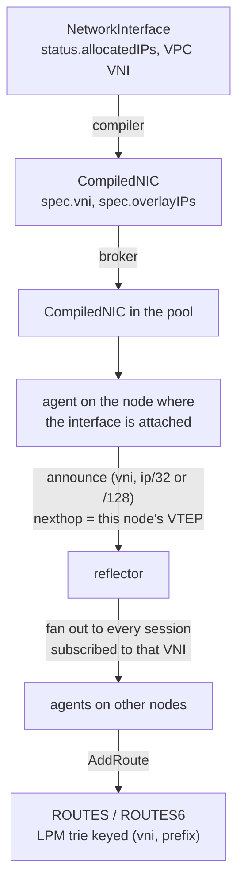
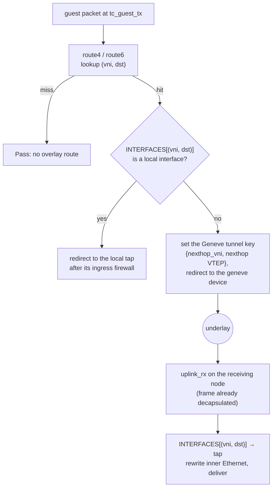

# Routing and VNIs

Every VPC is its own routing domain, identified by a **VNI** (virtual network identifier). The
datapath looks up every overlay packet by `(VNI, destination)`, so two VPCs can use the same address
ranges without colliding, and a route in one VPC is never visible from another. The only way a route
crosses VPCs is an explicit [VPC peering](vpc-peering.md) import.

## The API: VPC and NetworkInterface

Routing has no CRD of its own. It follows from two kinds:

- `VPC` is the isolation domain. `spec.vni` optionally pins the VNI; leave it unset and the dispatch
  allocates one into `status.vni`.
- `NetworkInterface` joins a workload to a VPC through `spec.vpcRef`. Its overlay addresses come
  from a `Subnet` of that VPC (`spec.subnetRef`, optional when the VPC has exactly one), or are
  pinned with `spec.ips`. The authoritative set is `status.allocatedIPs`.

```yaml
apiVersion: net.ectobase.dev/v1alpha1
kind: VPC
metadata: {name: blue, namespace: tenant-a}
spec: {}                      # VNI allocated into status.vni
---
apiVersion: net.ectobase.dev/v1alpha1
kind: Subnet
metadata: {name: blue-v4, namespace: tenant-a}
spec:
  vpcRef: {name: blue}
  v4Prefix: 10.0.10.0/24
---
apiVersion: net.ectobase.dev/v1alpha1
kind: NetworkInterface
metadata: {name: web-0, namespace: tenant-a}
spec:
  vpcRef: {name: blue}        # one Subnet in the VPC, so subnetRef can be omitted
```

The full field list is in the API reference: [`VPC`](../reference/api/net.md#vpc),
[`Subnet`](../reference/api/net.md#subnet),
[`NetworkInterface`](../reference/api/net.md#networkinterface).

## How a route gets from intent to the datapath

This section follows one interface's address from the CRD to the BPF route table on every node that
needs it.



1. The [compiler](../concepts/what-is-ectobase.md#vocabulary) (mesh-controller) resolves the
   interface's VNI (the interface's `status.vni`, else its VPC's `status.vni`) and writes `spec.vni`
   and `spec.overlayIPs` into a `CompiledNIC`. The spec carries no underlay address: which node the
   interface lands on is node-local state.
2. The broker syncs the `CompiledNIC` twin into the pool cluster.
3. The agent on each node asks the local flowplane which interfaces are attached (`ListInterfaces`).
   A `CompiledNIC` counts as local when one of its `(VNI, overlay IP)` pairs is attached there. For
   each local address, the agent announces a host route, `/32` for IPv4 and `/128` for IPv6, with
   this node's VTEP (its single `/128` underlay address) as the nexthop. It subscribes to the VNI of
   every local interface, plus the reserved public VNI 0 that carries the WAN edge's default routes.
4. The reflector fans each announcement out to every session subscribed to that VNI. The agents that
   receive it program the route into flowplane with `AddRoute`.

The [route bus](../architecture/route-bus.md) page covers the protocol, snapshots and fencing. Route
distribution is a per-VNI publish/subscribe channel; BGP appears only at the [WAN edge](ns-edge.md),
outside the overlay.

When the reflector holds several nexthops for one prefix (two origins announcing the same address),
it sends the set sorted as strings, and the agent programs only the first entry. The exception is a
node that hosts the address itself: it skips its own VTEP and takes the first other nexthop. The
route table holds one nexthop per prefix; there is no ECMP inside the overlay.

## The route table

flowplane keeps overlay routes in two BPF `LPM_TRIE` maps, `ROUTES` (IPv4) and `ROUTES6` (IPv6),
each with room for 65,536 entries. One trie holds every VPC's routes because the VNI is part of the
key:

| Field | IPv4 key (`RouteLpmData`) | IPv6 key (`RouteLpmData6`) |
|---|---|---|
| VNI, big-endian | 4 bytes | 4 bytes |
| Address | 4 bytes | 16 bytes |
| Stored prefix length | 32 + IPv4 prefix length | 32 + IPv6 prefix length |
| Lookup length | 64 | 160 |

The VNI occupies the high 32 bits and every stored route includes all of them, so a lookup in VNI A
can only match entries whose VNI bits equal A. Within a VNI the trie returns the longest matching
prefix, so a `/32` host route wins over a covering prefix.

The value, `RouteValue`, carries three fields:

- `nexthop_ipv6`: the VTEP of the node that owns the destination.
- `nexthop_vni`: the VNI to put on the wire. It equals the key's VNI except for a peering import,
  which delivers under the peer's VNI.
- `is_external`: set on the WAN default routes, which marks the traffic as eligible for egress NAT.

## Forwarding in the datapath

Two programs do the forwarding: `tc_guest_tx` on the guest edge and `uplink_rx` on the Geneve
device. The route lookup and the local-or-encap decision live in `flowplane-core`, so the same code
runs in the kernel, in the simulator and in unit tests.



- A same-node destination never touches the wire. `deliver` finds it in `INTERFACES` (`INTERFACES6`
  for IPv6) and redirects to its tap, still subject to that interface's ingress
  [firewall](firewall.md).
- A remote destination gets its tunnel key stamped with `bpf_skb_set_tunnel_key` and is redirected
  to the kernel's `collect_md` Geneve device, which builds the outer IPv6/UDP/Geneve header.
- On the receiving node, the kernel strips the outer header on the Geneve device's receive path, and
  `uplink_rx` runs as a tcx program on that device's ingress. It reads the VNI from the tunnel key
  and demultiplexes `INTERFACES[(vni, inner dst)]` to the target tap.

For IPv6, each forwarding program tail-calls a dedicated program, `tc_guest_egress_v6` on the guest
side and `xdp_uplink_v6` (a tc program despite its name) on the uplink side, so the IPv6 firewall,
conntrack and route path gets a fresh 512-byte BPF stack.

The outer header only has to reach the right node, so the underlay address names a node and never an
endpoint. The [overlay](../architecture/overlay.md) page describes the encapsulation, and [programs
and hooks](../architecture/dataplane/programs.md) describes each program in full.

## Reachability is separate from permission

A route makes a destination reachable; it does not let traffic through. The [firewall](firewall.md)
is evaluated independently, so a packet is forwarded only when a route exists and the firewall
admits it. How much the firewall admits depends on the VPC's `defaultPolicy`. This split is what
lets peering import another VPC's routes while the destination still decides, through its own
`FirewallPolicy`, whom it accepts.

## Limits

- The route table holds 65,536 IPv4 and 65,536 IPv6 entries per node, shared by every VPC on that
  node.
- Routes are host routes: workload addresses, LB addresses and their peering imports are all `/32`
  or `/128`. The only wider routes are the edges' defaults (`0.0.0.0/0`, `::/0`, `64:ff9b::/96`),
  imported into egress VNIs.
- One nexthop per prefix: when several nodes announce the same address, every sender uses the first
  of the reflector's sorted nexthops, except a node that hosts the address, which takes the first
  nexthop that is not its own VTEP.

## Where to go next

- [Your first VPC](../guides/first-vpc.md)
- [The route bus](../architecture/route-bus.md)
- [Firewall](firewall.md)
- [VPC peering](vpc-peering.md)
