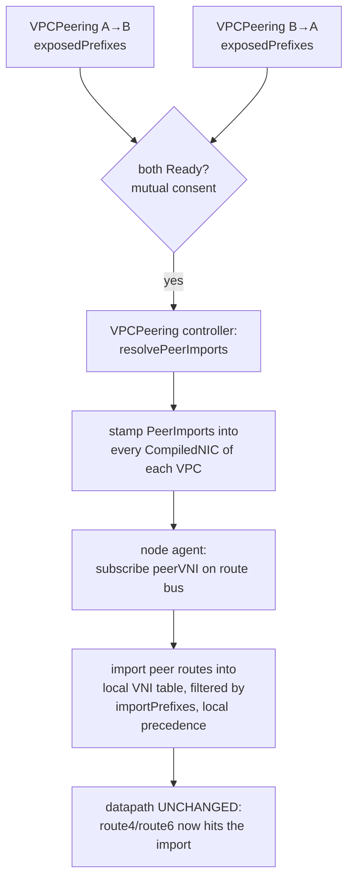

# VPC peering

VPC peering lets guests in two different VPCs — two overlay networks, each identified by a VNI —
reach each other. It is a **pure control-plane feature**: there is **no eBPF / `flowplane-core`
datapath change** and **no route-bus protocol change**. Peering generalizes the same
route-import primitive the [North-South WAN edge](./ns-edge.md) already uses for public egress —
*"subscribe to VNI X, install its allow-listed prefixes into my table with X's nexthop"* — from
the single well-known public VNI (0) to arbitrary peer VNIs.

Two properties define the feature:

- **Reachability is imported, not tunnelled differently.** The local agent installs the peer VPC's
  overlay routes into the local VPC's route table, keyed by the local VNI. The overlay's
  underlay-derived delivery does the rest — the receiver derives the delivery VNI from the
  underlay `/128`, not from anything carried in the packet, so a route imported under VNI-A that
  points at a VNI-B guest's underlay Just Works.
- **Security is orthogonal.** Peering grants *reachability only*. The deny-by-default ingress
  [firewall](./firewall.md) still drops cross-VPC traffic until a `FirewallPolicy` explicitly
  allows the peer's CIDRs. Reachability without policy means no connectivity — a deliberate
  two-step, mirroring how LB membership never generates firewall rules.

## Why no datapath change

Routes in a VNI table are looked up keyed by `(vni, dst)` (`flowplane-core/src/egress.rs`
`route4`/`route6`). A route under VNI-B is invisible to a lookup under VNI-A — that is the
tenant-isolation invariant. Delivery VNI is derived at the receiver from `UNDERLAY[outer_dst]`,
**not** from a VNI tag on the wire. So importing VNI-B's routes into VNI-A's table with VNI-B's
underlay nexthop makes them resolvable and deliverable with no kernel change. Peering is entirely
a question of *which routes land in which VNI table*, which is control-plane bookkeeping.

## Mutual consent

Peering is expressed as **one-directional `VPCPeering` objects**; a **pair** (`A→B` plus `B→A`)
forms a peering. Each object declares its own side:

```go
type VPCPeeringSpec struct {
    // VPCRef is this side's VPC (same namespace).
    VPCRef LocalObjectReference `json:"vpcRef"`
    // PeerVPCRef references the other VPC (may be another tenant namespace — peering is
    // hub-authored).
    PeerVPCRef ObjectReference `json:"peerVpcRef"`
    // ExposedPrefixes is the CIDR allow-list THIS side offers to the peer. Only local routes
    // within these CIDRs become reachable to the peer VPC. Empty = expose nothing (fail-closed).
    // Reachability scope only — never a firewall grant.
    ExposedPrefixes []string `json:"exposedPrefixes,omitempty"`
}
```

- **Mutual consent:** `A→B` becomes `Ready` only when the reciprocal `B→A` also exists (and is
  itself consistent). Either side deleting its object tears the peering down and withdraws the
  imported routes.
- **`exposedPrefixes` is per-side and fail-closed:** an empty list exposes nothing. It scopes
  reachability, route-table size, and topology visibility — it is *never* a firewall grant.
- **Cross-namespace `peerVpcRef`** is allowed: the hub is authoritative and sees all
  tenants.

## The pipeline



### Hub: `VPCPeering` → `CompiledNIC.PeerImports`

The `CompiledNICReconciler` (`netplane/controllers/compilednic.go`) resolves peerings and stamps a
directive onto **every `CompiledNIC` of each side's VPC** — mirroring how `CompiledLB` rides on
`CompiledNIC`. `resolvePeerImports` walks all `VPCPeering`s and, for each `Ready` one, resolves the
peer VNI and the **reciprocal** side's `exposedPrefixes` (what the peer exposes to us):

```go
// A Ready peering P (VPCRef=local, PeerVPCRef=peer) contributes an import of the PEER's VNI,
// filtered by what the PEER exposes to us — the reciprocal peering (peer→local) ExposedPrefixes.
recip := exposed[k{p.Spec.PeerVPCRef.Namespace, p.Spec.PeerVPCRef.Name, p.Spec.VPCRef.Name}]
out = append(out, PeerImportSpec{
    VPCName:        p.Spec.VPCRef.Name,
    PeerVNI:        peerVNI,
    ImportPrefixes: recip,
})
```

`Compile()` then emits the matching entries onto each NIC:

```go
type CompiledPeerImport struct {
    // PeerVNI is the peer VPC's VNI to subscribe to on the route bus.
    PeerVNI int32 `json:"peerVni"`
    // ImportPrefixes is the PEER's exposedPrefixes: only peer routes within these CIDRs are
    // imported (filter applied importer-side).
    ImportPrefixes []string `json:"importPrefixes"`
}
```

The reconciler watches `VPCPeering` and re-enqueues **both** sides' NICs when a peering (or its
reciprocal) changes (`nicsForPeering`), so a consent race converges when the second object appears.

**`exposedPrefixes` is enforced importer-side.** Each side's exposed list is carried by the hub
into the peer's `CompiledNIC`, and the peer's agent drops any imported route outside that list.
This needs zero route-bus protocol change; the hub is the trust anchor regardless.
Overlap between peer ranges is **permitted** — there is no overlap rejection; overlaps are resolved
at the agent by local precedence.

### Node agent: subscribe, import, precedence

The agent (`netplane/agent/importreconcile.go`, `desiredPeeringImports`) scans the `CompiledNIC`s
scheduled to its node, unions their `PeerImports` per local VNI (deduped by peer VNI, prefixes
unioned deterministically), and:

1. **Subscribes** to each peer VNI on the route bus (alongside local VNIs and the public VNI).
2. **Imports** each learned peer route `(prefix, nexthop)` into the local VNI's route table —
   `AddRoute(localVNI, prefix, nexthop)` — **iff** the prefix is within `importPrefixes`.
3. **Honours local precedence** (the overlap rule): every route is tagged by origin —
   *own* (a locally-hosted guest, or a route learned on the local VNI) vs *imported* (learned on a
   peer VNI). An imported route never overwrites an own route for the same prefix; when an own
   route appears for a prefix currently held by an import, the own route evicts the import; LPM
   longest-prefix specificity handles different-length prefixes naturally, so only exact-key
   collisions need the origin tie-break.
4. **Withdraws / prunes** on peer-route withdraw or when a `PeerImport` is removed (unsubscribe +
   withdraw its imported routes).

## End-to-end flow

1. An operator (or the hub) creates `VPCPeering A→B` and `B→A`, each with its
   `exposedPrefixes`.
2. The hub controller marks both `Ready` and stamps `PeerImports` into every `CompiledNIC`
   of A and B; the sync pipeline pushes the updated CompiledNICs to nodes.
3. VPC-B's agent subscribes to VNI-A and imports A's exposed prefixes into VNI-B's route table
   (local precedence honoured).
4. **Datapath (unchanged):** a VPC-B guest sends to an exposed A-address → `route4(vni_B, dst)`
   now *hits* the imported route → encap to the A-guest's underlay → A's node underlay-derives
   VNI-A → delivers to the A guest.
5. **Return is symmetric** (A imports B's exposed prefixes) — but the destination NIC's
   deny-by-default ingress firewall drops it **until a `FirewallPolicy` allows the peer's CIDR**.

## Scope

- **No datapath / route-bus protocol change.** Peering is control-plane only.
- **No firewall coupling.** Peering never grants firewall permission; `FirewallPolicy` is the sole
  security gate.
- **No overlap rejection.** Overlapping guest ranges are allowed; own-VNI routes win.
- **No transitive peering.** `A↔B` and `B↔C` do not make `A↔C` reachable; each peering is an
  explicit mutual pair, and peer-of-peer routes are not re-exported.
- **No aggregate-CIDR advertising change.** The route bus keeps advertising per-guest host routes;
  `exposedPrefixes` filters them importer-side.

The forgotten-`FirewallPolicy` footgun (reachability without policy = silent no-connectivity) is
deliberate; `VPCPeering` status surfaces that policy is still required.
