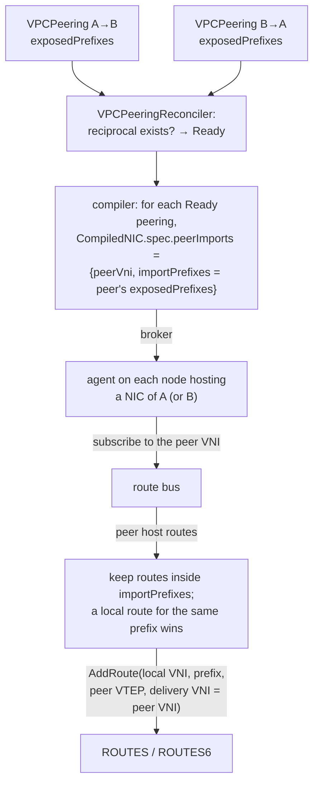

# VPC peering

VPC peering lets workloads in two VPCs reach each other. Each side states which of its own address ranges it exposes, both sides must consent, and the result is reachability only: the destination's [firewall](firewall.md) still has to admit the traffic. Peering is control-plane bookkeeping; the datapath forwards an imported route exactly like a native one.

## The API: a pair of VPCPeering objects

A `VPCPeering` is one direction of a peering. A reciprocal pair, `A→B` in A's namespace and `B→A` in B's, forms an active peering.

| Field | Meaning |
|---|---|
| `spec.vpcRef` | This side's VPC, in the same namespace as the object. |
| `spec.peerVpcRef` | The other VPC, by `namespace` and `name`. It may be in another namespace. |
| `spec.exposedPrefixes` | CIDRs this side offers to the peer. Only local routes inside them become reachable. Empty exposes nothing. |
| `status.state` | `Pending` (no reciprocal yet), `Ready` (reciprocal present) or `Invalid`. |

```yaml
apiVersion: net.ectobase.dev/v1alpha1
kind: VPCPeering
metadata: {name: blue-to-green, namespace: tenant-a}
spec:
  vpcRef: {name: blue}
  peerVpcRef: {namespace: tenant-b, name: green}
  exposedPrefixes: [10.0.10.0/24]
---
apiVersion: net.ectobase.dev/v1alpha1
kind: VPCPeering
metadata: {name: green-to-blue, namespace: tenant-b}
spec:
  vpcRef: {name: green}
  peerVpcRef: {namespace: tenant-a, name: blue}
  exposedPrefixes: [10.0.20.0/24]
```

A peering is `Invalid` when it names its own VPC or an `exposedPrefixes` entry is not a CIDR. The schema is in the API reference: [`VPCPeering`](../reference/api/net.md#vpcpeering).

## How a peering becomes routes

The peering controller decides consent, the compiler turns consent into import directives on each interface, and the agents act on those directives over the route bus.


```mermaid
flowchart TD
    ab["VPCPeering A→B<br/>exposedPrefixes"] --> rec["VPCPeeringReconciler:<br/>reciprocal exists? → Ready"]
    ba["VPCPeering B→A<br/>exposedPrefixes"] --> rec
    rec --> comp["compiler: for each Ready peering,<br/>CompiledNIC.spec.peerImports =<br/>{peerVni, importPrefixes = peer's exposedPrefixes}"]
    comp -->|broker| agent["agent on each node hosting<br/>a NIC of A (or B)"]
    agent -->|"subscribe to the peer VNI"| bus["route bus"]
    bus -->|"peer host routes"| filter["keep routes inside importPrefixes;<br/>a local route for the same prefix wins"]
    filter -->|"AddRoute(local VNI, prefix,<br/>peer VTEP, delivery VNI = peer VNI)"| dp["ROUTES / ROUTES6"]
```

1. Consent. `VPCPeeringReconciler` marks a peering `Ready` when the reciprocal object exists (same VPC pair, reversed), else `Pending`. It re-evaluates the counterpart whenever either side changes, so the pair converges together.
2. Compile. For every `Ready` peering, the compiler adds a `CompiledPeerImport` to each `CompiledNIC` of the local VPC: the peer's VNI and, as `importPrefixes`, the reciprocal object's `exposedPrefixes`. In other words, what B exposes is enforced on A's side, when A imports.
3. Import. The agent unions the imports of its local interfaces per local VNI and subscribes to each peer VNI. For every route it learns on a peer VNI that falls inside `importPrefixes`, it programs the route into the local VNI's table with the peer node's VTEP as nexthop and the peer's VNI as the delivery VNI.

The overlap rule is local precedence. A route learned on the local VNI always wins over an import for the same prefix, and the longest-prefix match decides between different prefix lengths. Overlapping address ranges between peers are allowed.

## Why the datapath needs no change

A route lookup is keyed by `(VNI, destination)`, so a route under VNI B is invisible to a lookup under VNI A. Peering places B's route in A's table and records B's VNI in the route's `nexthop_vni`. The sender stamps that VNI into the Geneve tunnel key, and the receiving node demultiplexes `INTERFACES[(VNI B, dst)]` exactly as it does for native B traffic. The only datapath feature peering relies on is the `delivery_vni` field of `AddRoute`, which every route already has.

## Revocation

Deleting either `VPCPeering` revokes the peering for both sides:

1. The surviving object's reciprocal is gone, so the reconciler moves it back to `Pending`.
2. The compiler only emits imports for `Ready` peerings, so it drops the `peerImports` entry from every affected `CompiledNIC`.
3. On its next reconcile, each agent withdraws every route it imported from the peer VNI and drops the subscription. It forgets the routes it had learned on that VNI once the VNI has been missing from its subscriptions for three reconciles in a row, so a single transient read does not churn them.

The datapath looks up a route for every packet, so cross-VPC traffic stops once the import is withdrawn, including on established connections. Changing `exposedPrefixes` narrows or widens the imports the same way.

## Limits

- No transitive peering. `A↔B` and `B↔C` do not make `A↔C` reachable; imported routes are never re-exported.
- No firewall coupling. Under `defaultPolicy: Deny`, or in a direction a policy governs, cross-VPC traffic also needs a `FirewallPolicy` on the destination that allows the peer's CIDR. A peering without that policy shows `Ready` and carries no traffic.
- Routed only. MACs are unique per VPC, not fleet-wide, and delivery resolves on `(VNI, overlay IP)`, so there is no shared L2 across a peering.
- `Ready` means the reciprocal object exists; it does not check that the reciprocal is itself valid.
- The live test (`TestVPCPeering`) proves the deny-by-default two-step and local precedence. Revocation is covered by unit tests of the controller and the agent, not by a live test.

## Where to go next

- [Guide: firewall and peering](../guides/firewall-and-peering.md)
- [Routing and multi-VNI tenancy](routing-vni.md)
- [Distributed firewall](firewall.md)
- [The route bus](../architecture/route-bus.md)
