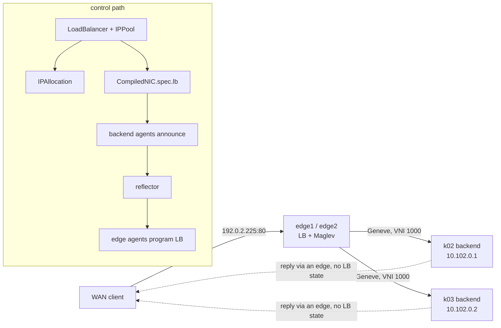

# Expose a service to the WAN

In this guide you publish an HTTP service to the outside world. You register a public address
range as an `IPPool`, create a `LoadBalancer` that takes an address from it, and run two backends
behind it, one on each pool. Then you reach the address from the lab's `wan` container, which
stands in for a client on the internet, and watch requests land on both pools. On the way you
look at the address claim, the load-balancer membership compiled into each backend's NIC, and
the Maglev table the WAN edges built from the route bus alone.

!!! note "Automated twin"
    `TestLbFromIntentReachesTheWan` in `test/lab/livetest/lbintent_test.go` drives the same
    path: an `IPPool`, a `LoadBalancer` that selects backends by label, a backend `Container`,
    and a `curl` from the WAN. The test pins the load-balancer address (`192.0.2.7`, in a /27
    pool), pins the VNI, the backend's IP and MAC, and runs one backend on one pool. This guide
    lets the allocator pick the address from a /28 and runs a backend on each pool. Keep the
    guide and the test in step.

## Prerequisites

- A running lab; see [Bring up the lab](lab.md), and the `khub`, `k02` and `k03` aliases.
- [Your first VPC](first-vpc.md), for VPCs, NICs and Containers.

The objects live in the `default` namespace with a `guide-` prefix. The address range
`192.0.2.224/28` is a slice of the lab's edge-owned public prefix `192.0.2.0/24`, which both
WAN edges advertise. It does not overlap the slices the live tests use.

## Step 1: register a public address pool

An **IPPool** is a typed range of addresses that consumers draw from. `spec.type` is required:
`public` for addresses reached from outside the fabric, `internal` for addresses that are not.
A `LoadBalancer` only accepts a `public` pool, because an address from an internal range would
be advertised with nothing able to route to it.

Create the pool, a VPC for the backends, and the `LoadBalancer`:

```sh
khub apply -f - <<'EOF'
apiVersion: net.ectobase.dev/v1alpha1
kind: VPC
metadata: {name: guide-web, namespace: default}
spec: {defaultPolicy: Allow}
---
apiVersion: net.ectobase.dev/v1alpha1
kind: Subnet
metadata: {name: guide-web-v4, namespace: default}
spec:
  vpcRef: {name: guide-web}
  v4Prefix: 10.102.0.0/24
---
apiVersion: net.ectobase.dev/v1alpha1
kind: IPPool
metadata: {name: guide-public, namespace: default}
spec:
  type: public
  v4Prefix: 192.0.2.224/28
---
apiVersion: net.ectobase.dev/v1alpha1
kind: LoadBalancer
metadata: {name: guide-web, namespace: default}
spec:
  ip: ""
  poolRef: {name: guide-public}
  ports:
  - {port: 80, proto: TCP}
  targetSelector:
    matchLabels: {app: guide-web}
EOF
```

```text
vpc.net.ectobase.dev/guide-web created
subnet.net.ectobase.dev/guide-web-v4 created
ippool.net.ectobase.dev/guide-public created
loadbalancer.net.ectobase.dev/guide-web created
```

`ip: ""` asks the allocator for an address; setting it to an address inside the pool reserves
that one instead. The `LoadBalancer` selects its backends by NIC label. `targetRefs`, a list of
NIC names, is the alternative.

## Step 2: see the address claim

The pool is Ready and has one allocation. The load balancer is `Allocated` with the lowest free
address; the allocator skips the network address `192.0.2.224`:

```sh
khub get ippool guide-public -o jsonpath='{.status}{"\n"}'
khub get lb guide-web -o jsonpath='{.status}{"\n"}'
```

```text
{"allocated":1,"state":"Ready","total":16}
{"allocatedIP":"192.0.2.225","observedGeneration":1,"state":"Allocated"}
```

Each claimed address is an **IPAllocation** object, named after the pool and the address. The
name is the claim: two consumers cannot create the same name, so they cannot hold the same
address. The `ownerReference` points at the `LoadBalancer`, which is how the address is released
when the load balancer is deleted:

```sh
khub get ipallocation guide-public-192-0-2-225 -o yaml
```

```text
metadata:
  labels:
    net.ectobase.dev/consumer-uid: fd511e47-4f83-4523-846a-4b8d2371aa0f
    net.ectobase.dev/pool: guide-public
  name: guide-public-192-0-2-225
  namespace: default
  ownerReferences:
  - apiVersion: net.ectobase.dev/v1alpha1
    blockOwnerDeletion: true
    controller: true
    kind: LoadBalancer
    name: guide-web
...
spec:
  address: 192.0.2.225
  consumerRef:
    kind: LoadBalancer
    name: guide-web
  poolRef:
    name: guide-public
```

Two pools in one namespace must not overlap: the later one goes to `Conflict`, so the same
address is never handed out twice.

## Step 3: start a backend on each pool

Each backend is a NIC labelled `app: guide-web` and a `Container` that serves a page naming its
pool. busybox `httpd` listens on all addresses; that matters, because the edge delivers each
request to the backend's own overlay address:

```sh
khub apply -f - <<'EOF'
apiVersion: net.ectobase.dev/v1alpha1
kind: NetworkInterface
metadata:
  name: guide-web-k02
  namespace: default
  labels: {app: guide-web}
spec:
  vpcRef: {name: guide-web}
---
apiVersion: compute.ectobase.dev/v1alpha1
kind: Container
metadata: {name: guide-web-k02, namespace: default}
spec:
  clusterName: k02
  interfaceRefs: [{name: guide-web-k02}]
  image: busybox:1.36
  command: ["sh", "-c", "mkdir -p /www && echo served by k02 > /www/index.html && exec httpd -f -p 80 -h /www"]
---
apiVersion: net.ectobase.dev/v1alpha1
kind: NetworkInterface
metadata:
  name: guide-web-k03
  namespace: default
  labels: {app: guide-web}
spec:
  vpcRef: {name: guide-web}
---
apiVersion: compute.ectobase.dev/v1alpha1
kind: Container
metadata: {name: guide-web-k03, namespace: default}
spec:
  clusterName: k03
  interfaceRefs: [{name: guide-web-k03}]
  image: busybox:1.36
  command: ["sh", "-c", "mkdir -p /www && echo served by k03 > /www/index.html && exec httpd -f -p 80 -h /www"]
EOF
```

```sh
khub get nic -l app=guide-web -o 'custom-columns=NAME:.metadata.name,STATE:.status.state,IPS:.status.allocatedIPs'
k02 get pods -n default
k03 get pods -n default
```

```text
NAME            STATE       IPS
guide-web-k02   Allocated   [10.102.0.1]
guide-web-k03   Allocated   [10.102.0.2]
NAME                    READY   STATUS    RESTARTS   AGE
default-guide-web-k02   1/1     Running   0          30s
NAME                    READY   STATUS    RESTARTS   AGE
default-guide-web-k03   1/1     Running   0          30s
```

The compiler joins the `LoadBalancer` to every NIC its selector matches and writes the
membership into each backend's `CompiledNIC`. It does so only once the load balancer is
`Allocated`. In the pool, the twin now carries the address and its ports:

```sh
k02 -n default get compilednic default-guide-web-k02 -o jsonpath='{.spec.lb}{"\n"}'
```

```text
[{"ip":"192.0.2.225","ports":[{"port":80,"proto":"TCP"}]}]
```

That is all the backend node's agent needs. It sees an attached interface that is a
load-balancer member, and announces the address, its ports and the node's VTEP on the route
bus. The edges' agents receive the announcement from the reflector and program their flowplane.

## Step 4: reach it from the WAN

The `wan` container routes `192.0.2.0/24` to both edges with equal cost, so either edge can
receive a request:

```sh
sudo docker exec clab-ectobase-wan ip route show 192.0.2.0/24
```

```text
192.0.2.0/24
	nexthop via 172.29.0.11 dev br0 weight 1
	nexthop via 172.29.0.12 dev br0 weight 1
```

Run `curl` in the `wan` container's network namespace a few times:

```sh
for i in 1 2 3 4 5 6 7 8; do
  sudo docker run --rm --network container:clab-ectobase-wan curlimages/curl:latest \
    -4 -s --max-time 8 http://192.0.2.225/
done
```

```text
served by k02
served by k03
served by k02
served by k02
served by k03
served by k02
served by k03
served by k03
```

Each new connection has a new source port, so the edge's hash sends it to one backend or the
other. Packets of one connection always go to the same backend.

## Step 5: look at the edge

Each edge's flowplane keeps its maps under its own pin directory on the host. The `LB` map has
one entry for the service:

```sh
sudo bpftool map dump pinned /sys/fs/bpf/flowplane-edge1/LB
```

```text
key: 00 00 00 00 c0 00 02 e1  50 00 06 00  value: 05 00 00 00 fd 03 00 00
Found 1 element
```

| Bytes | Field | Value |
|---|---|---|
| key 0–3 | VNI | 0, the public VNI every load-balancer address is registered under at the edge |
| key 4–7 | address | `192.0.2.225` |
| key 8–9 | port, little-endian | 80 |
| key 10 | protocol | 6 (TCP) |
| value 0–3 | Maglev table id | 5 |
| value 4–7 | table size | 1021 slots |

The `MAGLEV` map holds the table's slots; each slot names a backend by its node's VTEP, its
overlay address and its VNI. The table is too large to read raw, so count the slots per backend:

```sh
sudo bpftool -j map dump pinned /sys/fs/bpf/flowplane-edge1/MAGLEV | python3 -c '
import json, sys, ipaddress, collections
count = collections.Counter()
for e in json.load(sys.stdin):
    k = bytes(int(b, 16) for b in e["key"]); v = bytes(int(b, 16) for b in e["value"])
    if int.from_bytes(k[0:4], "little") != 5:
        continue
    count[(str(ipaddress.IPv6Address(v[0:16])), str(ipaddress.IPv4Address(v[16:20])),
           int.from_bytes(v[32:36], "little"))] += 1
for backend, slots in count.items(): print(backend, slots)'
```

```text
('fd00:cafe:1914::1', '10.102.0.1', 1000) 511
('fd00:cafe:1aa7::1', '10.102.0.2', 1000) 510
```

The two backends share the 1021 slots almost evenly: one on `k02`'s VTEP, one on `k03`'s.
`edge2` holds the same table. Nobody configured either edge: an edge has no apiserver, and its
agent learned the load balancer and both backends from the route bus.

The edge picks a slot by hashing the packet's 5-tuple, rewrites the inner destination to the
backend's overlay address, and sends the packet to the backend's node in Geneve. A Geneve option
carries the load-balancer address, so the backend's node can rewrite the reply's source back to
`192.0.2.225`. The reply skips the load balancer (direct server return): the backend's node
routes it toward the WAN through an edge by the VPC's default route. That default exists because
the edges originate one into the public VNI, and the backend's node imports it into the VPC
because the NIC is a load-balancer member.

## What just happened



The `LoadBalancer` and two Containers were the whole input. The allocator claimed an address,
the compiler marked both NICs as members, the backend agents announced the membership, and the
edge agents built the Maglev table from it.

## Cleanup

```sh
khub delete container guide-web-k02 guide-web-k03
khub delete networkinterface guide-web-k02 guide-web-k03
khub delete loadbalancer guide-web
khub get ipallocations
khub delete ippool guide-public
khub delete subnet guide-web-v4
khub delete vpc guide-web
```

```text
container.compute.ectobase.dev "guide-web-k02" deleted from default namespace
container.compute.ectobase.dev "guide-web-k03" deleted from default namespace
networkinterface.net.ectobase.dev "guide-web-k02" deleted from default namespace
networkinterface.net.ectobase.dev "guide-web-k03" deleted from default namespace
loadbalancer.net.ectobase.dev "guide-web" deleted from default namespace
No resources found in default namespace.
ippool.net.ectobase.dev "guide-public" deleted from default namespace
subnet.net.ectobase.dev "guide-web-v4" deleted from default namespace
vpc.net.ectobase.dev "guide-web" deleted from default namespace
```

The `IPAllocation` went with its `LoadBalancer`. Within half a minute both edges drop the
service, and the WAN gets no answer:

```sh
sudo bpftool map dump pinned /sys/fs/bpf/flowplane-edge1/LB
sudo bpftool map dump pinned /sys/fs/bpf/flowplane-edge2/LB
sudo docker run --rm --network container:clab-ectobase-wan curlimages/curl:latest \
  -4 -s --max-time 4 http://192.0.2.225/ || echo "curl exit $?"
```

```text
Found 0 elements
Found 0 elements
curl exit 28
```

## Where to go next

- [Egress through NAT](nat-egress.md)
- [Load balancing](../features/loadbalancer.md)
- [North-South at the edge](../features/ns-edge.md)
