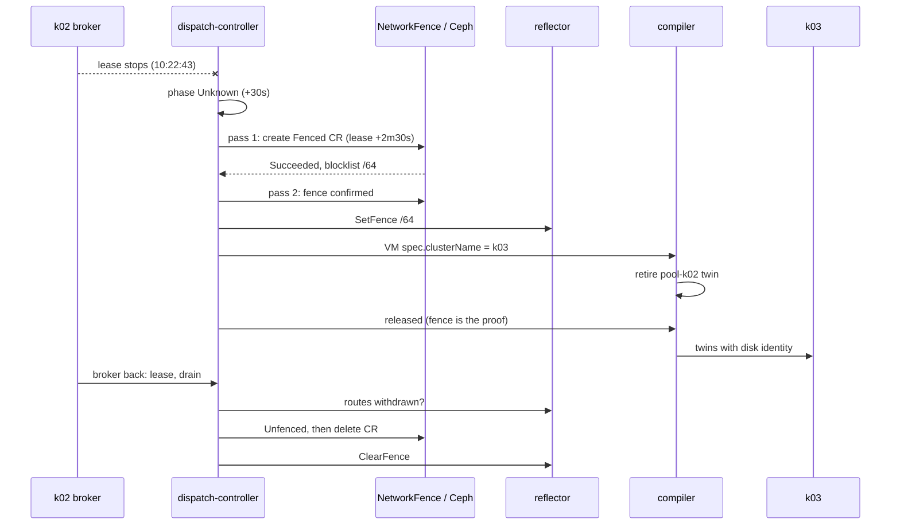

# Fail over a cluster

In this guide you lose a pool and watch the dispatch recover from it. You boot a VM with a
persistent disk on `k02`, cut `k02`'s broker off the way the live test does, and follow what the
dispatch does about it: the pool turns `Unknown`, the dispatch fences the pool's underlay prefix off Ceph
and off the route bus, and rebinds the VM to `k03`, which boots it from the same disk. Then you
bring `k02` back and watch it earn its fence off again: it drops its stale copy of the VM, reports
itself drained, withdraws the VM's route, and only then does the fence come off.

!!! note "Automated twin"
    `TestTier2Failover` in `test/lab/livetest/tier2_test.go` runs the same sequence: an RBD-backed
    VM pinned to `k02`, `k02`'s broker scaled to 0, then a `Succeeded` `NetworkFence`, a Ceph
    blocklist entry for `k02`'s prefix, the rebind to `k03`, the same disk by CSI handle on `k03`,
    and after recovery the blocklist cleared, the `NetworkFence` deleted and `k02` holding nothing
    of the VM. Its fixture, `testdata/tier2-vm.yaml`, pins the VNI, IP and MAC and imports
    fedora 41 into a 6 GiB disk. The test does not require the guest to run on `k03`. This guide
    boots cirros, lets the allocators choose, and follows the guest with a peer. Keep the guide and
    the test in step.

!!! warning "This guide fences k02"
    From the first failover pass until the fence is released, about five minutes in this run,
    nothing on `k02`'s node can reach Ceph, and for most of that time the reflector hides every
    overlay route `k02` announces. Run it on a lab where nothing else depends on `k02`. Two rules keep the lab safe:

    - Do not interrupt the run between scaling the broker down and seeing the fence released.
      Ceph drops a blocklist entry only when its `NetworkFence` is flipped to `Unfenced`, and the
      entry's expiry is years away. If anything goes wrong, scale the broker back to 1 and wait
      for the recovery in Step 8 to finish.
    - Never delete a `NetworkFence`. Deleting it leaves the blocklist entry behind with nothing
      tracking it. See [Storage and VMs](../architecture/storage-and-vms.md) for the one case
      where an operator unfences by hand.

## Prerequisites

- A running lab with Ceph and KubeVirt (`make lab-ceph`, `make lab-tier2-up`); see
  [Bring up the lab](lab.md), and the `khub`, `k02` and `k03` aliases.
- [Move a VM](move-a-vm.md), which introduces `Volume`, the disk identity and the move gate that
  failover reuses.
- No other `VirtualMachine` bound to `k02`. Failover rebinds every VM whose `spec.clusterName` is
  the lost pool, not only yours.

The objects live in the `default` namespace with a `guide-` prefix, in a VPC on `10.107.0.0/24`.

Terms used here: a **pool** is a compute cluster represented by a `ClusterPool` on the dispatch;
its **broker** renews a lease on that object and syncs twins. A **fence** on a prefix is two
things at once: a csi-addons `NetworkFence` that puts the prefix on the Ceph blocklist, and a
fence on the **reflector**, the route bus hub, that stops it advertising routes from the prefix.
**Drain** is the broker's report that no VM instance runs in a fenced prefix any more, and
**release** is lifting a fence.

## Step 1: the network and a peer

```sh
khub apply -f - <<'EOF'
apiVersion: net.ectobase.dev/v1alpha1
kind: VPC
metadata: {name: guide-fo, namespace: default}
spec: {defaultPolicy: Allow}
---
apiVersion: net.ectobase.dev/v1alpha1
kind: Subnet
metadata: {name: guide-fo-v4, namespace: default}
spec:
  vpcRef: {name: guide-fo}
  v4Prefix: 10.107.0.0/24
---
apiVersion: net.ectobase.dev/v1alpha1
kind: NetworkInterface
metadata: {name: guide-fo-vm, namespace: default}
spec:
  vpcRef: {name: guide-fo}
---
apiVersion: net.ectobase.dev/v1alpha1
kind: NetworkInterface
metadata: {name: guide-fo-peer, namespace: default}
spec:
  vpcRef: {name: guide-fo}
---
apiVersion: compute.ectobase.dev/v1alpha1
kind: Container
metadata: {name: guide-fo-peer, namespace: default}
spec:
  clusterName: k03
  interfaceRefs: [{name: guide-fo-peer}]
  image: busybox:1.36
  command: ["sleep", "infinity"]
EOF
khub get nic -o 'custom-columns=NAME:.metadata.name,STATE:.status.state,IPS:.status.allocatedIPs,MAC:.status.allocatedMAC'
```

```text
vpc.net.ectobase.dev/guide-fo created
subnet.net.ectobase.dev/guide-fo-v4 created
networkinterface.net.ectobase.dev/guide-fo-vm created
networkinterface.net.ectobase.dev/guide-fo-peer created
container.compute.ectobase.dev/guide-fo-peer created
NAME            STATE       IPS            MAC
guide-fo-peer   Allocated   [10.107.0.2]   02:f3:f8:e6:13:a3
guide-fo-vm     Allocated   [10.107.0.1]   02:49:fa:4b:fb:66
```

Wait for both NICs to be `Allocated` before you create the VM; [Move a VM](move-a-vm.md) explains
why.

## Step 2: a VM with a persistent disk on k02

The VM boots cirros from an RBD-backed `Volume`, and its user-data installs the same boot logger
as in [Move a VM](move-a-vm.md): every boot appends a line to `/root/boots` on the disk and serves
the file on port 80. `runStrategy: RerunOnFailure` is the compiler's default; it is spelled out
here because the live test's fixture does the same.

```sh
khub apply -f - <<'EOF'
apiVersion: storage.ectobase.dev/v1alpha1
kind: Volume
metadata: {name: guide-fo-disk, namespace: default}
spec:
  size: 1Gi
  storageClass: ceph-rbd
  bootImage: quay.io/kubevirt/cirros-container-disk-demo:latest
---
apiVersion: compute.ectobase.dev/v1alpha1
kind: VirtualMachine
metadata: {name: guide-fo-vm, namespace: default}
spec:
  clusterName: k02
  interfaceRefs: [{name: guide-fo-vm}]
  volumeRefs: [{name: guide-fo-disk}]
  runStrategy: RerunOnFailure
  resources:
    requests: {cpu: "1", memory: 256Mi}
  cloudInit:
    userData: |
      #!/bin/sh
      cat > /etc/rc3.d/S96-guide <<'EOS'
      #!/bin/sh
      echo "booted at $(date -u +%T)" >> /root/boots
      echo "=== /root/boots ==="; cat /root/boots
      while true; do
        { printf 'HTTP/1.0 200 OK\r\n\r\n'; cat /root/boots; } | nc -l -p 80
      done &
      EOS
      chmod +x /etc/rc3.d/S96-guide
      /etc/rc3.d/S96-guide
EOF
```

```text
volume.storage.ectobase.dev/guide-fo-disk created
virtualmachine.compute.ectobase.dev/guide-fo-vm created
```

Wait until the VM runs and, more important, until the `Volume` records the disk's identity. A
disk becomes portable only once its identity is recorded: before that, a rebind would give the VM
a blank disk on `k03`. The live test waits for the same thing.

```sh
k02 -n default get dv,pvc,vmi
khub get volume guide-fo-disk -o jsonpath='{.status.diskIdentity.csi.volumeHandle}{"\n"}'
```

```text
NAME                                                           PHASE       PROGRESS   RESTARTS   AGE
datavolume.cdi.kubevirt.io/default-guide-fo-vm-guide-fo-disk   Succeeded   100.0%                74s

NAME                                                      STATUS   VOLUME                                     CAPACITY   ACCESS MODES   STORAGECLASS   VOLUMEATTRIBUTESCLASS   AGE
persistentvolumeclaim/default-guide-fo-vm-guide-fo-disk   Bound    pvc-b3e97382-47d0-472e-a989-8f2f67e28227   1Gi        RWO            ceph-rbd       <unset>                 74s

NAME                                                     AGE   PHASE     IP    NODENAME   READY
virtualmachineinstance.kubevirt.io/default-guide-fo-vm   74s   Running         k02-1      True
0001-0024-950cadf7-c357-4c8f-aa46-399f1f2a6559-0000000000000002-064fc728-65e5-44f8-9d6e-521c548e4bf3
```

Note the PV behind the claim and the image it names. These are what must reappear on `k03`:

```sh
k02 get pv pvc-b3e97382-47d0-472e-a989-8f2f67e28227 \
  -o 'custom-columns=NAME:.metadata.name,RECLAIM:.spec.persistentVolumeReclaimPolicy,IMAGE:.spec.csi.volumeAttributes.imageName,HANDLE:.spec.csi.volumeHandle'
sudo docker exec clab-ectobase-ceph rbd ls -p replicapool
```

```text
NAME                                       RECLAIM   IMAGE                                          HANDLE
pvc-b3e97382-47d0-472e-a989-8f2f67e28227   Retain    csi-vol-064fc728-65e5-44f8-9d6e-521c548e4bf3   0001-0024-950cadf7-c357-4c8f-aa46-399f1f2a6559-0000000000000002-064fc728-65e5-44f8-9d6e-521c548e4bf3
csi-vol-064fc728-65e5-44f8-9d6e-521c548e4bf3
```

The guest has booted once, on `k02`, and the peer on `k03` can read its boot log:

```sh
L=$(k02 -n default get pods -l vm.kubevirt.io/name=default-guide-fo-vm -o name)
k02 -n default logs $L -c guest-console-log | grep -E 'Lease of|boots|booted at'
k03 -n default exec default-guide-fo-peer -- wget -q -O - -T 5 http://10.107.0.1/
```

```text
Lease of 10.107.0.1 obtained, lease time 268435455
=== /root/boots ===
booted at 10:21:15
booted at 10:21:15
```

## Step 3: the fence coordinates

A pool is fenced by the prefixes its nodes live in. `k02` has one node, so its fence coordinate is
that node's /64. The `NetworkFence` for it will be named after the prefix, `ectobase-` followed by
the prefix with `:` replaced by `-` and `/` by `--`. Check the starting point: both pools `Ready`,
nothing fenced, no `NetworkFence`, an empty blocklist:

```sh
khub get clusterpools -o 'custom-columns=NAME:.metadata.name,PHASE:.status.phase,PREFIXES:.status.nodePrefixes,FENCED:.status.fencedPrefixes'
khub get networkfences
sudo docker exec clab-ectobase-ceph ceph osd blocklist ls
```

```text
NAME   PHASE   PREFIXES                FENCED
k02    Ready   [fd00:cafe:1914::/64]   <none>
k03    Ready   [fd00:cafe:1aa7::/64]   <none>
No resources found
listed 0 entries
```

The `NetworkFence` for `k02` will be `ectobase-fd00-cafe-1914----64`.

!!! warning "The lab now fences the /48"
    The output in this guide was captured before the lab's `ClusterPool`s declared
    `spec.underlayPrefix`. They now do, because a pool needs it to get its route-bus intermediate,
    and failover fences that one aggregate instead of the node /64 (see
    [failover](../architecture/failover.md#decide-what-to-fence-coverage)). On a current lab, `k02`'s
    fence coordinate is `fd00:cafe:1914::/48` and its `NetworkFence` is
    `ectobase-fd00-cafe-1914----48`: use that name for `FC` and in the commands below, and read
    `/48` wherever the captured output shows `fd00:cafe:1914::/64` as a fenced prefix. Check it with
    `khub get clusterpool k02 -o jsonpath='{.spec.underlayPrefix}'`.

## Step 4: lose k02

Start two observers. In one terminal, ping the VM from the peer once a second:

```sh
k03 -n default exec default-guide-fo-peer -- sh -c 'for i in $(seq 1 700); do if ping -c1 -W1 10.107.0.1 >/dev/null; then echo "$(date +%T) up"; else echo "$(date +%T) down"; fi; sleep 1; done'
```

In another, sample the pool, the fence, the VM and the route every five seconds. Save this as
`watch-failover.sh` and run it from the repository root:

```sh
#!/usr/bin/env bash
khub() { kubectl --kubeconfig test/lab/build/ectobase/dispatch.kubeconfig "$@"; }
k02() { kubectl --kubeconfig test/lab/build/ectobase/k02.kubeconfig "$@"; }
k03() { kubectl --kubeconfig test/lab/build/ectobase/k03.kubeconfig "$@"; }
FC=ectobase-fd00-cafe-1914----64
pid3=$(sudo docker inspect -f '{{.State.Pid}}' clab-ectobase-k03-1)
for i in $(seq 1 ${1:-200}); do
  t=$(date -u +%T)
  pool=$(khub get clusterpool k02 -o jsonpath='phase={.status.phase} ready={.status.conditions[?(@.type=="Ready")].reason} fenced={.status.fencedPrefixes} drain={.status.nodeDrain} frb={.status.conditions[?(@.type=="FenceReleaseBlocked")].reason}' 2>&1)
  nf=$(khub get networkfence $FC -o jsonpath='{.spec.fenceState}/{.status.result}/{.status.message}' 2>/dev/null || echo none)
  vm=$(khub get vm guide-fo-vm -o jsonpath='cn={.spec.clusterName} fb={.status.conditions[?(@.type=="FailoverBlocked")].reason} sch={.status.conditions[?(@.type=="Scheduled")].reason} mv={.status.conditions[?(@.type=="Moving")].reason}' 2>&1)
  bl=$(sudo docker exec clab-ectobase-ceph ceph osd blocklist ls 2>&1 | grep -c 1914)
  l2=$(k02 -n default get pods -l vm.kubevirt.io/name=default-guide-fo-vm --no-headers 2>/dev/null | awk '{print $3}' | head -1)
  l3=$(k03 -n default get pods -l vm.kubevirt.io/name=default-guide-fo-vm --no-headers 2>/dev/null | awk '{print $3}' | head -1)
  rt=$(sudo bpftool map dump pinned /proc/$pid3/root/sys/fs/bpf/flowplane/ROUTES 2>/dev/null | grep -A2 '00 00 03 e8  0a 6b 00 01' | tail -2 | tr -s ' \n' ' ' | cut -c13-50)
  echo "$t | $pool | nf=$nf | $vm | bl=$bl | k02=${l2:--} k03=${l3:--} | k03route=${rt:-none}"
  sleep 5
done
```

Each line holds: `k02`'s phase, `Ready` reason, `fencedPrefixes`, drain report and
`FenceReleaseBlocked` reason; the `NetworkFence`'s state, result and message; the VM's pool and
its `FailoverBlocked`, `Scheduled` and `Moving` reasons; how many blocklist entries name `k02`'s
prefix; each pool's virt-launcher status; and on `k03`, the next-hop bytes of the route to the VM,
`10.107.0.1` in VNI 1000.

Then stop `k02`'s broker. This is how the live test simulates a lost pool: the node, its agent and
its datapath keep running, and the VM keeps running on it, but the dispatch stops hearing from the
pool. That is the split-brain case fencing exists for.

```sh
k02 -n ectobase-system scale deploy/dispatch-broker --replicas=0
```

```text
deployment.apps/dispatch-broker scaled
```

## Step 5: the pool goes Unknown

The broker renews `status.lease.renewTime` every 10 seconds. The pool-health controller marks a
pool `Unknown` once the lease is more than 30 seconds old:

```sh
khub get clusterpool k02 -o yaml
```

```text
...
status:
  conditions:
  - lastTransitionTime: "2026-10-01T10:23:13Z"
    message: broker lease not renewed within the staleness threshold
    reason: LeaseExpired
    status: "False"
    type: Ready
  lease:
    holderIdentity: k02-1
    renewTime: "2026-10-01T10:22:43.955276Z"
  nodePrefixes:
  - fd00:cafe:1914::/64
  phase: Unknown
```

`Unknown` is not yet lost. The failover controller acts only once the pool is `Unknown` and its
lease is older than 2 minutes, far above the 30-second health window, so that a short blip never
moves a VM. The VM keeps running on `k02` meanwhile, and the peer's pings keep succeeding.

## Step 6: the storage fence

The failover controller looks at a pool again at least every 2 minutes. Its first pass on the lost pool, at
10:25:13, applies the storage fence: it creates a `Fenced` `NetworkFence` for the /64, and
csi-addons asks ceph-csi to blocklist the range:

```sh
khub get networkfence ectobase-fd00-cafe-1914----64 -o yaml
sudo docker exec clab-ectobase-ceph ceph osd blocklist ls
```

```text
...
spec:
  cidrs:
  - fd00:cafe:1914::/64
  driver: rbd.csi.ceph.com
  fenceState: Fenced
  parameters:
    clusterID: 950cadf7-c357-4c8f-aa46-399f1f2a6559
  secret:
    name: csi-rbd-secret
    namespace: ceph-csi
status:
  message: fencing operation successful
  result: Succeeded
cidr:[fd00:cafe:1914::]:0/64 2031-10-01T15:31:14.273977+0000
listed 1 entries
```

The blocklist entry expires in five years. Only the `Unfenced` flip in Step 8 removes it, which is
why the run must not be abandoned now.

The VM did not move in this pass. A newly created fence is not yet confirmed: the controller trusts
it only once csi-addons reports `Succeeded` with `fencing operation successful`, and that report
lands after the pass has ended. Until every fence is confirmed, the controller only writes status,
never the VM's spec:

```sh
khub get vm guide-fo-vm -o yaml
```

```text
...
status:
  conditions:
  - lastTransitionTime: "2026-10-01T10:25:13Z"
    message: 'storage fence unconfirmed for fd00:cafe:1914::/64: NetworkFence ectobase-fd00-cafe-1914----64
      created; awaiting Succeeded'
    reason: FenceUnconfirmed
    status: "True"
    type: FailoverBlocked
  placement:
    clusterName: k02
    nodeName: k02-1
    nodePrefix: fd00:cafe:1914::/64
```

For the same reason, `k02`'s `status.fencedPrefixes` is still empty: a prefix is recorded there
only once its storage fence is confirmed. The VM on `k02` still answers pings, because nothing has
touched the overlay yet. It can no longer write its disk.

## Step 7: the network fence and the rebind

The next pass, two minutes later, finds the storage fence confirmed. It records the prefix in
`fencedPrefixes`, sets the reflector fence, releases the twins `k02` can no longer release itself,
and rebinds the VM. The watch loop, trimmed to the lines where something changed:

```text
10:22:43 | phase=Ready ready=LeaseFresh fenced= drain= frb= | nf=none | cn=k02 fb= sch= mv= | bl=0 | k02=Running k03=- | k03route= 00 00 fd 00 ca fe 19 14 00 00 00 00 0
10:23:16 | phase=Unknown ready=LeaseExpired fenced= drain= frb= | nf=none | cn=k02 fb= sch= mv= | bl=0 | k02=Running k03=- | k03route= 00 00 fd 00 ca fe 19 14 00 00 00 00 0
10:25:16 | phase=Unknown ready=LeaseExpired fenced= drain= frb= | nf=Fenced/Succeeded/fencing operation successful | cn=k02 fb=FenceUnconfirmed sch= mv= | bl=1 | k02=Running k03=- | k03route= 00 00 fd 00 ca fe 19 14 00 00 00 00 0
10:27:16 | phase=Unknown ready=LeaseExpired fenced=["fd00:cafe:1914::/64"] drain= frb= | nf=Fenced/Succeeded/fencing operation successful | cn=k03 fb=FailedOver sch=FailedOver mv=Moved | bl=1 | k02=Running k03=ContainerCreating | k03route=none
10:27:21 | phase=Unknown ready=LeaseExpired fenced=["fd00:cafe:1914::/64"] drain= frb= | nf=Fenced/Succeeded/fencing operation successful | cn=k03 fb=FailedOver sch=FailedOver mv=Moved | bl=1 | k02=Running k03=Running | k03route= 00 00 fd 00 ca fe 1a a7 00 00 00 00 0
```

The last column shows the reflector fence at work. Until 10:27 the route to `10.107.0.1` on `k03`
pointed at `fd00:cafe:1914::1`, `k02`'s VTEP. At 10:27:16 it was gone: the reflector keeps the
route but no longer advertises a nexthop inside the fenced /64. Five seconds later the VM's
interface was attached on `k03` itself, and the route pointed at `fd00:cafe:1aa7::1`.

The VM's status tells the story from the dispatch's side:

```sh
khub get vm guide-fo-vm -o yaml
```

```text
...
status:
  conditions:
  - lastTransitionTime: "2026-10-01T10:27:14Z"
    message: failed over to k03
    reason: FailedOver
    status: "False"
    type: FailoverBlocked
  - lastTransitionTime: "2026-10-01T10:27:14Z"
    message: bound to k03
    reason: FailedOver
    status: "True"
    type: Scheduled
  - lastTransitionTime: "2026-10-01T10:27:14Z"
    message: running on pool k03
    reason: Moved
    status: "False"
    type: Moving
  placement:
    clusterName: k03
    nodeName: k03-1
    nodePrefix: fd00:cafe:1aa7::/64
```

The rebind went through the same gate as a planned move. Writing `spec.clusterName` made the
compiler retire the twin in `pool-k02` and wait. `k02`'s broker, being down, could not prove the VM
gone, but the fence makes that proof true regardless, so the failover controller set
`status.released` on the retired twin itself, and the gate opened within the same second. The
twins now live only in `pool-k03`, and `k03` attached the original image by its CSI handle:

```sh
khub get compiledvms,compiledvolumeattachments,compilednics -A | grep -E 'NAMESPACE|guide'
k03 -n default get vmi,pvc
k03 get pv -o 'custom-columns=NAME:.metadata.name,RECLAIM:.spec.persistentVolumeReclaimPolicy,HANDLE:.spec.csi.volumeHandle' | grep -E 'NAME|guide'
```

```text
NAMESPACE   NAME                                                   CREATED AT
pool-k03    compiledvm.compiled.ectobase.dev/default-guide-fo-vm   2026-10-01T10:27:14Z
NAMESPACE   NAME                                                                               CREATED AT
pool-k03    compiledvolumeattachment.compiled.ectobase.dev/default-guide-fo-vm-guide-fo-disk   2026-10-01T10:27:14Z
NAMESPACE   NAME                                                      CREATED AT
pool-k03    compilednic.compiled.ectobase.dev/default-guide-fo-peer   2026-10-01T10:20:39Z
pool-k03    compilednic.compiled.ectobase.dev/default-guide-fo-vm     2026-10-01T10:27:14Z
NAME                                                     AGE   PHASE     IP    NODENAME   READY
virtualmachineinstance.kubevirt.io/default-guide-fo-vm   27s   Running         k03-1      True

NAME                                                      STATUS   VOLUME                                               CAPACITY   ACCESS MODES   STORAGECLASS   VOLUMEATTRIBUTESCLASS   AGE
persistentvolumeclaim/default-guide-fo-vm-guide-fo-disk   Bound    ectobase-default-default-guide-fo-vm-guide-fo-disk   1Gi        RWO            ceph-rbd       <unset>                 27s
NAME                                                 RECLAIM   HANDLE
ectobase-default-default-guide-fo-vm-guide-fo-disk   Retain    0001-0024-950cadf7-c357-4c8f-aa46-399f1f2a6559-0000000000000002-064fc728-65e5-44f8-9d6e-521c548e4bf3
```

The handle is the one `k02`'s PV carried in Step 2.

Meanwhile `k02` still runs its copy. Its broker is down, so nobody has told the pool that the VM
left. That copy is harmless: it cannot reach Ceph, and no other node can reach it over the overlay.

```sh
k02 -n default get compiledvms,compiledvolumeattachments,vm.kubevirt.io,vmi,pvc
```

```text
NAME                                                   AGE
compiledvm.compiled.ectobase.dev/default-guide-fo-vm   6m53s

NAME                                                                               AGE
compiledvolumeattachment.compiled.ectobase.dev/default-guide-fo-vm-guide-fo-disk   6m52s

NAME                                             AGE     STATUS    READY
virtualmachine.kubevirt.io/default-guide-fo-vm   6m52s   Running   True

NAME                                                     AGE     PHASE     IP    NODENAME   READY
virtualmachineinstance.kubevirt.io/default-guide-fo-vm   6m52s   Running         k02-1      True

NAME                                                      STATUS   VOLUME                                     CAPACITY   ACCESS MODES   STORAGECLASS   VOLUMEATTRIBUTESCLASS   AGE
persistentvolumeclaim/default-guide-fo-vm-guide-fo-disk   Bound    pvc-b3e97382-47d0-472e-a989-8f2f67e28227   1Gi        RWO            ceph-rbd       <unset>                 6m52s
```

!!! warning "Lab only: the target pauses until the fence is released"
    On the lab, the VM on `k03` does not boot yet. KubeVirt pauses it on its first disk read:

    ```sh
    k03 -n default get vmi default-guide-fo-vm -o jsonpath='{.status.conditions[?(@.type=="Paused")]}{"\n"}'
    for d in /sys/bus/rbd/devices/*; do echo "$d $(cat $d/name) $(cat $d/client_addr)"; done
    ```

    ```text
    {"lastProbeTime":"2026-10-01T10:27:21Z","lastTransitionTime":"2026-10-01T10:27:21Z","message":"VMI was paused, low-level IO error detected","reason":"PausedIOError","status":"True","type":"Paused"}
    /sys/bus/rbd/devices/0 csi-vol-064fc728-65e5-44f8-9d6e-521c548e4bf3 [fd00:cafe:1914::1]:0/4006860686
    ```

    The lab's Talos nodes are containers that share one host kernel, and RBD images are mapped by
    that kernel. The host has a single mapping of the image, made for `k02` with a Ceph client
    address inside `k02`'s fenced /64, and `k03`'s claim ends up on that same device. The
    target's reads therefore come from a blocklisted client and fail (the host's `dmesg` shows
    `rbd: rbd0: read result -108`). The guest resumes once Step 8 lifts the fence.
    On hardware where each node has its own kernel, the target maps the image with its own client,
    whose address is outside the fenced prefix. `TestTier2Failover` does not require the guest
    to run on `k03`, so it does not see this.

## Step 8: bring k02 back

Restore the broker:

```sh
k02 -n ectobase-system scale deploy/dispatch-broker --replicas=1
```

```text
deployment.apps/dispatch-broker scaled
```

The fence does not come off just because the pool is back. Each fenced prefix must pass three
gates, checked on every pass:

| Gate | Passes when |
|---|---|
| Reachable | The pool is `Ready` and its lease is fresh. |
| Drained | The broker's current report says no VM instance runs in the prefix. |
| Routes withdrawn | The reflector stores no route from inside the prefix for an address now placed on another pool. |

The watch loop, again trimmed to the changes:

```text
10:29:04 | phase=Ready ready=LeaseFresh fenced=["fd00:cafe:1914::/64"] drain=[{"prefix":"fd00:cafe:1914::/64"}] frb= | nf=Fenced/Succeeded/fencing operation successful | cn=k03 fb=FailedOver sch=FailedOver mv=Moved | bl=1 | k02=Terminating k03=Running | k03route= 00 00 fd 00 ca fe 1a a7 00 00 00 00 0
10:29:43 | phase=Ready ready=LeaseFresh fenced=["fd00:cafe:1914::/64"] drain=[{"drained":true,"prefix":"fd00:cafe:1914::/64"}] frb=RoutesStillAnnounced | nf=Fenced/Succeeded/fencing operation successful | cn=k03 fb=FailedOver sch=FailedOver mv=Moved | bl=1 | k02=- k03=Running | k03route= 00 00 fd 00 ca fe 1a a7 00 00 00 00 0
10:29:48 | phase=Ready ready=LeaseFresh fenced=["fd00:cafe:1914::/64"] drain=[{"drained":true,"prefix":"fd00:cafe:1914::/64"}] frb=RoutesWithdrawn | nf=Unfenced/Succeeded/unfencing operation successful | cn=k03 fb=FailedOver sch=FailedOver mv=Moved | bl=0 | k02=- k03=Running | k03route= 00 00 fd 00 ca fe 1a a7 00 00 00 00 0
10:29:54 | phase=Ready ready=LeaseFresh fenced= drain=[{"drained":true,"prefix":"fd00:cafe:1914::/64"}] frb=RoutesWithdrawn | nf=none | cn=k03 fb=FailedOver sch=FailedOver mv=Moved | bl=0 | k02=- k03=Running | k03route= 00 00 fd 00 ca fe 1a a7 00 00 00 00 0
10:30:04 | phase=Ready ready=LeaseFresh fenced= drain= frb=RoutesWithdrawn | nf=none | cn=k03 fb=FailedOver sch=FailedOver mv=Moved | bl=0 | k02=- k03=Running | k03route= 00 00 fd 00 ca fe 1a a7 00 00 00 00 0
```

1. At 10:29:04, reachable but not drained. The lease is fresh again and the pool is `Ready`. The
   drain entry has no `drained: true`: when the pool was lost, the controller reset every entry,
   so only a report the broker makes after its return counts. The broker's first pass deletes
   the twins the dispatch removed while it was down, and the stale VM's launcher is
   `Terminating`.
2. At 10:29:43, drained, but a route remains. The stale VM is gone and the broker reports the
   prefix drained. But `k02`'s agent still announces the VM's /32: it withdraws it only after its
   interface is detached and on its next reconcile. Lifting the fence now would have the reflector
   advertise the address from both pools. The pool's `FenceReleaseBlocked` condition, and the
   controller's log, name exactly what holds it:

    ```sh
    khub -n system logs deploy/dispatch-controller | grep 'holding fence release'
    ```

    ```text
    2026-10-01T10:29:42Z	INFO	holding fence release on route state	{"controller": "failover", ... "pool": "k02", "reason": "RoutesStillAnnounced", "detail": ["fd00:cafe:1914::/64 still announces addresses placed on other pools, waiting for their withdraw: vni 1000 10.107.0.1/32 from node k02-1 via fd00:cafe:1914::1 (nic default/guide-fo-vm on pool k03)"]}
    ```

3. At 10:29:48, the release. The route is withdrawn, so all three gates pass. The controller
   releases the storage fence first: it flips the `NetworkFence` to `Unfenced`, csi-addons removes
   the blocklist entry and reports `unfencing operation successful`, and only then is the CR
   deleted (10:29:54). Then it clears the reflector fence and drops the prefix from
   `fencedPrefixes`.

The pool's final state:

```sh
khub get clusterpool k02 -o yaml
khub get networkfences
sudo docker exec clab-ectobase-ceph ceph osd blocklist ls
```

```text
...
status:
  conditions:
  - lastTransitionTime: "2026-10-01T10:29:02Z"
    message: broker lease renewed within the staleness threshold
    reason: LeaseFresh
    status: "True"
    type: Ready
  - lastTransitionTime: "2026-10-01T10:29:47Z"
    message: no fenced prefix is waiting on a route
    reason: RoutesWithdrawn
    status: "False"
    type: FenceReleaseBlocked
  lease:
    holderIdentity: k02-1
    renewTime: "2026-10-01T10:30:02.832678Z"
  nodePrefixes:
  - fd00:cafe:1914::/64
  phase: Ready
No resources found
listed 0 entries
```

## Step 9: the source let go, the disk survived

`k02` holds nothing of the VM: no twin, no KubeVirt VM, no claim and no PV. The image is still in
Ceph, and the guest on `k03` booted from it. Its boot log has the line written on `k02` before the
failover:

```sh
k02 -n default get compiledvms,compiledvolumeattachments,compilednics,vm.kubevirt.io,vmi,pvc
k02 get pv | grep guide || echo "no guide PV on k02"
sudo docker exec clab-ectobase-ceph rbd ls -p replicapool
L=$(k03 -n default get pods -l vm.kubevirt.io/name=default-guide-fo-vm -o name)
k03 -n default logs $L -c guest-console-log | grep -E 'Lease of|boots|booted at'
k03 -n default exec default-guide-fo-peer -- wget -q -O - -T 5 http://10.107.0.1/
```

```text
No resources found in default namespace.
no guide PV on k02
csi-vol-064fc728-65e5-44f8-9d6e-521c548e4bf3
Lease of 10.107.0.1 obtained, lease time 268435455
=== /root/boots ===
booted at 10:21:15
booted at 10:29:55
booted at 10:21:15
booted at 10:29:55
```

From the peer's point of view the VM was unreachable from 10:27:15, when the reflector fence hid
`k02`'s route, until 10:29:55. The rebind itself happened at 10:27:14, about four and a half
minutes after the last lease renewal: 2 minutes of failover threshold, then two passes of the
failover controller, 2 minutes apart. The rest of the outage is the lab's shared-kernel pause
described in Step 7.

## What just happened



The dispatch never had to reach `k02` to move the VM safely. It cut `k02` off from the disk and
from the overlay first, and used that cut as the proof that the old copy could do no harm. On the
way back it demanded the opposite proof from `k02` itself, a fresh lease, a drain report and a
withdrawn route, before it reopened anything.

## Cleanup

```sh
khub delete virtualmachine guide-fo-vm
khub delete container guide-fo-peer
khub delete volume guide-fo-disk
khub delete networkinterface guide-fo-vm guide-fo-peer
khub delete subnet guide-fo-v4
khub delete vpc guide-fo
```

```text
virtualmachine.compute.ectobase.dev "guide-fo-vm" deleted from default namespace
container.compute.ectobase.dev "guide-fo-peer" deleted from default namespace
volume.storage.ectobase.dev "guide-fo-disk" deleted from default namespace
networkinterface.net.ectobase.dev "guide-fo-vm" deleted from default namespace
networkinterface.net.ectobase.dev "guide-fo-peer" deleted from default namespace
subnet.net.ectobase.dev "guide-fo-v4" deleted from default namespace
vpc.net.ectobase.dev "guide-fo" deleted from default namespace
```

Deleting the `Volume` reclaims the image. Confirm the lab is as you found it: both pools `Ready`
with nothing fenced, no `NetworkFence`, an empty blocklist, an empty RBD pool, and no RBD device
left on the host:

```sh
khub get clusterpools -o 'custom-columns=NAME:.metadata.name,PHASE:.status.phase,FENCED:.status.fencedPrefixes,DRAIN:.status.nodeDrain'
khub get networkfences
sudo docker exec clab-ectobase-ceph ceph osd blocklist ls
sudo docker exec clab-ectobase-ceph rbd ls -p replicapool
ls /sys/bus/rbd/devices/
```

```text
NAME   PHASE   FENCED   DRAIN
k02    Ready   <none>   <none>
k03    Ready   <none>   <none>
No resources found
listed 0 entries
```

On the lab, until the VM on `k03` is deleted, `k02`'s ceph-csi keeps failing to unmap the shared
RBD device with `rbd: unmap failed: (16) Device or resource busy`, because `k03`'s guest holds it
open. Once the VM is gone, the next retry unmaps it. This is the same shared-kernel effect as in
Step 7.

## Where to go next

- [Failover and rescheduling](../architecture/failover.md)
- [Storage and VMs](../architecture/storage-and-vms.md)
- [Move a VM](move-a-vm.md)
