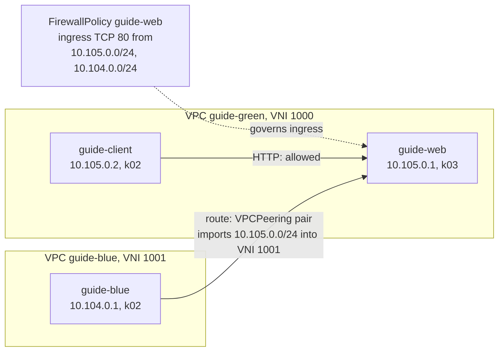

# Firewall and peering

In this guide you control who may talk to whom. You build a VPC with a web server and a client,
then tighten it step by step: a `FirewallPolicy` that admits only HTTP, a higher-priority policy
that denies one client, and the three postures `VPC.spec.defaultPolicy` can set. Then you add a
second VPC, peer the two with a pair of `VPCPeering` objects, see that the peering grants a route
but not permission, open the firewall for the peer, and revoke the peering to cut the traffic again.

!!! note "Automated twin"
    `TestVPCPeering` in `test/lab/livetest/vpcpeering_test.go` drives the peering path: two VPCs,
    a `VPCPeering` pair, a deny-all `FirewallPolicy` on the destination, then an allow policy for
    the peer's CIDR, with a ping checked at each step. It is the only live test that applies a
    `FirewallPolicy`. The test pins what this guide lets the allocators choose (VNIs 110 and 120,
    IPs and MACs), and it also checks that a local address shadows an overlapping imported prefix.
    No live test covers `defaultPolicy` or revocation; the guide shows both. Keep the guide and
    the test in step.

## Prerequisites

- A running lab; see [Bring up the lab](lab.md), and the `khub`, `k02` and `k03` aliases.
- [Your first VPC](first-vpc.md), for VPCs, NICs, Containers and the `ROUTES` map.

The objects live in the `default` namespace with a `guide-` prefix. The two VPCs use
`10.105.0.0/24` and `10.104.0.0/24`, which no live test and no other guide uses.

## Step 1: a VPC with no firewall policy

Create the VPC `guide-green` with no `defaultPolicy`, a web server on `k03` and a client on `k02`.
The web server's NIC carries the label `app: guide-web`, which the policies below select on:

```sh
khub apply -f - <<'EOF'
apiVersion: net.ectobase.dev/v1alpha1
kind: VPC
metadata: {name: guide-green, namespace: default}
spec: {}   # no defaultPolicy
---
apiVersion: net.ectobase.dev/v1alpha1
kind: Subnet
metadata: {name: guide-green-v4, namespace: default}
spec:
  vpcRef: {name: guide-green}
  v4Prefix: 10.105.0.0/24
---
apiVersion: net.ectobase.dev/v1alpha1
kind: NetworkInterface
metadata:
  name: guide-web
  namespace: default
  labels: {app: guide-web}
spec:
  vpcRef: {name: guide-green}
---
apiVersion: compute.ectobase.dev/v1alpha1
kind: Container
metadata: {name: guide-web, namespace: default}
spec:
  clusterName: k03
  interfaceRefs: [{name: guide-web}]
  image: busybox:1.36
  command: ["sh", "-c", "mkdir -p /www && echo hello from guide-web > /www/index.html && exec httpd -f -p 80 -h /www"]
---
apiVersion: net.ectobase.dev/v1alpha1
kind: NetworkInterface
metadata: {name: guide-client, namespace: default}
spec:
  vpcRef: {name: guide-green}
---
apiVersion: compute.ectobase.dev/v1alpha1
kind: Container
metadata: {name: guide-client, namespace: default}
spec:
  clusterName: k02
  interfaceRefs: [{name: guide-client}]
  image: busybox:1.36
  command: ["sleep", "infinity"]
EOF
```

The firewall is always on: the datapath drops any packet that no allow rule admits. With
`defaultPolicy` unset, the compiler follows Kubernetes NetworkPolicy semantics per interface and
per direction. A direction that no policy governs is open; a direction with rules admits only what
they allow. The VPC's `FirewallDefault` condition says so:

```sh
khub get vpc guide-green -o yaml
```

```text
...
status:
  conditions:
  - lastTransitionTime: "2026-10-01T09:55:10Z"
    message: 'defaultPolicy is unset: a direction no FirewallPolicy governs is open,
      a governed direction admits only what its rules allow (Kubernetes NetworkPolicy
      semantics)'
    observedGeneration: 1
    reason: PerDirection
    status: "True"
    type: FirewallDefault
  state: Ready
  vni: 1000
```

The web server gets `10.105.0.1` and the client `10.105.0.2`. No policy selects either NIC, so the
compiler makes "open" explicit: each direction ends in an allow-all pair, one per address family.
This is the rule set the node's datapath enforces:

```sh
k03 -n default get compilednic default-guide-web -o jsonpath='{.spec.firewall}{"\n"}'
```

```text
{"egress":[{"action":"Allow","cidr":"0.0.0.0/0"},{"action":"Allow","cidr":"::/0"}],"ingress":[{"action":"Allow","cidr":"0.0.0.0/0"},{"action":"Allow","cidr":"::/0"}]}
```

Both ICMP and HTTP get through:

```sh
k02 -n default exec default-guide-client -- ping -c3 -W2 10.105.0.1
k02 -n default exec default-guide-client -- wget -q -O - -T 5 http://10.105.0.1/
```

```text
PING 10.105.0.1 (10.105.0.1): 56 data bytes
64 bytes from 10.105.0.1: seq=0 ttl=64 time=0.202 ms
64 bytes from 10.105.0.1: seq=1 ttl=64 time=0.139 ms
64 bytes from 10.105.0.1: seq=2 ttl=64 time=0.199 ms
...
hello from guide-web
```

## Step 2: allow only HTTP

A **FirewallPolicy** selects NICs by label and lists `ingress` and `egress` rules. Each rule
matches a peer CIDR, optionally a protocol and a destination port, and allows or denies. Admit
HTTP from the VPC's own range to the web server, and nothing else:

```sh
khub apply -f - <<'EOF'
apiVersion: net.ectobase.dev/v1alpha1
kind: FirewallPolicy
metadata: {name: guide-web, namespace: default}
spec:
  interfaceSelector: {matchLabels: {app: guide-web}}
  ingress:
  - {cidr: 10.105.0.0/24, proto: TCP, port: 80, action: Allow}
EOF
```

The policy governs the web server's ingress, so its ingress allow-all is gone. Its egress has no
rule, so egress stays open:

```sh
k03 -n default get compilednic default-guide-web -o jsonpath='{.spec.firewall}{"\n"}'
```

```text
{"egress":[{"action":"Allow","cidr":"0.0.0.0/0"},{"action":"Allow","cidr":"::/0"}],"ingress":[{"action":"Allow","cidr":"10.105.0.0/24","port":80,"proto":"TCP"}]}
```

The compiler reports the result on the NIC's `FirewallCompiled` condition, including how much of
the per-interface budget of 256 rules per address family the NIC uses:

```sh
khub get nic guide-web -o jsonpath='{.status.conditions}{"\n"}'
```

```text
[{"lastTransitionTime":"2026-10-01T09:55:10Z","message":"1 ingress and 2 egress rules; rule budget used: IPv4 2/256, IPv6 1/256","observedGeneration":1,"reason":"Compiled","status":"True","type":"FirewallCompiled"}]
```

Now ping is dropped and HTTP passes. The web server can still reach the client, because its own
egress and the client's ingress are both ungoverned:

```sh
k02 -n default exec default-guide-client -- ping -c3 -W2 10.105.0.1
k02 -n default exec default-guide-client -- wget -q -O - -T 5 http://10.105.0.1/
k03 -n default exec default-guide-web -- ping -c2 -W2 10.105.0.2
```

```text
PING 10.105.0.1 (10.105.0.1): 56 data bytes

--- 10.105.0.1 ping statistics ---
3 packets transmitted, 0 packets received, 100% packet loss
command terminated with exit code 1
hello from guide-web
PING 10.105.0.2 (10.105.0.2): 56 data bytes
64 bytes from 10.105.0.2: seq=0 ttl=64 time=0.176 ms
64 bytes from 10.105.0.2: seq=1 ttl=64 time=0.183 ms
...
```

## Step 3: deny one client

Several policies can select the same NIC. Their rules are merged into one ordered list and the
first match decides. `spec.priority` orders policies: lower wins, and an unset priority is 32768.
Block the client with a policy at priority 100:

```sh
khub apply -f - <<'EOF'
apiVersion: net.ectobase.dev/v1alpha1
kind: FirewallPolicy
metadata: {name: guide-web-block, namespace: default}
spec:
  interfaceSelector: {matchLabels: {app: guide-web}}
  priority: 100
  ingress:
  - {cidr: 10.105.0.2/32, action: Deny}
EOF
```

The deny now comes first in the web server's ingress, ahead of the allow, and HTTP from the client
times out:

```sh
k03 -n default get compilednic default-guide-web -o jsonpath='{.spec.firewall.ingress}{"\n"}'
k02 -n default exec default-guide-client -- wget -q -O - -T 5 http://10.105.0.1/
```

```text
[{"action":"Deny","cidr":"10.105.0.2/32"},{"action":"Allow","cidr":"10.105.0.0/24","port":80,"proto":"TCP"}]
wget: download timed out
command terminated with exit code 1
```

Remove the block before going on:

```sh
khub delete firewallpolicy guide-web-block
```

## Step 4: change the default posture

`VPC.spec.defaultPolicy` decides what happens to traffic no rule matches, on every NIC of the VPC.
Set it to `Deny`:

```sh
khub patch vpc guide-green --type=merge -p '{"spec":{"defaultPolicy":"Deny"}}'
khub get vpc guide-green -o jsonpath='{.status.conditions[?(@.type=="FirewallDefault")].reason}: {.status.conditions[?(@.type=="FirewallDefault")].message}{"\n"}'
```

```text
vpc.net.ectobase.dev/guide-green patched
Deny: traffic no firewall rule matches is dropped, in both directions, on every interface
```

Ungoverned directions are no longer open. The client has no rule at all, so its compiled firewall
is empty, which the datapath treats as deny-all. The web server keeps only its HTTP allow. The
client cannot reach the server even on port 80, because its own egress drops the request:

```sh
k02 -n default get compilednic default-guide-client -o jsonpath='{.spec.firewall}{"\n"}'
k03 -n default get compilednic default-guide-web -o jsonpath='{.spec.firewall}{"\n"}'
k02 -n default exec default-guide-client -- wget -q -O - -T 5 http://10.105.0.1/
```

```text
{}
{"ingress":[{"action":"Allow","cidr":"10.105.0.0/24","port":80,"proto":"TCP"}]}
wget: download timed out
command terminated with exit code 1
```

Under `Deny`, a flow needs an allow on both ends: the sender's egress and the receiver's ingress.
Label the client and give it an egress rule for HTTP to the server:

```sh
khub label nic guide-client app=guide-client
khub apply -f - <<'EOF'
apiVersion: net.ectobase.dev/v1alpha1
kind: FirewallPolicy
metadata: {name: guide-client, namespace: default}
spec:
  interfaceSelector: {matchLabels: {app: guide-client}}
  egress:
  - {cidr: 10.105.0.1/32, proto: TCP, port: 80, action: Allow}
EOF
```

```sh
k02 -n default get compilednic default-guide-client -o jsonpath='{.spec.firewall}{"\n"}'
k02 -n default exec default-guide-client -- wget -q -O - -T 5 http://10.105.0.1/
k02 -n default exec default-guide-client -- ping -c2 -W2 10.105.0.1
```

```text
{"egress":[{"action":"Allow","cidr":"10.105.0.1/32","port":80,"proto":"TCP"}]}
hello from guide-web
PING 10.105.0.1 (10.105.0.1): 56 data bytes

--- 10.105.0.1 ping statistics ---
2 packets transmitted, 0 packets received, 100% packet loss
command terminated with exit code 1
```

The web server's egress still has no rule, yet its reply got back. The firewall is stateful: the
request created a connection-tracking entry, and the reply rides it without being evaluated.

`Allow` is the opposite posture. The compiler appends an allow-all pair below every rule, in both
directions, so a rule can still deny something but anything unmatched passes. Ping works again,
even though the web server's only real rule is about HTTP:

```sh
khub patch vpc guide-green --type=merge -p '{"spec":{"defaultPolicy":"Allow"}}'
k03 -n default get compilednic default-guide-web -o jsonpath='{.spec.firewall.ingress}{"\n"}'
k02 -n default exec default-guide-client -- ping -c2 -W2 10.105.0.1
```

```text
vpc.net.ectobase.dev/guide-green patched
[{"action":"Allow","cidr":"10.105.0.0/24","port":80,"proto":"TCP"},{"action":"Allow","cidr":"0.0.0.0/0"},{"action":"Allow","cidr":"::/0"}]
PING 10.105.0.1 (10.105.0.1): 56 data bytes
64 bytes from 10.105.0.1: seq=0 ttl=64 time=0.193 ms
64 bytes from 10.105.0.1: seq=1 ttl=64 time=0.179 ms
...
```

| `defaultPolicy` | Unmatched traffic | Effect in this step |
|---|---|---|
| unset | Open in a direction no policy governs, dropped in a governed one | Ping to the web server dropped, its egress open |
| `Deny` | Dropped in both directions on every NIC | Each end needs its own allow |
| `Allow` | Passes in both directions | Only explicit `Deny` rules block |

Return to the unset posture and drop the client's policy, so that the peering steps start from
Step 2's state:

```sh
khub patch vpc guide-green --type=merge -p '{"spec":{"defaultPolicy":null}}'
khub delete firewallpolicy guide-client
```

## Step 5: a second VPC

Create `guide-blue` with one container on `k02`. It has its own VNI, so it is a separate overlay
network:

```sh
khub apply -f - <<'EOF'
apiVersion: net.ectobase.dev/v1alpha1
kind: VPC
metadata: {name: guide-blue, namespace: default}
spec: {}
---
apiVersion: net.ectobase.dev/v1alpha1
kind: Subnet
metadata: {name: guide-blue-v4, namespace: default}
spec:
  vpcRef: {name: guide-blue}
  v4Prefix: 10.104.0.0/24
---
apiVersion: net.ectobase.dev/v1alpha1
kind: NetworkInterface
metadata: {name: guide-blue, namespace: default}
spec:
  vpcRef: {name: guide-blue}
---
apiVersion: compute.ectobase.dev/v1alpha1
kind: Container
metadata: {name: guide-blue, namespace: default}
spec:
  clusterName: k02
  interfaceRefs: [{name: guide-blue}]
  image: busybox:1.36
  command: ["sleep", "infinity"]
EOF
```

```sh
khub get vpc -o 'custom-columns=NAME:.metadata.name,STATE:.status.state,VNI:.status.vni'
khub get nic -o 'custom-columns=NAME:.metadata.name,VPC:.spec.vpcRef.name,STATE:.status.state,IPS:.status.allocatedIPs'
```

```text
NAME          STATE   VNI
guide-blue    Ready   1001
guide-green   Ready   1000
NAME           VPC           STATE       IPS
guide-blue     guide-blue    Allocated   [10.104.0.1]
guide-client   guide-green   Allocated   [10.105.0.2]
guide-web      guide-green   Allocated   [10.105.0.1]
```

The blue container cannot reach the web server. This time it is not the firewall: `k02`'s route
table for VNI 1001 (`00 00 03 e9`) holds only blue's own address:

```sh
k02 -n default exec default-guide-blue -- wget -q -O - -T 5 http://10.105.0.1/
pid=$(sudo docker inspect -f '{{.State.Pid}}' clab-ectobase-k02-1)
sudo bpftool map dump pinned /proc/$pid/root/sys/fs/bpf/flowplane/ROUTES | grep -B1 -A3 '00 00 03 e9'
```

```text
wget: download timed out
command terminated with exit code 1
key:
40 00 00 00 00 00 03 e9  0a 68 00 01
value:
e9 03 00 00 fd 00 ca fe  19 14 00 00 00 00 00 00
00 00 00 01 00 00 00 00
```

## Step 6: peer the two VPCs

A **VPCPeering** is one direction of a peering: it names its own VPC, the peer VPC, and the
prefixes it exposes to that peer. A peering becomes active only when the reciprocal object exists,
so both sides must consent. Create blue's side first:

```sh
khub apply -f - <<'EOF'
apiVersion: net.ectobase.dev/v1alpha1
kind: VPCPeering
metadata: {name: guide-blue-to-green, namespace: default}
spec:
  vpcRef: {name: guide-blue}
  peerVpcRef: {namespace: default, name: guide-green}
  exposedPrefixes: [10.104.0.0/24]
EOF
khub get vpcpeering guide-blue-to-green -o jsonpath='{.status}{"\n"}'
```

```text
vpcpeering.net.ectobase.dev/guide-blue-to-green created
{"message":"awaiting reciprocal peering","state":"Pending"}
```

Then green's side. Both turn `Ready`:

```sh
khub apply -f - <<'EOF'
apiVersion: net.ectobase.dev/v1alpha1
kind: VPCPeering
metadata: {name: guide-green-to-blue, namespace: default}
spec:
  vpcRef: {name: guide-green}
  peerVpcRef: {namespace: default, name: guide-blue}
  exposedPrefixes: [10.105.0.0/24]
EOF
khub get vpcpeerings -o 'custom-columns=NAME:.metadata.name,STATE:.status.state,MESSAGE:.status.message'
```

```text
vpcpeering.net.ectobase.dev/guide-green-to-blue created
NAME                  STATE   MESSAGE
guide-blue-to-green   Ready   reciprocal peering present
guide-green-to-blue   Ready   reciprocal peering present
```

For each `Ready` peering, the compiler adds an import to every NIC of the local VPC: the peer's VNI
and the prefixes the peer exposes. What green exposes is what blue's NIC imports, and the reverse:

```sh
k02 -n default get compilednic default-guide-blue -o jsonpath='{.spec.peerImports}{"\n"}'
k03 -n default get compilednic default-guide-web -o jsonpath='{.spec.peerImports}{"\n"}'
```

```text
[{"importPrefixes":["10.105.0.0/24"],"peerVni":1000}]
[{"importPrefixes":["10.104.0.0/24"],"peerVni":1001}]
```

Each node's agent subscribes to the peer VNI on the route bus and copies every peer route inside
the imported prefixes into the local VNI's table. On `k02`, VNI 1001 now also holds the web
server's address:

```sh
sudo bpftool map dump pinned /proc/$pid/root/sys/fs/bpf/flowplane/ROUTES | grep -B1 -A3 '00 00 03 e9'
```

```text
key:
40 00 00 00 00 00 03 e9  0a 68 00 01
value:
e9 03 00 00 fd 00 ca fe  19 14 00 00 00 00 00 00
00 00 00 01 00 00 00 00
key:
40 00 00 00 00 00 03 e9  0a 69 00 01
value:
e8 03 00 00 fd 00 ca fe  1a a7 00 00 00 00 00 00
00 00 00 01 00 00 00 00
```

| Bytes | Field | Imported entry |
|---|---|---|
| key 4–7 | VNI, big-endian | 1001: the table blue's packets are looked up in |
| key 8–11 | IPv4 address | `10.105.0.1`, the web server |
| value 0–3 | delivery VNI, little-endian | 1000: green's VNI |
| value 4–19 | next-hop VTEP | `fd00:cafe:1aa7::1`, `k03-1` |

A packet from blue to `10.105.0.1` matches this entry, is sent to `k03` in Geneve with VNI 1000,
and arrives in green's VNI exactly like native green traffic. The datapath has no notion of
peering; the agent only programmed a route with a different delivery VNI.

## Step 7: the firewall still decides

The route exists, but HTTP from blue still times out. The web server's ingress is governed by
`guide-web`, which admits only `10.105.0.0/24`, and blue's address is `10.104.0.1`:

```sh
k02 -n default exec default-guide-blue -- wget -q -O - -T 5 http://10.105.0.1/
```

```text
wget: download timed out
command terminated with exit code 1
```

A peering grants reachability only; permission stays with the destination's own policy. Add blue's
range to it:

```sh
khub apply -f - <<'EOF'
apiVersion: net.ectobase.dev/v1alpha1
kind: FirewallPolicy
metadata: {name: guide-web, namespace: default}
spec:
  interfaceSelector: {matchLabels: {app: guide-web}}
  ingress:
  - {cidr: 10.105.0.0/24, proto: TCP, port: 80, action: Allow}
  - {cidr: 10.104.0.0/24, proto: TCP, port: 80, action: Allow}
EOF
```

```sh
k02 -n default exec default-guide-blue -- wget -q -O - -T 5 http://10.105.0.1/
k02 -n default exec default-guide-blue -- ping -c2 -W2 10.105.0.1
```

```text
firewallpolicy.net.ectobase.dev/guide-web configured
hello from guide-web
PING 10.105.0.1 (10.105.0.1): 56 data bytes

--- 10.105.0.1 ping statistics ---
2 packets transmitted, 0 packets received, 100% packet loss
command terminated with exit code 1
```

HTTP crosses the peering; ping does not, because the policy allows only TCP port 80.

!!! warning "Known issue: peered workloads on the same node cannot reach each other"
    The blue container shares node `k02-1` with the green client, and blue cannot reach it even
    though the client's ingress is open: `k02`'s VNI 1001 table has no entry for `10.105.0.2`.
    The reflector does not send an announcement back to the agent that made it, and the agent
    builds peer imports only from routes it learned from the reflector, so an address in the peer
    VPC on the same node is not imported. Place peered workloads on different nodes until this
    is fixed. `TestVPCPeering` puts its two VPCs on different clusters and does not cover it.

## Step 8: revoke the peering

Deleting either side revokes the peering for both. Start a request loop from blue in one
terminal:

```sh
k02 -n default exec default-guide-blue -- sh -c 'for i in $(seq 1 10); do if wget -q -O /dev/null -T 1 http://10.105.0.1/; then echo "$(date +%T) ok"; else echo "$(date +%T) fail"; fi; sleep 1; done'
```

and delete green's side in another:

```sh
khub delete vpcpeering guide-green-to-blue
```

```text
10:00:50 ok
10:00:51 ok
10:00:52 ok
10:00:53 ok
10:00:54 ok
wget: download timed out
10:00:56 fail
wget: download timed out
10:00:58 fail
...
```

The delete was issued at 10:00:54, and the next request already failed. With its reciprocal gone,
blue's side is back to `Pending`. The compiler emits imports only for `Ready` peerings, so both
NICs lose theirs, and each agent withdraws the imported routes and drops the subscription:

```sh
khub get vpcpeerings -o 'custom-columns=NAME:.metadata.name,STATE:.status.state,MESSAGE:.status.message'
k02 -n default get compilednic default-guide-blue -o jsonpath='{.spec.peerImports}{"|\n"}'
k03 -n default get compilednic default-guide-web -o jsonpath='{.spec.peerImports}{"|\n"}'
```

```text
NAME                  STATE     MESSAGE
guide-blue-to-green   Pending   awaiting reciprocal peering
|
|
```

On `k03` the imported entry for `10.104.0.1` is gone from VNI 1000 as well, so neither direction
has a route left.

## What just happened



Two separate mechanisms decide whether a packet arrives. The firewall decides permission, from
`FirewallPolicy` objects and the VPC's `defaultPolicy`, compiled per NIC and enforced on both ends
of a flow. Routing decides reachability, and a VPC sees another VPC's addresses only through a
`Ready` `VPCPeering` pair. A flow across VPCs needs both.

## Cleanup

```sh
khub delete vpcpeering guide-blue-to-green
khub delete firewallpolicy guide-web
khub delete container guide-web guide-client guide-blue
khub delete networkinterface guide-web guide-client guide-blue
khub delete subnet guide-green-v4 guide-blue-v4
khub delete vpc guide-green guide-blue
```

```text
vpcpeering.net.ectobase.dev "guide-blue-to-green" deleted from default namespace
firewallpolicy.net.ectobase.dev "guide-web" deleted from default namespace
container.compute.ectobase.dev "guide-web" deleted from default namespace
container.compute.ectobase.dev "guide-client" deleted from default namespace
container.compute.ectobase.dev "guide-blue" deleted from default namespace
networkinterface.net.ectobase.dev "guide-web" deleted from default namespace
networkinterface.net.ectobase.dev "guide-client" deleted from default namespace
networkinterface.net.ectobase.dev "guide-blue" deleted from default namespace
subnet.net.ectobase.dev "guide-green-v4" deleted from default namespace
subnet.net.ectobase.dev "guide-blue-v4" deleted from default namespace
vpc.net.ectobase.dev "guide-green" deleted from default namespace
vpc.net.ectobase.dev "guide-blue" deleted from default namespace
```

After half a minute the twins and Pods are gone from both pools:

```sh
khub get compilednics,compiledcontainers -A
k02 -n default get pods,compilednics
k03 -n default get pods,compilednics
```

```text
No resources found
No resources found in default namespace.
No resources found in default namespace.
```

## Where to go next

- [Firewall](../features/firewall.md)
- [VPC peering](../features/vpc-peering.md)
- [The route bus](../architecture/route-bus.md)
