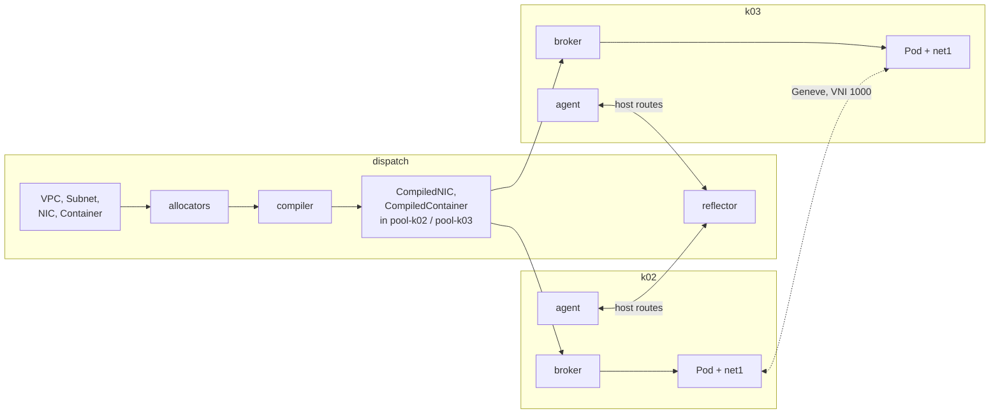

# Your first VPC

In this guide you build a private network that spans two clusters. You create a `VPC` and a
`Subnet` on the dispatch, two `NetworkInterface` objects that draw their addresses from it, and
two `Container` workloads, one on pool `k02` and one on pool `k03`. Then you ping from one
container to the other across the overlay. Along the way you see each layer the intent passes
through: the allocators' status, the compiled twins on the dispatch, the broker's copies in the
pools, the Pods the materializer creates, and the route each node programs into its eBPF maps.

!!! note "Automated twin"
    `TestPodOverlayPing` in `test/lab/livetest/pod_test.go` drives the same path: a VPC, two
    NICs and a `Container` per pool, then a ping in both directions. The test pins what this
    guide lets the allocators choose: it sets `spec.vni` and writes the VPC status by hand, pins
    each NIC's IP and MAC, sets the container's `nodeName`, and works in the `default`
    namespace. It also sends an 8000-byte ping to prove the jumbo underlay. Keep the guide and
    the test in step.

## Prerequisites

A running lab with both pools Ready; see [Bring up the lab](lab.md). The commands use the
aliases from that guide:

```sh
alias khub='kubectl --kubeconfig test/lab/build/ectobase/dispatch.kubeconfig'
alias k02='kubectl --kubeconfig test/lab/build/ectobase/k02.kubeconfig'
alias k03='kubectl --kubeconfig test/lab/build/ectobase/k03.kubeconfig'
```

You apply every ectobase object to the dispatch, through `khub`. You use `k02` and `k03` only
to look at what arrived in the pools.

## Step 1: create the namespace everywhere

The objects in this guide live in namespace `guide-first-vpc`. Create it on the dispatch and in
both pools:

```sh
khub create namespace guide-first-vpc
k02 create namespace guide-first-vpc
k03 create namespace guide-first-vpc
```

The pools need it too because of how compiled objects travel. On the dispatch, the
**compiler** (the mesh-controller) writes each compiled object into the target pool's namespace,
`pool-k02` or `pool-k03`. Each pool's **broker** copies those objects down into the pool, but
into their source namespace, `guide-first-vpc`, so that the CNI and the materializers find them
next to the workloads they describe. The broker does not create that namespace.

!!! warning "The broker does not create namespaces in the pool"
    If the namespace is missing in a pool, the broker logs an error on every sync and nothing
    for that namespace reaches the pool:

    ```text
    ERROR	Reconciler error	{"controller": "broker", ... "error": "create guide-first-vpc/guide-first-vpc-app-a: namespaces \"guide-first-vpc\" not found\ncreate container guide-first-vpc/guide-first-vpc-app-a: namespaces \"guide-first-vpc\" not found"}
    ```

    Creating the namespace is enough: the broker picks the objects up on its next sync.

## Step 2: create a VPC and a Subnet

A **VPC** is an isolation domain: an overlay network with its own **VNI** (virtual network
identifier) on the shared underlay. A **Subnet** gives the VPC an address range for its
interfaces to draw from.

```sh
khub apply -f - <<'EOF'
apiVersion: net.ectobase.dev/v1alpha1
kind: VPC
metadata:
  name: demo
  namespace: guide-first-vpc
spec:
  defaultPolicy: Allow
---
apiVersion: net.ectobase.dev/v1alpha1
kind: Subnet
metadata:
  name: demo-v4
  namespace: guide-first-vpc
spec:
  vpcRef: {name: demo}
  v4Prefix: 10.100.0.0/24
EOF
```

```text
vpc.net.ectobase.dev/demo created
subnet.net.ectobase.dev/demo-v4 created
```

The VPC sets no `spec.vni`, so the VPC controller allocates the lowest free VNI from 1000
upward. `defaultPolicy: Allow` lets through all traffic that no firewall rule matches; the
`FirewallDefault` condition states the posture in effect:

```sh
khub -n guide-first-vpc get vpc demo -o yaml
```

```text
...
status:
  conditions:
  - lastTransitionTime: "2026-10-01T07:39:50Z"
    message: 'traffic no firewall rule matches is allowed: every interface''s ingress
      and egress end with an implicit lowest-priority allow-all'
    observedGeneration: 1
    reason: Allow
    status: "True"
    type: FirewallDefault
  state: Ready
  vni: 1000
```

The Subnet is Ready. `v4Total` counts every address in the prefix; the allocator never hands
out the network and broadcast addresses.

```sh
khub -n guide-first-vpc get subnet demo-v4 -o jsonpath='{.status}{"\n"}'
```

```text
{"state":"Ready","v4Total":256}
```

## Step 3: create two network interfaces

A **NetworkInterface** (NIC) is a workload's port on the VPC. Leave out `ips` and `mac`, and the
central allocators pick both:

```sh
khub apply -f - <<'EOF'
apiVersion: net.ectobase.dev/v1alpha1
kind: NetworkInterface
metadata:
  name: app-a
  namespace: guide-first-vpc
spec:
  vpcRef: {name: demo}
---
apiVersion: net.ectobase.dev/v1alpha1
kind: NetworkInterface
metadata:
  name: app-b
  namespace: guide-first-vpc
spec:
  vpcRef: {name: demo}
EOF
```

The VPC has exactly one Subnet, so the NICs need no `subnetRef`. Each NIC is `Allocated`, with
the lowest free addresses in the Subnet and a MAC derived from its identity:

```sh
khub -n guide-first-vpc get nic \
  -o 'custom-columns=NAME:.metadata.name,STATE:.status.state,IPS:.status.allocatedIPs,MAC:.status.allocatedMAC'
```

```text
NAME    STATE       IPS            MAC
app-a   Allocated   [10.100.0.1]   02:5f:31:c3:fa:4a
app-b   Allocated   [10.100.0.2]   02:13:a2:46:22:17
```

The `status` is the authority: everything downstream reads `status.allocatedIPs` and
`status.allocatedMAC`, never `spec.ips`. A NIC on its own compiles to nothing yet, because it has
no placement. That comes from the workload that owns it.

### Pinning an address

To choose the address yourself, list it in `spec.ips`; to choose the MAC, set `spec.mac`. The
allocator checks that a pinned address is inside the Subnet and unclaimed, and reserves it. An
address outside every Subnet makes the NIC `Invalid`:

```sh
khub apply -f - <<'EOF'
apiVersion: net.ectobase.dev/v1alpha1
kind: NetworkInterface
metadata: {name: pinned, namespace: guide-first-vpc}
spec:
  vpcRef: {name: demo}
  ips: [10.100.0.50]
  mac: "02:00:00:00:00:50"
---
apiVersion: net.ectobase.dev/v1alpha1
kind: NetworkInterface
metadata: {name: outside, namespace: guide-first-vpc}
spec:
  vpcRef: {name: demo}
  ips: [10.99.0.1]
EOF
khub -n guide-first-vpc get nic \
  -o 'custom-columns=NAME:.metadata.name,STATE:.status.state,IPS:.status.allocatedIPs,MAC:.status.allocatedMAC'
```

```text
NAME      STATE       IPS             MAC
app-a     Allocated   [10.100.0.1]    02:5f:31:c3:fa:4a
app-b     Allocated   [10.100.0.2]    02:13:a2:46:22:17
outside   Invalid     <none>          <none>
pinned    Allocated   [10.100.0.50]   02:00:00:00:00:50
```

Delete the two before you go on; they are not used again:

```sh
khub -n guide-first-vpc delete nic pinned outside
```

The NIC states you can meet:

| State | Meaning | What to do |
|---|---|---|
| `Allocated` | Addresses and MAC are assigned. Only an `Allocated` NIC compiles. | Nothing. |
| `Pending` | The Subnet is not Ready yet. | Wait. |
| `Invalid` | The request cannot be met: no Subnet resolves (the VPC has none, or several and no `subnetRef`), a pinned IP is outside the Subnet or malformed, or a pinned MAC clashes. | Fix the NIC or the Subnet. |
| `Exhausted` | The Subnet has no free address. | Widen the Subnet or free an address. A freed address retries waiting NICs. |

Allocation is sticky. Editing an unrelated field does not renumber a NIC: the allocator prefers
the NIC's current address. If a NIC that has compiled later drops out of `Allocated`, its compiled
twin is kept, so the running workload keeps its last good address. To take an address away,
delete the NIC.

## Step 4: run a container on each pool

A **Container** is a container workload on the overlay. It owns its NICs through
`interfaceRefs` and carries the placement: `clusterName` names the pool. Put `app-a` on `k02` and
`app-b` on `k03`:

```sh
khub apply -f - <<'EOF'
apiVersion: compute.ectobase.dev/v1alpha1
kind: Container
metadata:
  name: app-a
  namespace: guide-first-vpc
spec:
  clusterName: k02
  interfaceRefs: [{name: app-a}]
  image: busybox:1.36
  command: ["sleep", "infinity"]
---
apiVersion: compute.ectobase.dev/v1alpha1
kind: Container
metadata:
  name: app-b
  namespace: guide-first-vpc
spec:
  clusterName: k03
  interfaceRefs: [{name: app-b}]
  image: busybox:1.36
  command: ["sleep", "infinity"]
EOF
```

The compiler now has everything it needs: a Ready VPC, `Allocated` NICs and a placement. For each
Container it writes a `CompiledContainer`, and for each NIC a `CompiledNIC`, into the target
pool's namespace on the dispatch. These are the **twins**, named `<namespace>-<name>`:

```sh
khub get compilednics,compiledcontainers -A
```

```text
NAMESPACE   NAME                                                      CREATED AT
pool-k02    compilednic.compiled.ectobase.dev/guide-first-vpc-app-a   2026-10-01T07:40:15Z
pool-k03    compilednic.compiled.ectobase.dev/guide-first-vpc-app-b   2026-10-01T07:40:15Z

NAMESPACE   NAME                                                            CREATED AT
pool-k02    compiledcontainer.compiled.ectobase.dev/guide-first-vpc-app-a   2026-10-01T07:40:15Z
pool-k03    compiledcontainer.compiled.ectobase.dev/guide-first-vpc-app-b   2026-10-01T07:40:15Z
```

A `CompiledNIC` is everything a pool needs to know about the interface, and nothing about how it
was decided. There are no Subnet or VPC references, only the resolved VNI, address, MAC and
firewall. The compiler expanded `defaultPolicy: Allow` into explicit allow-all rules:

```sh
khub -n pool-k02 get compilednic guide-first-vpc-app-a -o yaml
```

```text
...
  annotations:
    compiled.ectobase.dev/source-name: app-a
    compiled.ectobase.dev/source-namespace: guide-first-vpc
  labels:
    workload: app-a
  name: guide-first-vpc-app-a
  namespace: pool-k02
...
spec:
  clusterName: k02
  firewall:
    egress:
    - action: Allow
      cidr: 0.0.0.0/0
    - action: Allow
      cidr: ::/0
    ingress:
    - action: Allow
      cidr: 0.0.0.0/0
    - action: Allow
      cidr: ::/0
  mac: 02:5f:31:c3:fa:4a
  overlayIPs:
  - 10.100.0.1
  port: {}
  vni: 1000
```

The `source-namespace` annotation is what tells the broker where the copy goes. In `k02`, the
broker's copy has the same name and spec, in `guide-first-vpc`. Next to it is the Pod the
pod-materializer created from the `CompiledContainer`:

```sh
k02 -n guide-first-vpc get compilednics,compiledcontainers,pods -o wide
```

```text
NAME                                                      AGE
compilednic.compiled.ectobase.dev/guide-first-vpc-app-a   11s

NAME                                                            AGE
compiledcontainer.compiled.ectobase.dev/guide-first-vpc-app-a   11s

NAME                        READY   STATUS    RESTARTS   AGE   IP                   NODE    NOMINATED NODE   READINESS GATES
pod/guide-first-vpc-app-a   1/1     Running   0          11s   fd00:244:1914::87b   k02-1   <none>           <none>
```

The Pod's primary interface belongs to the cluster's own CNI (Cilium in the lab). The overlay is
a second interface: the materializer asks Multus for the `ectobase-system/flowplane-overlay`
network, and Multus calls the flowplane CNI, which reads the `CompiledNIC` and asks the node's
flowplane to attach the interface:

```sh
k02 -n guide-first-vpc get pod guide-first-vpc-app-a \
  -o jsonpath='{.metadata.annotations.k8s\.v1\.cni\.cncf\.io/networks}{"\n"}'
k02 -n guide-first-vpc exec guide-first-vpc-app-a -- ip addr show net1
k02 -n guide-first-vpc exec guide-first-vpc-app-a -- ip route
```

```text
ectobase-system/flowplane-overlay
466: net1@if467: <BROADCAST,MULTICAST,NOARP,UP,LOWER_UP,M-DOWN> mtu 8920 qdisc noqueue qlen 1000
    link/ether 00:00:00:00:00:00 brd ff:ff:ff:ff:ff:ff
    inet 10.100.0.1/32 scope global net1
       valid_lft forever preferred_lft forever
...
default dev net1 scope link
```

`net1` is a netkit device in L3 mode, which is why it shows no MAC and `NOARP`. It carries the
allocated address as a /32 and the Pod's default route. Its MTU is 8920, derived from the lab's
9000-byte underlay. `app-b` on `k03` looks the same, with `10.100.0.2`.

## Step 5: ping across the clusters

```sh
k02 -n guide-first-vpc exec guide-first-vpc-app-a -- ping -c3 10.100.0.2
```

```text
PING 10.100.0.2 (10.100.0.2): 56 data bytes
64 bytes from 10.100.0.2: seq=0 ttl=64 time=0.212 ms
64 bytes from 10.100.0.2: seq=1 ttl=64 time=0.171 ms
64 bytes from 10.100.0.2: seq=2 ttl=64 time=0.183 ms

--- 10.100.0.2 ping statistics ---
3 packets transmitted, 3 packets received, 0% packet loss
round-trip min/avg/max = 0.171/0.188/0.212 ms
```

And back:

```sh
k03 -n guide-first-vpc exec guide-first-vpc-app-b -- ping -c3 10.100.0.1
```

```text
PING 10.100.0.1 (10.100.0.1): 56 data bytes
64 bytes from 10.100.0.1: seq=0 ttl=64 time=0.257 ms
64 bytes from 10.100.0.1: seq=1 ttl=64 time=0.203 ms
64 bytes from 10.100.0.1: seq=2 ttl=64 time=0.240 ms
...
```

## Step 6: look at the route

How did `k02` know where `10.100.0.2` lives? Through the **route bus**. Each node's
**agent** (mesh-agent) asks its local flowplane which interfaces are attached and announces a
host route for each one, (VNI, overlay IP) with the node's **VTEP** as next hop, to the
**reflector** on the dispatch. The reflector relays it to every agent subscribed to that VNI, and
each agent programs it into its node's `ROUTES` map. An agent subscribes to the VNIs of the
interfaces attached on its node, which is why the route reached `k02` as soon as `app-a`
attached there.

Read `k02`'s `ROUTES` map from the host. The keys start with the VNI, so filter on 1000
(`00 00 03 e8`):

```sh
pid=$(sudo docker inspect -f '{{.State.Pid}}' clab-ectobase-k02-1)
sudo bpftool map dump pinned /proc/$pid/root/sys/fs/bpf/flowplane/ROUTES | grep -A4 '00 00 03 e8'
```

```text
40 00 00 00 00 00 03 e8  0a 64 00 01
value:
e8 03 00 00 fd 00 ca fe  19 14 00 00 00 00 00 00
00 00 00 01 00 00 00 00
key:
40 00 00 00 00 00 03 e8  0a 64 00 02
value:
e8 03 00 00 fd 00 ca fe  1a a7 00 00 00 00 00 00
00 00 00 01 00 00 00 00
```

Decoded with the layouts in `flowplane/flowplane-common/src/maps/route.rs`:

| Bytes | Field | `10.100.0.2` entry |
|---|---|---|
| key 0–3 | LPM prefix length, little-endian | `0x40` = 64 bits: 32 of VNI and 32 of address, a host route |
| key 4–7 | VNI, big-endian | 1000 |
| key 8–11 | IPv4 address | `10.100.0.2` |
| value 0–3 | next-hop VNI, little-endian | 1000 |
| value 4–19 | next-hop VTEP | `fd00:cafe:1aa7::1`, the `k03-1` node |
| value 20 | external flag | 0: an overlay peer, not the WAN |

The first entry is `app-a`'s own address, announced by `k02` itself. A packet from `app-a` to
`10.100.0.2` matches the second entry, is wrapped in Geneve with VNI 1000 and sent to
`fd00:cafe:1aa7::1` over the fabric. On `k03` the kernel's Geneve device strips the outer
header and flowplane delivers the inner packet into `app-b`'s `net1`.

## What just happened

You wrote four kinds of intent on the dispatch, and none of it mentioned a node, a VTEP or a
route. The allocators filled in the VNI, addresses and MACs; the compiler joined the NICs with
their owning Containers into per-pool twins; the brokers copied the twins down; the
materializers and the CNI turned them into Pods with an overlay interface; and the agents
exchanged host routes over the route bus.



## Cleanup

Delete the workloads first, then the NICs, then the address space:

```sh
khub -n guide-first-vpc delete containers --all
khub -n guide-first-vpc delete networkinterfaces --all
khub -n guide-first-vpc delete subnets,vpcs --all
```

```text
container.compute.ectobase.dev "app-a" deleted from guide-first-vpc namespace
container.compute.ectobase.dev "app-b" deleted from guide-first-vpc namespace
networkinterface.net.ectobase.dev "app-a" deleted from guide-first-vpc namespace
networkinterface.net.ectobase.dev "app-b" deleted from guide-first-vpc namespace
subnet.net.ectobase.dev "demo-v4" deleted from guide-first-vpc namespace
vpc.net.ectobase.dev "demo" deleted from guide-first-vpc namespace
```

The twins, the pool copies and the Pods go with them:

```sh
khub get compilednics,compiledcontainers -A
k02 -n guide-first-vpc get compilednics,compiledcontainers,pods
k03 -n guide-first-vpc get compilednics,compiledcontainers,pods
```

```text
No resources found
No resources found in guide-first-vpc namespace.
No resources found in guide-first-vpc namespace.
```

The agents withdraw the routes as well: the same `bpftool` dump on `k02` no longer has any entry
for VNI 1000. Last, delete the namespace in all three clusters:

```sh
k02 delete namespace guide-first-vpc
k03 delete namespace guide-first-vpc
khub delete namespace guide-first-vpc --wait=false
```

!!! warning "Known issue: a dispatch namespace stays Terminating"
    On the dispatch, the namespace does not finish deleting. Its contents are gone, but
    Kubernetes' namespace controller cannot list the aggregated apiserver's `compiled`,
    `compute` and `storage` types and keeps the namespace in `Terminating`:

    ```text
    message: 'Failed to delete all resource types, 7 remaining: object *v1alpha1.CompiledContainerList
      does not implement the protobuf marshalling interface and cannot be encoded
      to a protobuf message, ...'
    reason: ContentDeletionFailed
    type: NamespaceDeletionContentFailure
    ```

    The namespace holds nothing and does no harm. A cluster administrator can remove it through
    the namespace's `finalize` subresource once `khub -n guide-first-vpc get` shows nothing for
    each ectobase type. The other guides use the `default` namespace for this reason.

## Where to go next

- [VMs across clusters](vms-across-clusters.md)
- [From intent to running workload](../concepts/intent-to-running.md)
- [The route bus](../architecture/route-bus.md)
- [Attaching workloads](../architecture/attaching-workloads.md)
