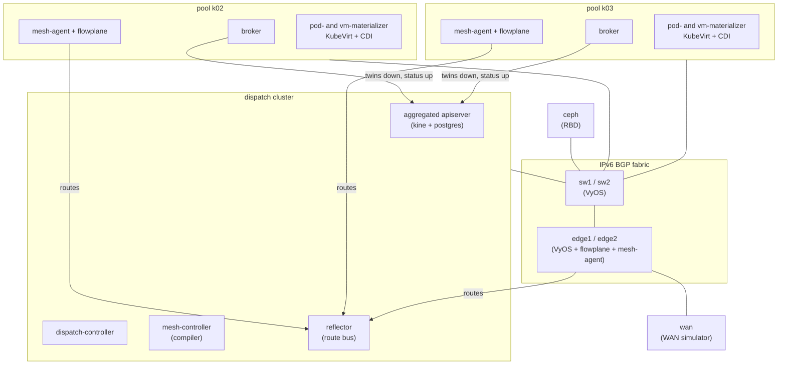

# About the guides

The guides are narrated walkthroughs that drive a real ectobase fleet from intent alone. Each one
applies objects to the dispatch, follows them down to the pools and the datapath, and shows what
you see at every step. This page describes the environment they run against, how they are
written, and the order to read them in.

## The lab

Every guide runs against **the lab**: a containerlab fabric on one Linux host that wraps three
single-node Talos Kubernetes clusters, two WAN edges, a simulated WAN and a Ceph node. The lab
CLI in `test/lab` builds it from `test/lab/lab.yaml`; [Bring up the lab](lab.md) covers that in
detail.

One cluster is the **dispatch**, the fleet control plane. The other two, `k02` and `k03`, are
**pools**: compute clusters that run the workloads, each represented on the dispatch by a
`ClusterPool`. You apply intent to the dispatch only. The pools receive compiled objects from it
and turn them into Pods, KubeVirt VMs and eBPF map entries.

| Component | Where | What it does in the guides |
|---|---|---|
| dispatch | Talos cluster `dispatch` | Serves the `net`, `compute`, `storage`, `compiled` and `platform` API groups. You apply every guide object here. |
| `k02`, `k03` | Talos clusters | Pools. Each runs a broker, a mesh-agent and flowplane, the CNI, the pod-materializer, and KubeVirt, CDI and the vm-materializer. |
| `sw1`, `sw2` | VyOS containers | A pure /128 relay: unnumbered eBGP to every node and both edges. |
| `edge1`, `edge2` | VyOS containers with sidecars | WAN edges. Each runs a flowplane sidecar in edge mode and a mesh-agent with no apiserver. They advertise the edge-owned public prefixes `192.0.2.0/24` and `2001:db8:2b::/64`. |
| `wan` | Linux container | Stands in for the internet. It routes the public prefixes back to both edges, so a test client in its network namespace sees what an outside client would. |
| `ceph` | Ceph demo container | One-OSD Ceph cluster serving RBD to every cluster through ceph-csi. |

## How the guides are written

Every command in a guide was run against the live lab, and every output block is real output,
trimmed with `...` where it is long. Generated values, such as allocated MACs, VNIs and Pod
names, will differ on your lab. Where a guide shows a raw BPF map dump, it decodes the bytes
next to it.

Each guide has an **automated twin**: a live test in `test/lab/livetest/` that drives the same
path with assertions. The guide and its twin change together. When the twin's path differs
from the guide's (for example, the test pins an address that the guide lets the allocator pick),
the guide says how.

The guides only apply and delete their own objects. Each one ends with a cleanup section that
leaves the lab as it found it.

## Reading order

Read [Bring up the lab](lab.md) first, even if your lab is already running: it explains the
kubeconfigs and inspection commands the rest assume. Then [Your first VPC](first-vpc.md), which
introduces the objects every later guide builds on. The remaining guides stand on their own.

| Guide | What you build | Automated twin |
|---|---|---|
| [Bring up the lab](lab.md) | The fabric, the three clusters, Ceph and KubeVirt | `TestClusterPoolsReady` and `TestBrokersConnectedToReflector` in `ectobase_test.go`, `TestBGPAndECMP` in `fabric_test.go` |
| [Your first VPC](first-vpc.md) | A VPC, a Subnet, two NICs and two containers pinging across pools | `TestPodOverlayPing` in `pod_test.go` |
| [VMs across clusters](vms-across-clusters.md) | A KubeVirt VM with cloud-init, reached from a container on the other pool | `TestVMOverlayConnectivity` in `vm_overlay_test.go` |
| [Expose a service to the WAN](expose-to-wan.md) | A public `IPPool` and a `LoadBalancer` with backends on both pools, reached from the WAN | `TestLbFromIntentReachesTheWan` in `lbintent_test.go` |
| [Egress through NAT](nat-egress.md) | A `NATGateway` giving two workloads egress to a WAN server | `TestNatFromIntent` in `natintent_test.go` |
| [Firewall and peering](firewall-and-peering.md) | `FirewallPolicy` objects and the three `defaultPolicy` postures, then two VPCs joined and separated by a `VPCPeering` pair | `TestVPCPeering` in `vpcpeering_test.go` |
| [Move a VM](move-a-vm.md) | A running VM with a Ceph disk moved from `k02` to `k03` by changing `spec.clusterName` | `TestPlannedMove` in `plannedmove_test.go` |
| [Fail over a cluster](failover.md) | A lost pool fenced off Ceph and the route bus, its VM rebound to the other pool on the same disk, and the fence released on recovery | `TestTier2Failover` in `tier2_test.go` |

## Where to go next

- [Bring up the lab](lab.md)
- [Your first VPC](first-vpc.md)
- [What is ectobase](../concepts/what-is-ectobase.md)
- [Fleet concepts](../concepts/fleet.md)
