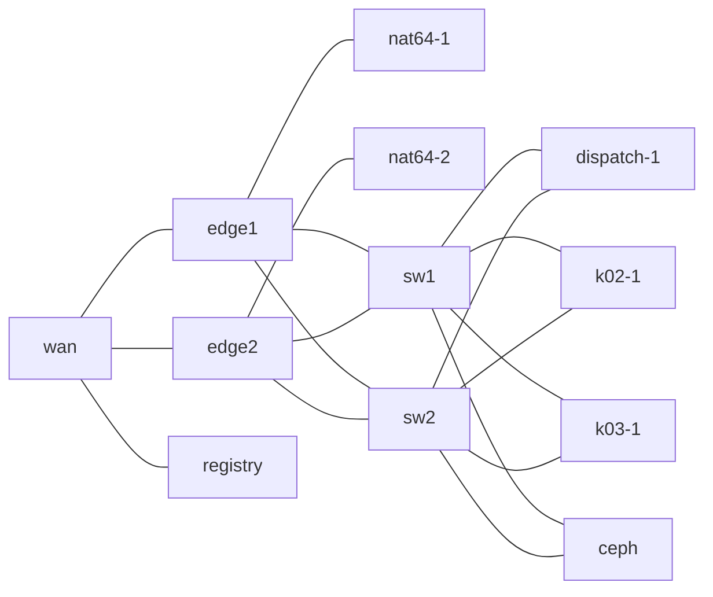
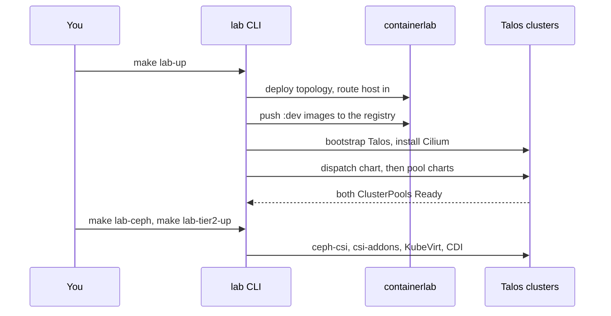

# Bring up the lab

The lab is the test environment every guide runs against: a containerlab IPv6 BGP fabric on one
Linux host, three single-node Talos Kubernetes clusters on that fabric, two WAN edges, a WAN
simulator and a Ceph node. This guide shows how to build it, what each bring-up step deploys,
and how to inspect the fabric and the clusters once it is running. The inspection output is from
a live lab; the bring-up commands are documented from the code and were not re-run for this page.

!!! note "Automated twin"
    The live suite's first tests check what this guide inspects: `TestClusterPoolsReady` and
    `TestBrokersConnectedToReflector` in `test/lab/livetest/ectobase_test.go`, and
    `TestBGPAndECMP` in `test/lab/livetest/fabric_test.go`. They check the same ClusterPool
    status and BGP state, but do not cover the bring-up itself. Change the guide and the tests
    together.

## Prerequisites

The lab drives containerlab and host networking, so it needs a Linux host with:

- the nix devShell (`nix develop`). It provides `go`, `containerlab`, `kubectl`, `helm`,
  `talosctl`, `grpcurl` and a `bpftool` new enough to render tcx attachments;
- Docker with IPv6 enabled on the containerlab management network;
- passwordless `sudo`. On NixOS the real setuid binary is `/run/wrappers/bin/sudo`; see the
  [runbook](../operations/runbook.md) if a nested `sudo` fails;
- the `rbd` kernel module loadable on the host, for the Ceph tier;
- tens of GB of free disk.

The lab is configured by `test/lab/lab.yaml`. The lab CLI reads `$LAB_CONFIG`, falling back to
`test/lab/lab.yaml` when you run it from the repository root. The file names the images and the
three clusters:

```yaml
fabric:
  as: { edge: 65000, switch: 65010, host: 65100 }
  nat64Prefix: 64:ff9b::/96
  ceph:
    enabled: true
  clusters:
    - { name: dispatch, nodes: 1 }
    - { name: k02, nodes: 1 }
    - { name: k03, nodes: 1 }
```

## Step 1: build the images

The fabric runs three kinds of image: fabric infrastructure, the Talos node image, and the six
ectobase component images.

```sh
make lab-images           # tayga, vyos and wan images for the fabric containers
make image-talos-mirror   # pull the pinned upstream Talos release and tag it for the lab
make lab-app-images       # flowplane, mesh, cni and the three dispatch images, tagged :dev
```

`make lab-up` depends on `lab-app-images`, so it rebuilds the component images for you. The lab
CLI itself never builds images: `lab up` only pushes the local `:dev` images into the fabric's
registry, and fails early if one is missing.

## Step 2: bring up the fabric and the clusters

```sh
make lab-up
```

`make lab-up` runs `sudo -E env "PATH=$PATH" go run ./test/lab up`. The `up` command
(`topology.Up` in `test/lab/topology/fabric.go`) does the following, in order:

1. Renders every template into `test/lab/build/<name>/`: the containerlab topology, the VyOS
   configs and each cluster's Talos machine configs and Cilium values.
2. Deploys the containerlab topology. Each Talos node boots from its rendered machine config.
3. Routes the host into the fabric through a veth to the `wan` container, so `kubectl` and
   `talosctl` can reach the nodes.
4. Pushes the local `:dev` images into the in-fabric registry.
5. For each cluster: bootstraps Talos, waits for the API server, installs Cilium, waits for the
   node to be Ready, and re-binds the node's DNS resolvers to the two edge loopbacks.
6. Deploys ectobase: the dispatch chart on the dispatch cluster, the pool chart on `k02` and `k03`.

`up` is done when both `ClusterPool` objects on the dispatch report Ready with their node
prefixes.

### What the deploy installs

The last step is the same two-chart install an operator runs; see
[Deploy with Helm](../operations/deploy-helm.md) for the operator's version and
`test/lab/internal/deploy/ectobase.go` for the exact sequence.

| Cluster | What lands there |
|---|---|
| dispatch | cert-manager first, because the chart creates `Issuer` and `Certificate` objects. Then `charts/ectobase-dispatch`: the aggregated apiserver with kine and postgres, `dispatch-controller`, the `mesh-controller` (the compiler) and the reflector. The `system` namespace is pre-created PodSecurity-privileged, because the aggregated apiserver runs `hostNetwork` and listens on the fabric at `:6444`. |
| dispatch | One fixture bundle per pool: a `pool-<name>` namespace, the `ClusterPool`, and the broker's RBAC and bootstrap identity. Also the WAN edges' route-bus CA. |
| `k02`, `k03` | cert-manager, the NetworkAttachmentDefinition CRD, a privileged `ectobase-system` namespace with two enrollment Secrets (the dispatch root CA and a short-lived bootstrap kubeconfig), then `charts/ectobase-pool`: the broker, mesh-agent, flowplane, the CNI and the pod-materializer. Multus goes in last. |

The bootstrap kubeconfig is used once, for the broker's first route-bus certificate request.
After that the broker talks to the dispatch over cert-manager-issued mutual TLS.

## Step 3: add Ceph and KubeVirt

The VM guides need RBD storage and KubeVirt. Both need `fabric.ceph.enabled: true`.

```sh
make lab-ceph       # Ceph pool, ceph-csi-rbd on every cluster, csi-addons on the dispatch
make lab-tier2-up   # KubeVirt, CDI and the flowplane network binding on each pool
```

`lab ceph` creates the RBD pool on the `ceph` container and installs ceph-csi on all three
clusters: the pools attach disks, and the dispatch runs the provisioner and csi-addons, which
carries out storage fences. `lab tier2 up` installs KubeVirt and CDI on `k02` and `k03`,
turns on the vm-materializer by upgrading the pool release, and gives the dispatch controller
the Ceph cluster ID it needs to fence.

!!! warning "Re-running `lab deploy`"
    `make lab-deploy` reinstalls the pool chart with its base values, which turns the
    vm-materializer off again. Run `make lab-tier2-up` after every `lab deploy`, or every VM and
    volume test fails waiting for a KubeVirt VM that is never created. The lab tool also takes the
    charts from the checkout that contains `LAB_CONFIG`, not from your working directory: to
    deploy a git worktree, point `LAB_CONFIG` at that worktree's `test/lab/lab.yaml`.

## Step 4: reach the clusters

Each cluster's kubeconfig lands at `test/lab/build/<name>/<cluster>.kubeconfig`, owned by you
even though `up` ran under `sudo`. The guides use three short aliases:

```sh
alias khub='kubectl --kubeconfig test/lab/build/ectobase/dispatch.kubeconfig'
alias k02='kubectl --kubeconfig test/lab/build/ectobase/k02.kubeconfig'
alias k03='kubectl --kubeconfig test/lab/build/ectobase/k03.kubeconfig'
```

Each kubeconfig points at the cluster's anycast API address, `fd00:cafe:<h>:1::1`, which the
node advertises over BGP only while its local API server is healthy:

```sh
grep server: test/lab/build/ectobase/*.kubeconfig
```

```text
test/lab/build/ectobase/dispatch.kubeconfig:    server: https://[fd00:cafe:2e6b:1::1]:6443
test/lab/build/ectobase/k02.kubeconfig:    server: https://[fd00:cafe:1914:1::1]:6443
test/lab/build/ectobase/k03.kubeconfig:    server: https://[fd00:cafe:1aa7:1::1]:6443
```

The `<h>` in each address is derived from a hash of the cluster name, so clusters never collide:
`2e6b` is the dispatch, `1914` is `k02` and `1aa7` is `k03`. Every node identity and API address
sits under `fd00:cafe::/32`, the one prefix the host routes into the fabric:

```sh
ip -6 route show fd00:cafe::/32
```

```text
fd00:cafe::/32 via fd00:29::1 dev ectojump metric 1024 pref medium
```

On the dispatch, the five ectobase API groups are served by the aggregated apiserver behind
`APIService` objects:

```sh
khub get apiservices | grep ectobase
```

```text
v1alpha1.compiled.ectobase.dev              system/apiserver-service   True        44h
v1alpha1.compute.ectobase.dev               system/apiserver-service   True        44h
v1alpha1.net.ectobase.dev                   system/apiserver-service   True        44h
v1alpha1.platform.ectobase.dev              system/apiserver-service   True        44h
v1alpha1.storage.ectobase.dev               system/apiserver-service   True        44h
```

The two pools are Ready. A pool's broker renews a lease on its `ClusterPool`; the lease holder is
the broker's node, and `nodePrefixes` lists the /64 each node's workloads are addressed under:

```sh
khub get clusterpools \
  -o 'custom-columns=NAME:.metadata.name,PHASE:.status.phase,LEASE:.status.lease.holderIdentity,PREFIXES:.status.nodePrefixes'
```

```text
NAME   PHASE   LEASE   PREFIXES
k02    Ready   k02-1   [fd00:cafe:1914::/64]
k03    Ready   k03-1   [fd00:cafe:1aa7::/64]
```

Each pool runs the ectobase components in `ectobase-system`. The images come from the lab's
in-fabric registry:

```sh
k02 -n ectobase-system get pods -o 'custom-columns=NAME:.metadata.name,IMAGE:.spec.containers[0].image'
```

```text
NAME                                IMAGE
dispatch-broker-5995474c5d-8kpfc    [fd00:29::5]:5000/trevex/ectobase/dispatch-broker:dev
flowplane-cni-install-hqlwh         [fd00:29::5]:5000/trevex/ectobase/cni:dev
flowplane-nls7d                     [fd00:29::5]:5000/trevex/ectobase/flowplane:dev
mesh-agent-q8nd7                    [fd00:29::5]:5000/trevex/ectobase/mesh:dev
pod-materializer-7d6df4c488-4b8dn   [fd00:29::5]:5000/trevex/ectobase/mesh:dev
vm-materializer-c6cd865b6-tszx9     [fd00:29::5]:5000/trevex/ectobase/mesh:dev
```

## Step 5: inspect the fabric

The fabric is a set of containers named `clab-<name>-<node>`:

```sh
sudo docker ps --format 'table {{.Names}}\t{{.Image}}' | sort
```

```text
clab-ectobase-ceph               quay.io/ceph/demo
clab-ectobase-ceph-net           frrouting/frr
clab-ectobase-dispatch-1         ghcr.io/trevex/ectobase/talos:container
clab-ectobase-edge1              ghcr.io/trevex/ectobase/vyos:clab
clab-ectobase-edge2              ghcr.io/trevex/ectobase/vyos:clab
clab-ectobase-flowplane-edge1    e751ffcd04cf
clab-ectobase-flowplane-edge2    e751ffcd04cf
clab-ectobase-k02-1              ghcr.io/trevex/ectobase/talos:container
clab-ectobase-k03-1              ghcr.io/trevex/ectobase/talos:container
clab-ectobase-mesh-agent-edge1   4c3c5e05956f
clab-ectobase-mesh-agent-edge2   4c3c5e05956f
clab-ectobase-nat64-1            ghcr.io/trevex/ectobase/tayga:latest
clab-ectobase-nat64-2            ghcr.io/trevex/ectobase/tayga:latest
clab-ectobase-registry           registry:2
clab-ectobase-sw1                ghcr.io/trevex/ectobase/vyos:clab
clab-ectobase-sw2                ghcr.io/trevex/ectobase/vyos:clab
clab-ectobase-wan                ghcr.io/trevex/ectobase/wan:latest
```



| Container | Role |
|---|---|
| `sw1`, `sw2` | VyOS, AS 65010. Unnumbered eBGP to both edges, every node and the Ceph node; they relay what those announce. |
| `edge1`, `edge2` | VyOS, AS 65000. They originate `::/0`, the NAT64 prefix `64:ff9b::/96` and the edge-owned public prefixes, and hand NAT64 traffic to Tayga. |
| `flowplane-edge1`, `flowplane-edge2` | flowplane in edge mode, sharing the edge's network namespace. It runs the North-South load balancer and the NAT return path. |
| `mesh-agent-edge1`, `mesh-agent-edge2` | The edge's mesh-agent. An edge has no apiserver, so the agent runs API-less and learns everything from the route bus. |
| `nat64-1`, `nat64-2` | Tayga NAT64, one per edge. |
| `wan` | The WAN simulator and the host's way into the fabric. |
| `registry` | A `registry:2` on the WAN segment at `[fd00:29::5]:5000`, holding the six `:dev` images. |
| `ceph`, `ceph-net` | The Ceph demo cluster and its FRR sidecar, on their own /64. |
| `dispatch-1`, `k02-1`, `k03-1` | The Talos nodes. Talos' embedded GoBGP advertises the node identity on `dummy0` and the anycast API address. |

A switch's BGP table shows the whole fabric: the edges' defaults and public prefixes, two /128s
per node (identity and API address) and the Ceph /64:

```sh
sudo docker exec clab-ectobase-sw1 vtysh -c 'show bgp ipv6 unicast'
```

```text
     Network          Next Hop            Metric LocPrf Weight Path
 *>  ::/0             eth1                     0             0 65000 i
 *=                   eth2                     0             0 65000 i
 *>  64:ff9b::/96     eth1                     0             0 65000 i
 *=                   eth2                     0             0 65000 i
 *>  2001:db8:2b::/64 eth1                     0             0 65000 i
 *=                   eth2                     0             0 65000 i
 *>  fd00:cafe:635::/64
                    eth6                     0             0 65100 i
 *>  fd00:cafe:1914::1/128
                    eth4                                   0 65100 i
 *>  fd00:cafe:1914:1::1/128
                    eth4                                   0 65100 i
...
 *>  fd00:ffff::e1/128
                    eth1                     0             0 65000 i
 *>  fd00:ffff::e2/128
                    eth2                     0             0 65000 i
```

The `wan` container routes everything that belongs to the fabric back over both edges, which is
what makes the edge-owned public prefixes anycast from the WAN's point of view:

```sh
sudo docker exec clab-ectobase-wan ip -6 route
```

```text
2001:db8:2b::/64 metric 1024 pref medium
	nexthop via fd00:29::11 dev br0 weight 1
	nexthop via fd00:29::12 dev br0 weight 1
...
fd00:cafe::/32 metric 1024 pref medium
	nexthop via fd00:29::11 dev br0 weight 1
	nexthop via fd00:29::12 dev br0 weight 1
fd00:ffff::/32 metric 1024 pref medium
	nexthop via fd00:29::11 dev br0 weight 1
	nexthop via fd00:29::12 dev br0 weight 1
```

The IPv4 public prefix `192.0.2.0/24` is routed the same way, via `172.29.0.11` and
`172.29.0.12`.

Each edge agent logs that it runs without an apiserver and mints its route-bus certificate from
the edge fleet's CA:

```sh
sudo docker logs clab-ectobase-mesh-agent-edge1 2>&1 | grep -E 'edge mode|minted edge'
```

```text
2026/10/01 06:59:24 edge mode: WAN edge edge1 at underlay=fd00:ffff::e1 loopback=fd00:ffff::e1, no apiserver
2026/10/01 06:59:24 minted edge route-bus leaf cn=edge1 sans=[fd00:ffff::e1] notAfter=2026-10-08T06:59:24Z
```

Ceph is a single-OSD demo cluster. `HEALTH_WARN` about missing replicas is expected:

```sh
sudo docker exec clab-ectobase-ceph ceph -s
```

```text
  cluster:
    id:     950cadf7-c357-4c8f-aa46-399f1f2a6559
    health: HEALTH_WARN
            2 pool(s) have no replicas configured
...
  services:
    mon: 1 daemons, quorum ceph-net (age 44h)
    mgr: ceph-net(active, since 44h)
    osd: 1 osds: 1 up (since 44h), 1 in (since 44h)
```

## The registry

`registry:2` on the WAN segment holds the locally built `:dev` images. `lab up` pushes them
through the registry's host-published port `127.0.0.1:5000`, under `trevex/ectobase/<name>`:

```sh
curl -s http://127.0.0.1:5000/v2/_catalog
```

```text
{"repositories":["trevex/ectobase/cni","trevex/ectobase/dispatch-apiserver","trevex/ectobase/dispatch-broker","trevex/ectobase/dispatch-controller","trevex/ectobase/flowplane","trevex/ectobase/mesh"]}
```

The deploy points the charts' image values at `[fd00:29::5]:5000/trevex/ectobase/<name>:dev`
directly, and each node's Talos config marks that host as plain HTTP. There is no `ghcr.io`
mirror: every other image is pulled from its upstream registry over the fabric's egress. The
registry's storage is `test/lab/build/<name>/registry-cache`, which survives `lab down`.

## Lab-specific datapath settings

Three settings in the lab exist because of containerlab veths. None of them applies to real
hardware.

**`FLOWPLANE_SKB_MODE` is a jumbo-MTU gate.** flowplane hands out a jumbo guest MTU only when
every uplink advertises XDP scatter-gather, or when `FLOWPLANE_SKB_MODE` is set
(`jumbo_ok` in `flowplane/flowplane/src/cli/serve.rs`). A containerlab veth advertises no XDP
features, so without the variable the guest MTU would be clamped to the 1500-derived value. The
pool chart sets it on the flowplane DaemonSet, and the containerlab topology sets it on both edge
sidecars. It selects no attach mode: forwarding runs as tcx programs, not XDP.

**The compute underlay is jumbo.** containerlab defaults every veth to MTU 9500;
`test/lab/templates/fabric.clab.yml.tmpl` sets the node-to-switch links to 9000 and every edge,
WAN, Tayga and registry link to 1500. flowplane derives the guest MTU from the uplink:
8920, which is 9000 minus 80 bytes: the outer IPv6, UDP and Geneve headers plus room for the
load balancer's Geneve option (`ENCAP_OVERHEAD_V6` in `flowplane-common`).
[Your first VPC](first-vpc.md) shows a Pod's overlay interface at 8920.

**Each edge sidecar has its own pin directory.** Both edge sidecars bind-mount the host's
`/sys/fs/bpf`, so they run with `--pin-dir /sys/fs/bpf/flowplane-edge1` and
`--pin-dir /sys/fs/bpf/flowplane-edge2`. Without the split the second sidecar would adopt the
first one's pinned maps and links. On the host you can read an edge's maps directly, for example
`sudo bpftool map dump pinned /sys/fs/bpf/flowplane-edge1/LB`.

## Debugging the datapath

flowplane's forwarding programs are tcx classifiers. The kernel's Geneve `collect_md` device,
`fp-geneve0`, strips the outer header before the programs run, so `tcpdump` sees traffic at
every layer as long as you choose the right device.

A Talos node has no shell, so inspect it from the host through the node container's PID. The
devShell's `bpftool` renders the tcx attachments (Talos ships no `bpftool`):

```sh
pid=$(sudo docker inspect -f '{{.State.Pid}}' clab-ectobase-k02-1)
sudo nsenter -t $pid -n bpftool net show dev fp-geneve0
```

```text
xdp:

tc:
fp-geneve0(297) tcx/ingress uplink_dsr_note prog_id 21446 link_id 791
fp-geneve0(297) tcx/ingress uplink_rx prog_id 21445 link_id 790
...
```

The node's pinned maps are reachable through the same PID, under `/proc/<pid>/root/sys/fs/bpf/flowplane/`:

```sh
sudo bpftool map show pinned /proc/$pid/root/sys/fs/bpf/flowplane/ROUTES
```

```text
6264: lpm_trie  name ROUTES  flags 0x1
	key 12B  value 24B  max_entries 65536  memlock 224B
```

[Your first VPC](first-vpc.md) decodes the entries of this map.

Where to capture:

- On a fabric uplink (`sudo nsenter -t $pid -n tcpdump -eni eth1`) you see the whole frame:
  outer IPv6, UDP 6081, Geneve and the inner packet.
- On `fp-geneve0` you see the decapsulated inner frame, which is what `uplink_rx` sees.
- No host-side capture shows the verdict. A delivered packet leaves through `bpf_redirect` or
  `bpf_redirect_peer` straight into another device, so capture inside the workload's network
  namespace to see the far end.

For a packet that passed the eBPF program and then vanished in the kernel, the
`skb:kfree_skb` tracepoint with its drop reason is the tool to reach for. The
`xdp:xdp_redirect*` tracepoints fire for nothing on this fabric, because no forwarding program is
XDP.

## Run the live suite

`make lab-test` runs `go test -tags live -timeout 45m -count=1 -v ./livetest/...` from
`test/lab`, under `sudo`. To run one guide's twin on its own, use `-run` from the same
directory:

```sh
cd test/lab
sudo -E env "PATH=$PATH" LAB_CONFIG=$PWD/lab.yaml \
  go test -tags live -count=1 -v -run '^TestPodOverlayPing$' ./livetest/
```

The tests skip when the fabric is not up.

## What just happened

The lab is one host running a whole fleet. `make lab-up` built the fabric and the three
clusters, then installed ectobase exactly as an operator would; `lab ceph` and `lab tier2 up`
added the storage and VM tiers.



## Tear down

These commands remove the lab. They were not run for this guide.

```sh
make lab-down         # destroy the topology; keeps build/<name>/registry-cache
make lab-down-purge   # also remove the registry cache
```

`lab down` removes the host route into the fabric, destroys the containerlab topology, releases
any RBD devices the nodes mapped on the host, and removes the edge sidecars' pinned BPF
objects. It then deletes `test/lab/build/<name>/`, except the registry cache unless you purge.
To redeploy only the ectobase charts on a running fabric, use `make lab-deploy`.

## Where to go next

- [Your first VPC](first-vpc.md)
- [About the guides](index.md)
- [Runbook](../operations/runbook.md)
- [Deploy with Helm](../operations/deploy-helm.md)
