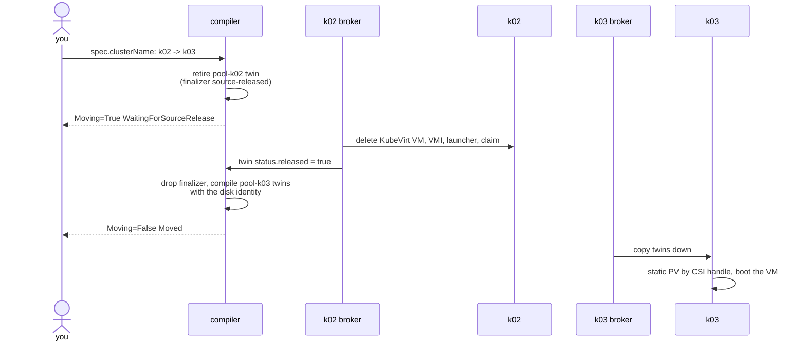

# Move a VM

In this guide you move a running VM with a persistent disk from pool `k02` to pool `k03` by
changing one field. You watch the move's safety gate at work: the source pool stops the VM and
proves it, and only then does the target start it. You check that the target boots from the same
Ceph image, identified by its CSI handle, that the data written on `k02` is still there, that the
VM keeps its address, and how long it was unreachable.

!!! note "Automated twin"
    `TestPlannedMove` in `test/lab/livetest/plannedmove_test.go` moves a running, disk-backed VM
    between the two pools. From the moment of the patch until the source holds nothing, it samples
    both clusters every second and fails if the target ever runs a virt-launcher while the source
    still has one or still holds the disk claim. It then checks the CSI handle and that the image
    is still in the Ceph pool. The test's VM has no network and a blank 1 GiB disk. This guide gives
    the VM a NIC, boots it from a cirros image imported into the disk, and adds a peer that measures
    the downtime. Keep the guide and the test in step.

## Prerequisites

- A running lab with Ceph and KubeVirt (`make lab-ceph`, `make lab-tier2-up`); see
  [Bring up the lab](lab.md), and the `khub`, `k02` and `k03` aliases.
- [VMs across clusters](vms-across-clusters.md), which introduces `VirtualMachine`, the
  vm-materializer and cloud-init.

The objects live in the `default` namespace with a `guide-` prefix, in a VPC on `10.106.0.0/24`.

The terms this guide uses: the **compiler** (the mesh-controller) lowers a `VirtualMachine` into
**twins**, `CompiledVM` and `CompiledVolumeAttachment` objects in namespace `pool-<name>` on the
dispatch; each pool's **broker** copies them down and reports status back. A **planned move** is a
change of `spec.clusterName` on a healthy pool.

## Step 1: the network and a peer

Create the VPC, the VM's NIC, and a busybox peer on `k03` that will watch the VM over the overlay:

```sh
khub apply -f - <<'EOF'
apiVersion: net.ectobase.dev/v1alpha1
kind: VPC
metadata: {name: guide-move, namespace: default}
spec: {defaultPolicy: Allow}
---
apiVersion: net.ectobase.dev/v1alpha1
kind: Subnet
metadata: {name: guide-move-v4, namespace: default}
spec:
  vpcRef: {name: guide-move}
  v4Prefix: 10.106.0.0/24
---
apiVersion: net.ectobase.dev/v1alpha1
kind: NetworkInterface
metadata: {name: guide-move-vm, namespace: default}
spec:
  vpcRef: {name: guide-move}
---
apiVersion: net.ectobase.dev/v1alpha1
kind: NetworkInterface
metadata: {name: guide-move-peer, namespace: default}
spec:
  vpcRef: {name: guide-move}
---
apiVersion: compute.ectobase.dev/v1alpha1
kind: Container
metadata: {name: guide-move-peer, namespace: default}
spec:
  clusterName: k03
  interfaceRefs: [{name: guide-move-peer}]
  image: busybox:1.36
  command: ["sleep", "infinity"]
EOF
```

Wait until both NICs are `Allocated` before you create the VM:

```sh
khub get nic -o 'custom-columns=NAME:.metadata.name,STATE:.status.state,IPS:.status.allocatedIPs,MAC:.status.allocatedMAC'
```

```text
NAME              STATE       IPS            MAC
guide-move-peer   Allocated   [10.106.0.2]   02:7c:66:13:3b:ac
guide-move-vm     Allocated   [10.106.0.1]   02:39:75:60:c5:1d
```

!!! warning "Known issue: a VM created before its NIC has a MAC never starts"
    If the `VirtualMachine` is compiled while its NIC has no MAC yet, the compiler writes the
    interface into the `CompiledVM` with an empty MAC, and the vm-materializer creates the KubeVirt
    VM without one. KubeVirt starts the VMI from that first version. When the MAC arrives a moment
    later, KubeVirt only marks the VM `RestartRequired`, and the launcher Pod never gets its overlay
    interface, because the flowplane CNI identifies a VM's NIC by that MAC:

    ```text
    plugin type="flowplane-cni" failed (add): pod default/virt-launcher-default-guide-move-vm-4k8pc
    has no "net.ectobase.dev/network-interface" annotation and no resolvable MAC: no MAC in any
    "k8s.v1.cni.cncf.io/networks" selection element
    ```

    Applying the NIC and the VM together sometimes wins the race and sometimes does not. Creating
    the NIC first, as this guide does, avoids it.

## Step 2: a VM with a persistent disk on k02

A **Volume** (`storage.ectobase.dev`) is a persistent disk: a size, a ceph-csi StorageClass, and
optionally a `bootImage` to import into it. A VM that lists the Volume in `volumeRefs` boots from
it instead of from a containerDisk.

The disk needs something worth keeping. cirros runs its cloud-init user-data once per instance, so
the user-data installs a script that runs on every boot: it appends a line to `/root/boots` on the
disk, prints the file to the serial console, and serves it on port 80.

```sh
khub apply -f - <<'EOF'
apiVersion: storage.ectobase.dev/v1alpha1
kind: Volume
metadata: {name: guide-move-disk, namespace: default}
spec:
  size: 1Gi
  storageClass: ceph-rbd
  bootImage: quay.io/kubevirt/cirros-container-disk-demo:latest
---
apiVersion: compute.ectobase.dev/v1alpha1
kind: VirtualMachine
metadata: {name: guide-move-vm, namespace: default}
spec:
  clusterName: k02
  interfaceRefs: [{name: guide-move-vm}]
  volumeRefs: [{name: guide-move-disk}]
  runStrategy: Always
  resources:
    requests: {cpu: "1", memory: 256Mi}
  cloudInit:
    userData: |
      #!/bin/sh
      cat > /etc/rc3.d/S96-guide <<'EOS'
      #!/bin/sh
      echo "booted at $(date -u +%T)" >> /root/boots
      echo "=== /root/boots ==="; cat /root/boots
      while true; do
        { printf 'HTTP/1.0 200 OK\r\n\r\n'; cat /root/boots; } | nc -l -p 80
      done &
      EOS
      chmod +x /etc/rc3.d/S96-guide
      /etc/rc3.d/S96-guide
EOF
```

```text
volume.storage.ectobase.dev/guide-move-disk created
virtualmachine.compute.ectobase.dev/guide-move-vm created
```

On `k02`, CDI imports the image into a new RBD-backed claim, and KubeVirt boots the VM from it.
The claim and the KubeVirt VM are named after the twins, `<namespace>-<vm>-<volume>` and
`<namespace>-<vm>`:

```sh
k02 -n default get dv,pvc,vm.kubevirt.io,vmi
```

```text
NAME                                                               PHASE       PROGRESS   RESTARTS   AGE
datavolume.cdi.kubevirt.io/default-guide-move-vm-guide-move-disk   Succeeded   100.0%                60s

NAME                                                          STATUS   VOLUME                                     CAPACITY   ACCESS MODES   STORAGECLASS   VOLUMEATTRIBUTESCLASS   AGE
persistentvolumeclaim/default-guide-move-vm-guide-move-disk   Bound    pvc-56b843a3-591e-4516-8959-339bd9bfdcb9   1Gi        RWO            ceph-rbd       <unset>                 60s

NAME                                               AGE   STATUS    READY
virtualmachine.kubevirt.io/default-guide-move-vm   60s   Running   True

NAME                                                       AGE   PHASE     IP    NODENAME   READY
virtualmachineinstance.kubevirt.io/default-guide-move-vm   60s   Running         k02-1      True
```

The StorageClass's reclaim policy is `Delete`, yet the PV says `Retain`. Once the claim is bound,
the pool flips its PV to `Retain` and records the PV's CSI source as the disk's identity. The
broker carries the identity up, and the dispatch copies it onto the `Volume`. From then on no pool
letting go of its claim can delete the image, and any pool can attach it by that identity:

```sh
k02 get pv
khub get volume guide-move-disk -o yaml
sudo docker exec clab-ectobase-ceph rbd ls -p replicapool
```

```text
NAME                                       CAPACITY   ACCESS MODES   RECLAIM POLICY   STATUS   CLAIM                                           STORAGECLASS   VOLUMEATTRIBUTESCLASS   REASON   AGE
pvc-56b843a3-591e-4516-8959-339bd9bfdcb9   1Gi        RWO            Retain           Bound    default/default-guide-move-vm-guide-move-disk   ceph-rbd       <unset>                          65s
...
status:
  diskIdentity:
    capacity: 1Gi
    csi:
      controllerExpandSecretRef:
        name: csi-rbd-secret
        namespace: ceph-csi
      driver: rbd.csi.ceph.com
      nodeStageSecretRef:
        name: csi-rbd-secret
        namespace: ceph-csi
      volumeAttributes:
        clusterID: 950cadf7-c357-4c8f-aa46-399f1f2a6559
        imageFeatures: layering
        imageName: csi-vol-187a5e24-25c0-4da9-8910-a7ecb44ab1cc
        journalPool: replicapool
        mapOptions: ms_mode=prefer-crc
        pool: replicapool
      volumeHandle: 0001-0024-950cadf7-c357-4c8f-aa46-399f1f2a6559-0000000000000002-187a5e24-25c0-4da9-8910-a7ecb44ab1cc
csi-vol-187a5e24-25c0-4da9-8910-a7ecb44ab1cc
```

Do not move a VM before `status.diskIdentity` is set. Until it is, no identity can reach the target,
which would provision a blank disk of its own.

The guest has booted and written its first line. Read it from the console and over the overlay:

```sh
L=$(k02 -n default get pods -l vm.kubevirt.io/name=default-guide-move-vm -o name)
k02 -n default logs $L -c guest-console-log | grep -E 'Lease of|boots|booted at'
k03 -n default exec default-guide-move-peer -- wget -q -O - -T 5 http://10.106.0.1/
```

```text
Lease of 10.106.0.1 obtained, lease time 268435455
=== /root/boots ===
booted at 10:16:40
booted at 10:16:40
```

## Step 3: start watching

A move takes well under a minute, so start two observers before you trigger it. In one terminal,
ping the VM from the peer once a second and log the result:

```sh
k03 -n default exec default-guide-move-peer -- sh -c 'for i in $(seq 1 80); do if ping -c1 -W1 10.106.0.1 >/dev/null; then echo "$(date +%T) up"; else echo "$(date +%T) down"; fi; sleep 1; done'
```

In another, sample both pools once a second. Save this as `watch-move.sh` and run it from the
repository root. Shell aliases do not reach scripts, so it defines its own `khub`, `k02` and `k03`:

```sh
#!/usr/bin/env bash
khub() { kubectl --kubeconfig test/lab/build/ectobase/dispatch.kubeconfig "$@"; }
k02() { kubectl --kubeconfig test/lab/build/ectobase/k02.kubeconfig "$@"; }
k03() { kubectl --kubeconfig test/lab/build/ectobase/k03.kubeconfig "$@"; }
# The CompiledVM twin in pool-<pool>: live, retired (deleting), and whether it is released.
twin() { khub -n pool-$1 get compiledvm default-guide-move-vm -o jsonpath='{.metadata.deletionTimestamp}|{.status.released}' 2>/dev/null | awk -F'|' '{ s="live"; if ($1!="") s="retired"; if ($2=="true") s=s",released"; print s }' || true; }
for i in $(seq 1 ${1:-120}); do
  t=$(date -u +%T)
  mv=$(khub get vm guide-move-vm -o jsonpath='{.status.conditions[?(@.type=="Moving")].reason}' 2>/dev/null)
  a=$(twin k02); b=$(twin k03)
  l2=$(k02 -n default get pods -l vm.kubevirt.io/name=default-guide-move-vm --no-headers 2>/dev/null | awk '{print $3}' | head -1)
  l3=$(k03 -n default get pods -l vm.kubevirt.io/name=default-guide-move-vm --no-headers 2>/dev/null | awk '{print $3}' | head -1)
  p2=$(k02 -n default get pvc default-guide-move-vm-guide-move-disk --no-headers 2>/dev/null | awk '{print $2}')
  p3=$(k03 -n default get pvc default-guide-move-vm-guide-move-disk --no-headers 2>/dev/null | awk '{print $2}')
  printf '%s  %-23s  %-16s  %-17s  %-8s  %-16s  %-17s  %s\n' "$t" "${mv:--}" "${a:--}" "${l2:--}" "${p2:--}" "${b:--}" "${l3:--}" "${p3:--}"
  sleep 1
done
```

Each line shows the time, the VM's `Moving` reason, then for `k02` and then `k03`: the
`CompiledVM` twin, the virt-launcher Pod's status and the disk claim's status.

## Step 4: move the VM

A move is an edit of `spec.clusterName`. There is no move object:

```sh
khub patch vm guide-move-vm --type=merge -p '{"spec":{"clusterName":"k03"}}'
khub get vm guide-move-vm -o jsonpath='{.status.conditions[?(@.type=="Moving")]}{"\n"}'
```

```text
virtualmachine.compute.ectobase.dev/guide-move-vm patched
{"lastTransitionTime":"2026-10-01T10:17:36Z","message":"waiting for pool(s) k02 to release the VM before it starts on k03","reason":"WaitingForSourceRelease","status":"True","type":"Moving"}
```

The compiler did not write anything into `pool-k03`. It retired the source twin instead: it added
the finalizer `compiled.ectobase.dev/source-released` and deleted the twin, so the twin stays
visible on the dispatch, terminating, until the source pool proves the VM is gone:

```sh
khub -n pool-k02 get compiledvm default-guide-move-vm -o yaml
```

```text
...
  deletionTimestamp: "2026-10-01T10:17:36Z"
  finalizers:
  - compiled.ectobase.dev/source-released
...
```

The order matters because nothing below ectobase prevents two writers. `ReadWriteOnce` is enforced
per cluster, and the lab's RBD images carry only the `layering` feature, so Ceph would let a second
pool attach the image while the first still runs the guest.

## Step 5: follow the handshake

The watch loop shows the whole move:

```text
10:17:31  -                        live              Running            Bound     -                 -                  -
...
10:17:35  -                        live              Running            Bound     -                 -                  -
10:17:37  WaitingForSourceRelease  retired           Terminating        Terminating  -                 -                  -
...
10:17:47  WaitingForSourceRelease  retired           Terminating        Terminating  -                 -                  -
10:17:48  WaitingForSourceRelease  retired           -                  -         -                 -                  -
10:17:49  WaitingForSourceRelease  retired           -                  -         -                 -                  -
10:17:51  WaitingForSourceRelease  retired           -                  -         -                 -                  -
10:17:52  Moved                    -                 -                  -         live              ContainerCreating  Bound
...
10:18:00  Moved                    -                 -                  -         live              ContainerCreating  Bound
10:18:01  Moved                    -                 -                  -         live              Running            Bound
```

1. At 10:17:37, the source tears down. `k02`'s broker treats the terminating twin as no longer
   wanted and deletes its downstream copy. The KubeVirt VM, the VMI and the virt-launcher follow,
   and the disk claim goes too. Before the claim is released, the PV is already `Retain`, so the
   image survives.
2. At 10:17:48, the source has let go. Nothing of the VM is left on `k02`: no KubeVirt VM, no
   VMI, no launcher, no claim. The broker checks every 5 seconds while a release is pending; once
   it finds nothing it sets `status.released: true` on the twin.
3. At 10:17:51, the gate opens. A controller on the dispatch drops the finalizer from a released
   twin, and the twin disappears. The flag and the twin vanish within the same second, so a
   one-second poll rarely catches `released`; the twin disappearing is the sign. The compiler
   then writes the `CompiledVM` and its attachment into `pool-k03` and sets `Moving` to `Moved`.
4. At 10:17:52, the target starts. `k03`'s broker copies the twins down, the claim binds at once
   (there is nothing to import), and the launcher is `Running` 9 seconds later.

At no sample did both pools hold a launcher or a claim at the same time. That is the property
`TestPlannedMove` asserts.

## Step 6: the same disk on k03

The VM's status records where it runs now:

```sh
khub get vm guide-move-vm -o yaml
```

```text
...
status:
  conditions:
  - lastTransitionTime: "2026-10-01T10:17:51Z"
    message: running on pool k03
    reason: Moved
    status: "False"
    type: Moving
  placement:
    clusterName: k03
    nodeName: k03-1
    nodePrefix: fd00:cafe:1aa7::/64
```

The attachment twin the compiler wrote for `k03` carries the identity recorded on the `Volume`:

```sh
khub -n pool-k03 get compiledvolumeattachment default-guide-move-vm-guide-move-disk \
  -o jsonpath='{.spec}' | python3 -m json.tool
```

```text
{
    "boot": true,
    "bootImage": "quay.io/kubevirt/cirros-container-disk-demo:latest",
    "clusterName": "k03",
    "diskIdentity": {
        "capacity": "1Gi",
        "csi": {
...
            "volumeHandle": "0001-0024-950cadf7-c357-4c8f-aa46-399f1f2a6559-0000000000000002-187a5e24-25c0-4da9-8910-a7ecb44ab1cc"
        }
    },
...
```

An attachment with an identity and no `DataVolume` of its own is a disk that moved in. So `k03` has
no `DataVolume`, and no import ran. The volume-materializer created a static PV that replays the
identity, pre-bound to the claim, with the same `volumeHandle` as the PV on `k02`. Ceph still holds
exactly one image:

```sh
k03 -n default get vm.kubevirt.io,vmi,dv,pvc
k03 get pv -o 'custom-columns=NAME:.metadata.name,RECLAIM:.spec.persistentVolumeReclaimPolicy,CLAIM:.spec.claimRef.name,HANDLE:.spec.csi.volumeHandle'
sudo docker exec clab-ectobase-ceph rbd ls -p replicapool
```

```text
NAME                                               AGE   STATUS    READY
virtualmachine.kubevirt.io/default-guide-move-vm   73s   Running   True

NAME                                                       AGE   PHASE     IP    NODENAME   READY
virtualmachineinstance.kubevirt.io/default-guide-move-vm   72s   Running         k03-1      True

NAME                                                          STATUS   VOLUME                                                   CAPACITY   ACCESS MODES   STORAGECLASS   VOLUMEATTRIBUTESCLASS   AGE
persistentvolumeclaim/default-guide-move-vm-guide-move-disk   Bound    ectobase-default-default-guide-move-vm-guide-move-disk   1Gi        RWO            ceph-rbd       <unset>                 73s
NAME                                                     RECLAIM   CLAIM                                   HANDLE
ectobase-default-default-guide-move-vm-guide-move-disk   Retain    default-guide-move-vm-guide-move-disk   0001-0024-950cadf7-c357-4c8f-aa46-399f1f2a6559-0000000000000002-187a5e24-25c0-4da9-8910-a7ecb44ab1cc
csi-vol-187a5e24-25c0-4da9-8910-a7ecb44ab1cc
```

The guest's boot log proves it is the same disk: the line written on `k02` is still there, followed
by the boot on `k03`. The VM kept its address and MAC, because allocations have no pool dimension,
so the peer reaches it at `10.106.0.1` as before:

```sh
L=$(k03 -n default get pods -l vm.kubevirt.io/name=default-guide-move-vm -o name)
k03 -n default logs $L -c guest-console-log | grep -E 'Lease of|boots|booted at'
k03 -n default exec default-guide-move-peer -- wget -q -O - -T 5 http://10.106.0.1/
```

```text
Lease of 10.106.0.1 obtained, lease time 268435455
=== /root/boots ===
booted at 10:16:40
booted at 10:18:05
booted at 10:16:40
booted at 10:18:05
```

And `k02` keeps nothing of the VM:

```sh
k02 -n default get vm.kubevirt.io,vmi,pods,pvc
k02 get pv | grep guide || echo "no PV on k02"
```

```text
No resources found in default namespace.
no PV on k02
```

## Step 7: the downtime

The peer's ping log from Step 3:

```text
10:17:35 up
10:17:36 up
10:17:38 down
...
10:18:04 down
10:18:06 up
10:18:07 up
```

The VM was unreachable for about 30 seconds. A planned move is a cold restart: the guest shuts down
on the source and boots again on the target, and open connections are reset. In this run the time
split as follows:

| Phase | From the watch loop | Duration |
|---|---|---|
| Source teardown: VM, VMI, launcher, claim | 10:17:36 to 10:17:48 | 12 s |
| Release seen, gate opens, twins written to `pool-k03` | 10:17:48 to 10:17:52 | 4 s |
| Claim bound, launcher created and started | 10:17:52 to 10:18:01 | 9 s |
| Guest boot to its network (`booted at 10:18:05`) | 10:18:01 to 10:18:06 | 5 s |

cirros boots in seconds even under the lab's software emulation; a larger guest makes the last row
dominate.

## What just happened



## Cleanup

```sh
khub delete virtualmachine guide-move-vm
khub delete container guide-move-peer
khub delete volume guide-move-disk
khub delete networkinterface guide-move-vm guide-move-peer
khub delete subnet guide-move-v4
khub delete vpc guide-move
```

```text
virtualmachine.compute.ectobase.dev "guide-move-vm" deleted from default namespace
container.compute.ectobase.dev "guide-move-peer" deleted from default namespace
volume.storage.ectobase.dev "guide-move-disk" deleted from default namespace
networkinterface.net.ectobase.dev "guide-move-vm" deleted from default namespace
networkinterface.net.ectobase.dev "guide-move-peer" deleted from default namespace
subnet.net.ectobase.dev "guide-move-v4" deleted from default namespace
vpc.net.ectobase.dev "guide-move" deleted from default namespace
```

Deleting the VM leaves the image alone, since every PV is `Retain`. Deleting the `Volume` reclaims
it: the `Volume`'s finalizer `storage.ectobase.dev/disk` holds it until no attachment references
it, then the dispatch deletes the image through the CSI driver. Within half a minute the Ceph pool
is empty and nothing is left in either pool:

```sh
sudo docker exec clab-ectobase-ceph rbd ls -p replicapool
khub get compiledvms,compiledvolumeattachments,compilednics,compiledcontainers -A
k03 get pv | grep guide || echo "no PV on k03"
```

```text
No resources found
no PV on k03
```

`rbd ls` prints nothing for an empty pool.

## Where to go next

- [Moving a VM between clusters](../architecture/vm-moves.md)
- [Storage and VMs](../architecture/storage-and-vms.md)
- [Fail over a cluster](failover.md)
