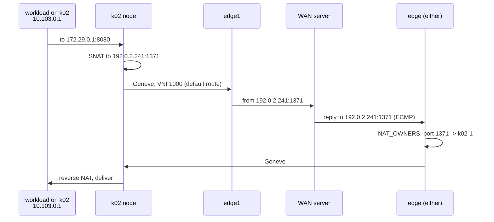

# Egress through NAT

In this guide you give a VPC's workloads outbound access to the WAN through a shared public
address. You create a `NATGateway` that draws its address from a public `IPPool`, run a workload
on each pool, and have both fetch a page from a server on the WAN side. The server sees one
public address, with each workload's connections in its own port range. Then you look at how
the reply finds its way back: the port blocks each WAN edge learned over the route bus.

!!! note "Automated twin"
    `TestNatFromIntent` in `test/lab/livetest/natintent_test.go` drives the same path: an
    `IPPool`, a `NATGateway`, a guest `Container`, and a `wget` from the guest to a server in the
    `wan` container's network namespace. The test runs one guest, pins the public address
    (`192.0.2.40`) and uses 8-port blocks so its assertions are exact; it also pins the VNI and
    the guest's IP and MAC. This guide runs a guest on each pool, lets the gateway claim its
    address, and keeps the default block size. Keep the guide and the test in step.

## Prerequisites

- A running lab; see [Bring up the lab](lab.md), and the `khub`, `k02` and `k03` aliases.
- [Your first VPC](first-vpc.md), for VPCs, NICs and Containers.
- [Expose a service to the WAN](expose-to-wan.md) introduces `IPPool` and `IPAllocation`; this
  guide uses them the same way.

The objects live in the `default` namespace with a `guide-` prefix. The pool `192.0.2.240/28` is
a slice of the edge-owned public prefix `192.0.2.0/24` that no live test uses.

## Step 1: create the gateway

A **NATGateway** gives every NIC in one VPC egress through source NAT. Each source address gets a
deterministic block of ports on a public address, `portsPerSource` ports wide (1024 by default).
The public addresses come from `poolRef`, which must be a `public` pool, because the WAN has to
route replies back to them.

```sh
khub apply -f - <<'EOF'
apiVersion: net.ectobase.dev/v1alpha1
kind: VPC
metadata: {name: guide-egress, namespace: default}
spec: {defaultPolicy: Allow}
---
apiVersion: net.ectobase.dev/v1alpha1
kind: Subnet
metadata: {name: guide-egress-v4, namespace: default}
spec:
  vpcRef: {name: guide-egress}
  v4Prefix: 10.103.0.0/24
---
apiVersion: net.ectobase.dev/v1alpha1
kind: IPPool
metadata: {name: guide-egress-pool, namespace: default}
spec:
  type: public
  v4Prefix: 192.0.2.240/28
---
apiVersion: net.ectobase.dev/v1alpha1
kind: NATGateway
metadata: {name: guide-egress, namespace: default}
spec:
  vpcRef: {name: guide-egress}
  poolRef: {name: guide-egress-pool}
EOF
```

```text
vpc.net.ectobase.dev/guide-egress created
subnet.net.ectobase.dev/guide-egress-v4 created
ippool.net.ectobase.dev/guide-egress-pool created
natgateway.net.ectobase.dev/guide-egress created
```

The gateway is Ready but holds nothing yet. It claims addresses on demand, when there are sources
to give blocks to:

```sh
khub get natgateway guide-egress -o jsonpath='{.status}{"\n"}'
khub get ipallocations
```

```text
{"state":"Ready"}
No resources found in default namespace.
```

To use particular addresses, list them in `spec.publicIPs`: with a `poolRef` set, each entry is a
pin inside the pool that the gateway must hold, the same way `LoadBalancer.spec.ip` pins a
load-balancer address.

## Step 2: run a workload on each pool

```sh
khub apply -f - <<'EOF'
apiVersion: net.ectobase.dev/v1alpha1
kind: NetworkInterface
metadata: {name: guide-egress-k02, namespace: default}
spec:
  vpcRef: {name: guide-egress}
---
apiVersion: compute.ectobase.dev/v1alpha1
kind: Container
metadata: {name: guide-egress-k02, namespace: default}
spec:
  clusterName: k02
  interfaceRefs: [{name: guide-egress-k02}]
  image: busybox:1.36
  command: ["sleep", "infinity"]
---
apiVersion: net.ectobase.dev/v1alpha1
kind: NetworkInterface
metadata: {name: guide-egress-k03, namespace: default}
spec:
  vpcRef: {name: guide-egress}
---
apiVersion: compute.ectobase.dev/v1alpha1
kind: Container
metadata: {name: guide-egress-k03, namespace: default}
spec:
  clusterName: k03
  interfaceRefs: [{name: guide-egress-k03}]
  image: busybox:1.36
  command: ["sleep", "infinity"]
EOF
```

As soon as the NICs have addresses, the gateway claims a public address and hands each source a
block. The bounds in the status are inclusive:

```sh
khub get natgateway guide-egress -o yaml
khub get ipallocations
```

```text
...
status:
  allocations:
  - portMax: 2047
    portMin: 1024
    publicIP: 192.0.2.241
    source: 10.103.0.1
  - portMax: 3071
    portMin: 2048
    publicIP: 192.0.2.241
    source: 10.103.0.2
  state: Ready
NAME                            CREATED AT
guide-egress-pool-192-0-2-241   2026-10-01T07:52:55Z
```

One address carries both sources. When every block on the addresses the gateway holds is taken,
it claims one more from the pool. It never gives an address back while it exists, because a
source still using a block would be re-NATed mid-flow; the addresses are released when the
gateway is deleted.

The compiler writes each source's block into its NIC's `CompiledNIC`, which is how the node
learns it:

```sh
k02 -n default get compilednic default-guide-egress-k02 -o jsonpath='{.spec.nat}{"\n"}'
```

```text
[{"natIP":"192.0.2.241","portMax":2047,"portMin":1024,"sourceIP":"10.103.0.1"}]
```

## Step 3: reach a server on the WAN

Start a throwaway HTTP server in the `wan` container's network namespace, on the WAN bridge
address `172.29.0.1`. `-vv` makes busybox `httpd` log each client's address and port:

```sh
sudo docker run -d --rm --name guide-nat-wan-httpd --network container:clab-ectobase-wan \
  busybox:latest sh -c 'mkdir -p /www && echo hello from the WAN > /www/index.html && exec httpd -f -vv -p 8080 -h /www'
```

Fetch the page from both workloads:

```sh
k02 -n default exec default-guide-egress-k02 -- wget -q -O - -T 5 http://172.29.0.1:8080/
k03 -n default exec default-guide-egress-k03 -- wget -q -O - -T 5 http://172.29.0.1:8080/
```

```text
hello from the WAN
hello from the WAN
```

The server saw both requests come from `192.0.2.241`, the `k02` workload's from a port in
1024–2047 and the `k03` workload's from a port in 2048–3071:

```sh
sudo docker logs guide-nat-wan-httpd 2>&1
```

```text
[::ffff:192.0.2.241]:1371: GET /
[::ffff:192.0.2.241]:1371: response:200
[::ffff:192.0.2.241]:2669: GET /
[::ffff:192.0.2.241]:2669: response:200
```

## Step 4: follow the packets

**Outbound**, the translation happens on the workload's own node. The node's agent programs the
source's block into its local flowplane, and imports the edges' default route into the VPC,
because the NIC has a NAT allocation. On `k02` the VPC's VNI (1000) now has a default route next
to the two host routes:

```sh
pid=$(sudo docker inspect -f '{{.State.Pid}}' clab-ectobase-k02-1)
sudo bpftool map dump pinned /proc/$pid/root/sys/fs/bpf/flowplane/ROUTES | grep -A4 '00 00 03 e8'
```

```text
...
key:
20 00 00 00 00 00 03 e8  00 00 00 00
value:
e8 03 00 00 fd 00 ff ff  00 00 00 00 00 00 00 00
00 00 00 e1 01 00 00 00
```

The prefix length is 32, the VNI's bits only, so this is `0.0.0.0/0` in VNI 1000. The next hop
is `fd00:ffff::e1`, edge1's loopback, and the external flag (`01`) marks it as WAN egress, which
is where the source NAT applies. The node rewrites the source to `192.0.2.241` and a port in the
source's block, wraps the packet in Geneve and sends it to the edge, which forwards it to the WAN.

**The reply** is addressed to `192.0.2.241`. The WAN routes the public prefix to both edges with
equal cost, so it can arrive at either one, and the edge must know which node owns that port.
Each node's agent announces its sources' blocks on the route bus, and every edge's agent programs
them into a longest-prefix-match trie keyed on address and port:

```sh
sudo bpftool map dump pinned /sys/fs/bpf/flowplane-edge1/NAT_OWNERS
```

```text
key:
26 00 00 00 c0 00 02 f1  04 00
value:
fd 00 ca fe 19 14 00 00  00 00 00 00 00 00 00 01
e8 03 00 00 00 04 00 08
key:
26 00 00 00 c0 00 02 f1  08 00
value:
fd 00 ca fe 1a a7 00 00  00 00 00 00 00 00 00 01
e8 03 00 00 00 08 00 0c
Found 2 elements
```

| Bytes | Field | First entry |
|---|---|---|
| key 0–3 | LPM prefix length, little-endian | `0x26` = 38: 32 bits of address and the top 6 bits of the port |
| key 4–7 | NAT address | `192.0.2.241` |
| key 8–9 | port, big-endian | 1024; with 6 significant bits it covers 1024–2047 |
| value 0–15 | owner's VTEP | `fd00:cafe:1914::1`, `k02-1` |
| value 16–19 | VNI, little-endian | 1000 |
| value 20–23 | port range, little-endian, end exclusive | 1024 to 2048 |

The second entry gives 2048–3071 to `k03-1`. A block becomes the fewest aligned prefixes that
cover it; a 1024-port block aligned on 1024 is one. `edge2` holds the same two entries. The edge
that receives the reply looks up the destination address and port, sends the packet to the owning
node in Geneve, and that node reverses the translation and delivers it to the workload.

## What just happened



The `NATGateway` and two Containers were the whole input. The gateway claimed an address from the
pool and gave each source a block; the compiler put each block in its NIC's twin; each node
translated its own sources and announced their blocks; and both edges learned every block, so
the reply could come back through either.

## Cleanup

```sh
sudo docker rm -f guide-nat-wan-httpd
khub delete container guide-egress-k02 guide-egress-k03
khub delete networkinterface guide-egress-k02 guide-egress-k03
khub delete natgateway guide-egress
khub get ipallocations
khub delete ippool guide-egress-pool
khub delete subnet guide-egress-v4
khub delete vpc guide-egress
```

```text
guide-nat-wan-httpd
container.compute.ectobase.dev "guide-egress-k02" deleted from default namespace
container.compute.ectobase.dev "guide-egress-k03" deleted from default namespace
networkinterface.net.ectobase.dev "guide-egress-k02" deleted from default namespace
networkinterface.net.ectobase.dev "guide-egress-k03" deleted from default namespace
natgateway.net.ectobase.dev "guide-egress" deleted from default namespace
No resources found in default namespace.
ippool.net.ectobase.dev "guide-egress-pool" deleted from default namespace
subnet.net.ectobase.dev "guide-egress-v4" deleted from default namespace
vpc.net.ectobase.dev "guide-egress" deleted from default namespace
```

The address went with the gateway. Within half a minute both edges have dropped the blocks and
the pools have no workloads left:

```sh
sudo bpftool map dump pinned /sys/fs/bpf/flowplane-edge1/NAT_OWNERS | tail -1
sudo bpftool map dump pinned /sys/fs/bpf/flowplane-edge2/NAT_OWNERS | tail -1
k02 -n default get pods,compilednics
k03 -n default get pods,compilednics
```

```text
Found 0 elements
Found 0 elements
No resources found in default namespace.
No resources found in default namespace.
```

## Where to go next

- [NAT](../features/nat.md)
- [North-South at the edge](../features/ns-edge.md)
- [Expose a service to the WAN](expose-to-wan.md)
