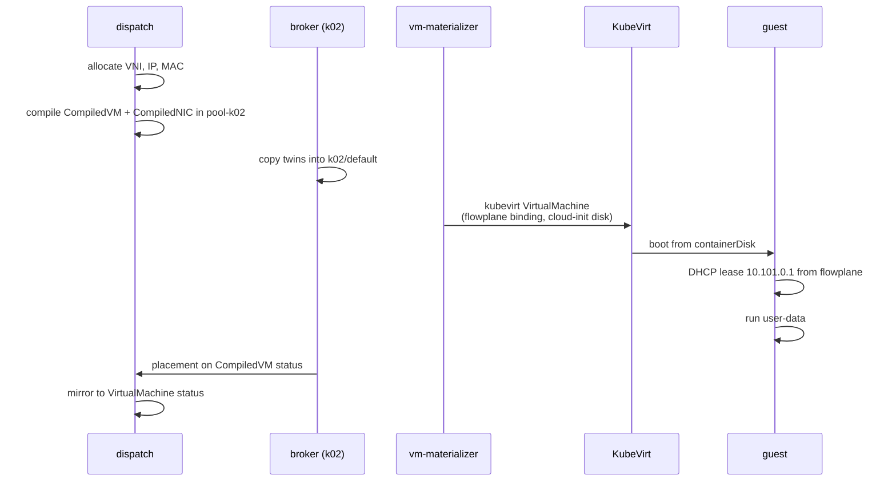

# VMs across clusters

In this guide you boot a KubeVirt virtual machine on pool `k02` from a single ectobase
`VirtualMachine` object, configure it with cloud-init, and reach it from a container on pool
`k03`. You see how the VM's placement is recorded, what the vm-materializer builds in the pool,
how the guest gets its overlay address without any network configuration in the image, and how
cloud-init runs inside it.

!!! note "Automated twin"
    `TestVMOverlayConnectivity` in `test/lab/livetest/vm_overlay_test.go` runs the closest path:
    a `VirtualMachine` booted from the same cirros containerDisk, pinged from a `Container` peer.
    It differs in three ways. The test puts the peer on the same node as the VM, so its ping
    never crosses clusters; it pins the VNI, IPs and MACs; and its VM has no cloud-init. This
    guide uses a peer on the other pool, the allocators and cloud-init. Keep the guide and the
    test in step.

## Prerequisites

- A running lab with KubeVirt installed on the pools (`make lab-tier2-up`); see
  [Bring up the lab](lab.md).
- The `khub`, `k02` and `k03` aliases from that guide.
- [Your first VPC](first-vpc.md), which introduces VPCs, Subnets, NICs and twins.

This guide works in the `default` namespace, which exists on every cluster, so there is no
namespace to create in the pools. Every object is named with a `guide-` prefix.

## Step 1: create the VPC and the VM

A `VirtualMachine` owns its NICs through `interfaceRefs`, as a `Container` does, and names its
pool in `clusterName`. With no `volumeRefs`, it boots from the containerDisk `image` and keeps no
state across restarts. `cloudInit.userData` is passed to the guest as a cloud-init NoCloud
datasource.

Create the network first and let the NIC get its address and MAC before the VM exists:

```sh
khub apply -f - <<'EOF'
apiVersion: net.ectobase.dev/v1alpha1
kind: VPC
metadata:
  name: guide-vms
  namespace: default
spec:
  defaultPolicy: Allow
---
apiVersion: net.ectobase.dev/v1alpha1
kind: Subnet
metadata:
  name: guide-vms-v4
  namespace: default
spec:
  vpcRef: {name: guide-vms}
  v4Prefix: 10.101.0.0/24
---
apiVersion: net.ectobase.dev/v1alpha1
kind: NetworkInterface
metadata:
  name: guide-vm
  namespace: default
spec:
  vpcRef: {name: guide-vms}
EOF
```

```text
vpc.net.ectobase.dev/guide-vms created
subnet.net.ectobase.dev/guide-vms-v4 created
networkinterface.net.ectobase.dev/guide-vm created
```

The VPC gets a VNI and the NIC an address and MAC, exactly as in the first guide:

```sh
khub get vpc guide-vms -o jsonpath='{.status.state} vni={.status.vni}{"\n"}'
khub get nic guide-vm -o jsonpath='{.status.state} {.status.allocatedIPs} {.status.allocatedMAC}{"\n"}'
```

```text
Ready vni=1000
Allocated ["10.101.0.1"] 02:2b:5e:62:7d:ff
```

!!! warning "Create the NIC before the VM"
    Wait for the NIC to report `Allocated` before you apply the `VirtualMachine`. A VM compiled
    while its NIC has no MAC yet starts without one and never gets its overlay interface; see the
    known issue in [Move a VM](move-a-vm.md).

Now the VM. The cirros image runs a user-data script that starts with `#!`. This one writes a page
and serves it on port 80 with `nc`, because cirros' busybox has no `httpd`:

```sh
khub apply -f - <<'EOF'
apiVersion: compute.ectobase.dev/v1alpha1
kind: VirtualMachine
metadata:
  name: guide-vm
  namespace: default
spec:
  clusterName: k02
  interfaceRefs: [{name: guide-vm}]
  image: quay.io/kubevirt/cirros-container-disk-demo:latest
  runStrategy: Always
  resources:
    requests: {cpu: "1", memory: 512Mi}
  cloudInit:
    userData: |
      #!/bin/sh
      echo "hello from $(hostname), set up by cloud-init" > /tmp/index.html
      while true; do
        { printf 'HTTP/1.0 200 OK\r\n\r\n'; cat /tmp/index.html; } | nc -l -p 80
      done &
EOF
```

```text
virtualmachine.compute.ectobase.dev/guide-vm created
```

## Step 2: follow the VM to the pool

The compiler lowers the `VirtualMachine` to a `CompiledVM` in `pool-k02`, next to the NIC's
`CompiledNIC`:

```sh
khub -n pool-k02 get compiledvms,compilednics
```

```text
NAME                                                CREATED AT
compiledvm.compiled.ectobase.dev/default-guide-vm   2026-10-01T07:45:56Z

NAME                                                 CREATED AT
compilednic.compiled.ectobase.dev/default-guide-vm   2026-10-01T07:45:56Z
```

The `CompiledVM` carries the boot intent, the cloud-init data and one interface per NIC, with the
allocated MAC and the overlay network's name:

```sh
khub -n pool-k02 get compiledvm default-guide-vm -o yaml
```

```text
...
spec:
  cloudInit:
    userData: |
      #!/bin/sh
      echo "hello from $(hostname), set up by cloud-init" > /tmp/index.html
      ...
  clusterName: k02
  image: quay.io/kubevirt/cirros-container-disk-demo:latest
  interfaces:
  - mac: 02:2b:5e:62:7d:ff
    networkName: ectobase-system/flowplane
  resources:
    requests:
      cpu: "1"
      memory: 512Mi
  runStrategy: Always
status:
  placement:
    clusterName: k02
    nodeName: k02-1
    nodePrefix: fd00:cafe:1914::/64
```

The broker copies the `CompiledVM` into `k02`'s `default` namespace, and the **vm-materializer**
turns it into a KubeVirt `VirtualMachine` of the same name. KubeVirt starts the instance in a
`virt-launcher` Pod:

```sh
k02 -n default get compiledvms,virtualmachines.kubevirt.io,vmi,pods -o wide
```

```text
NAME                                                AGE
compiledvm.compiled.ectobase.dev/default-guide-vm   53s

NAME                                          AGE   STATUS    READY
virtualmachine.kubevirt.io/default-guide-vm   53s   Running   True

NAME                                                  AGE   PHASE     IP    NODENAME   READY   LIVE-MIGRATABLE   PAUSED
virtualmachineinstance.kubevirt.io/default-guide-vm   53s   Running         k02-1      True    True

NAME                                       READY   STATUS    RESTARTS   AGE   IP                    NODE    NOMINATED NODE   READINESS GATES
pod/virt-launcher-default-guide-vm-mhmq9   3/3     Running   0          53s   fd00:244:1914::e619   k02-1   <none>           1/1
```

The materializer wires each interface to the overlay through KubeVirt's `flowplane` network
binding plugin and a Multus network, and adds the cloud-init disk next to the boot disk:

```sh
k02 -n default get vm.kubevirt.io default-guide-vm -o jsonpath='{.spec.template.spec.domain.devices.interfaces}{"\n"}{.spec.template.spec.networks}{"\n"}{.spec.template.spec.volumes[*].name}{"\n"}'
```

```text
[{"binding":{"name":"flowplane"},"macAddress":"02:2b:5e:62:7d:ff","name":"net0"}]
[{"multus":{"networkName":"ectobase-system/flowplane"},"name":"net0"}]
containerdisk cloudinitdisk
```

The binding attaches the guest through a tap device, and the guest's virtio NIC carries the MAC
the allocator chose. The VMI's IP column stays empty: the guest's overlay address belongs to
ectobase and is recorded on the NIC, not reported through KubeVirt.

## Step 3: check the placement

The pool reports where the VM actually runs onto the `CompiledVM`'s status, as you saw above. A
controller on the dispatch mirrors it onto the `VirtualMachine` you wrote:

```sh
khub get vm guide-vm -o yaml
```

```text
...
status:
  placement:
    clusterName: k02
    nodeName: k02-1
    nodePrefix: fd00:cafe:1914::/64
```

`spec.clusterName` is the intent; `status.placement` is the observation. The `nodePrefix` is the
node's /64, which is what a fence isolates if this pool is lost; see
[Failover](../architecture/failover.md).

## Step 4: watch the guest boot

The guest needs no network configuration of its own. flowplane answers its DHCP request with the
NIC's allocated address, and cirros reads the cloud-init disk as a NoCloud datasource. The
launcher Pod's `guest-console-log` container shows both:

```sh
k02 -n default logs virt-launcher-default-guide-vm-mhmq9 -c guest-console-log \
  | grep -E 'udhcpc|Lease of|datasource|local-hostname'
```

```text
udhcpc (v1.23.2) started
Lease of 10.101.0.1 obtained, lease time 268435455
=== datasource: nocloud local ===
local-hostname: default-guide-vm
```

Further down the same log, cirros prints its interface and routes: `eth0` has `10.101.0.1/32` and
a default route via `169.254.0.1`, the gateway address flowplane presents to every guest. Cirros'
boot script also pings that gateway and reports a failure; the gateway does not answer echo
requests, and traffic flows regardless.

## Step 5: reach the VM from the other pool

Start a container in the same VPC on `k03`:

```sh
khub apply -f - <<'EOF'
apiVersion: net.ectobase.dev/v1alpha1
kind: NetworkInterface
metadata:
  name: guide-peer
  namespace: default
spec:
  vpcRef: {name: guide-vms}
---
apiVersion: compute.ectobase.dev/v1alpha1
kind: Container
metadata:
  name: guide-peer
  namespace: default
spec:
  clusterName: k03
  interfaceRefs: [{name: guide-peer}]
  image: busybox:1.36
  command: ["sleep", "infinity"]
EOF
```

```sh
khub get nic guide-vm guide-peer \
  -o 'custom-columns=NAME:.metadata.name,STATE:.status.state,IPS:.status.allocatedIPs,MAC:.status.allocatedMAC'
k03 -n default get pods -l net.ectobase.dev/container=default-guide-peer
```

```text
NAME         STATE       IPS            MAC
guide-vm     Allocated   [10.101.0.1]   02:2b:5e:62:7d:ff
guide-peer   Allocated   [10.101.0.2]   02:90:22:40:6e:c0
NAME                 READY   STATUS    RESTARTS   AGE
default-guide-peer   1/1     Running   0          19s
```

Ping the VM, then fetch the page the cloud-init script serves:

```sh
k03 -n default exec default-guide-peer -- ping -c3 10.101.0.1
k03 -n default exec default-guide-peer -- wget -q -O - -T 5 http://10.101.0.1/
```

```text
PING 10.101.0.1 (10.101.0.1): 56 data bytes
64 bytes from 10.101.0.1: seq=0 ttl=64 time=1.034 ms
64 bytes from 10.101.0.1: seq=1 ttl=64 time=0.697 ms
64 bytes from 10.101.0.1: seq=2 ttl=64 time=0.636 ms

--- 10.101.0.1 ping statistics ---
3 packets transmitted, 3 packets received, 0% packet loss
round-trip min/avg/max = 0.636/0.789/1.034 ms
hello from default-guide-vm, set up by cloud-init
```

The VM and the container are on different clusters and different node /64s, and neither knows
it. To each of them the other is a host in `10.101.0.0/24`.

## Booting from a persistent disk

The VM in this guide is ephemeral: its root disk is the containerDisk and is lost when the VMI
stops. For a VM whose disk survives restarts and moves, create a `Volume`
(`storage.ectobase.dev/v1alpha1`) with a `size`, a `storageClass` (the lab's is `ceph-rbd`) and
a `bootImage`, and list it in the VM's `volumeRefs`. The vm-materializer then boots the VM from
an RBD-backed DataVolume instead of `image`. [Move a VM](move-a-vm.md) walks through that path,
including what happens to the disk when `clusterName` changes.

## What just happened

One `VirtualMachine` on the dispatch became a KubeVirt VM in another cluster, with its address,
MAC, network attachment and guest bootstrap all derived from intent.



## Cleanup

```sh
khub delete virtualmachine guide-vm
khub delete container guide-peer
khub delete networkinterface guide-vm guide-peer
khub delete subnet guide-vms-v4
khub delete vpc guide-vms
```

```text
virtualmachine.compute.ectobase.dev "guide-vm" deleted from default namespace
container.compute.ectobase.dev "guide-peer" deleted from default namespace
networkinterface.net.ectobase.dev "guide-vm" deleted from default namespace
networkinterface.net.ectobase.dev "guide-peer" deleted from default namespace
subnet.net.ectobase.dev "guide-vms-v4" deleted from default namespace
vpc.net.ectobase.dev "guide-vms" deleted from default namespace
```

After half a minute the twins, the KubeVirt objects and the Pods are gone:

```sh
khub get compiledvms,compilednics,compiledcontainers -A
k02 -n default get compiledvms,compilednics,vm.kubevirt.io,vmi,pods
k03 -n default get compilednics,compiledcontainers,pods
```

```text
No resources found
No resources found in default namespace.
No resources found in default namespace.
```

## Where to go next

- [Expose a service to the WAN](expose-to-wan.md)
- [Move a VM](move-a-vm.md)
- [Storage and VMs](../architecture/storage-and-vms.md)
- [DHCP, ARP and ND](../features/dhcp-arp-nd.md)
