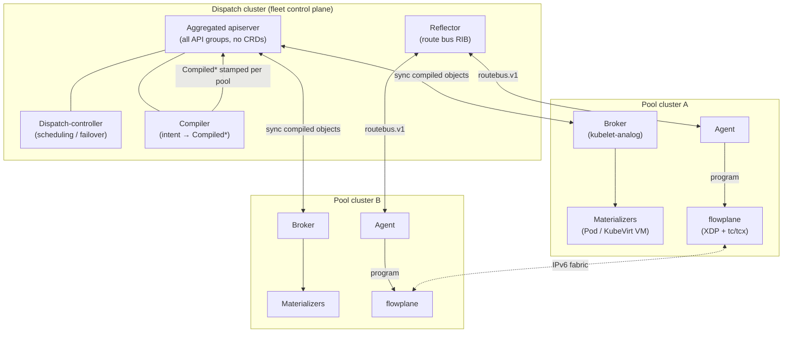

# ectobase

**ectobase** is a Kubernetes-native, multi-cluster IaaS platform that runs **containers and
KubeVirt virtual machines** side by side on a shared, tenant-isolated overlay network. The overlay
is implemented in **eBPF/XDP** and rides on a plain routed **IPv6 fabric**: every workload gets an
overlay address that is meaningful only within its tenant, and every host encapsulates and
decapsulates guest traffic in the kernel. On top of that overlay the platform provides routing,
stateful NAT, load balancing with DSR, a deny-by-default firewall, DHCP/ARP/ND, QoS, and
North-South internet egress — all driven by declarative Kubernetes intent.

The vision is a single control surface for a **fleet** of compute clusters: you author intent once
against an aggregated API, and the platform compiles that intent, distributes it to the right
cluster, and materializes it as a real container or VM wired into the overlay.

## Architecture at a glance

ectobase is two **planes** — a dataplane and a control plane — arranged as a **fleet** of one *dispatch*
cluster and many *pool* clusters, all reachable over the IPv6 fabric.

The **compiler** lowers user intent into a single per-NIC
[`CompiledNIC`](architecture/compile-sync-materialize.md) (plus `CompiledVM` / `CompiledContainer` /
`CompiledVolumeAttachment`) stamped for a specific pool. Each pool's **broker** syncs those compiled
objects down; **materializers** turn them into Pods and VMs, and the per-node **agent** programs the
`CompiledNIC` into the local dataplane. Overlay reachability is distributed over the
[route bus](architecture/route-bus.md) — a metalbond-style pub/sub RIB, **not** BGP in the hot path.
BGP appears only at the [WAN edge](features/ns-edge.md).

## Start here

- **Operators** → [Deploying with Helm](guides/deploy-helm.md), then the
  [Operations runbook](guides/runbook.md).
- **Contributors** → [Development](guides/development.md) and [Getting started](guides/getting-started.md).
- **Architects** → the [Concepts](concepts/two-planes-and-the-fleet.md) chapter and the
  [Architecture](architecture/layout.md) reference, starting with the
  [overlay](concepts/overlay.md).

## The two planes

- **flowplane** — the eBPF/XDP **dataplane** (Rust, built on [aya](https://aya-rs.dev/)). A
  map-driven kernel overlay: every forwarding decision is a per-flow table lookup. It holds no
  policy of its own and exposes a small per-node gRPC surface (`DataplaneNode`) that the control
  plane programs. A [DPDK backend](architecture/dataplane/dpdk.md) exists as a fourth `Pkt`/`Maps`
  implementation that is byte-parity with the eBPF datapath. Code: `flowplane/`.
- **mesh** — the per-cluster **control plane** (Go, controller-runtime). CRDs describe intent;
  controllers compile intent into `Compiled*` objects; the agent programs the local dataplane; the
  reflector distributes overlay routes. Code: `mesh/`, `cni/`.

## Roadmap

Several capabilities are designed and partially built, gated on hardware or further integration
work:

!!! note "Status: Planned"
    - **DPDK on real hardware / rte_flow offload.** The DPDK dataplane is byte-parity with the
      eBPF/sim datapath, but hardware-accelerated offload (mlx5 `rte_flow` RAW_DECAP/ENCAP, multi-queue
      RSS at line rate) requires a SmartNIC and is validated only in simulation today.
    - **Blue-green DPDK upgrades.** Hitless, state-handoff upgrades of the DPDK dataplane
      (externalized conntrack + atomic steering flip) are specified with primitives in place, but the
      full two-instance drain orchestration is not yet wired.
    - **Cross-pool failover.** Two-tier, fence-gated evacuation of a lost pool is partially built
      (health/lease tracking, Ceph NetworkFence, route blocklisting); end-to-end reschedule across
      pools is still being completed.

## Lineage

The dataplane began as a port of [ironcore dpservice](https://github.com/ironcore-dev/dpservice)'s
model onto eBPF and has since diverged: the dpservice DPDK/gRPC compatibility layer was removed, and
the control plane is a from-scratch Kubernetes-native design. The conformance suite still tracks
dpservice's behavioral coverage — see the [conformance map](testing/conformance-map.md).
