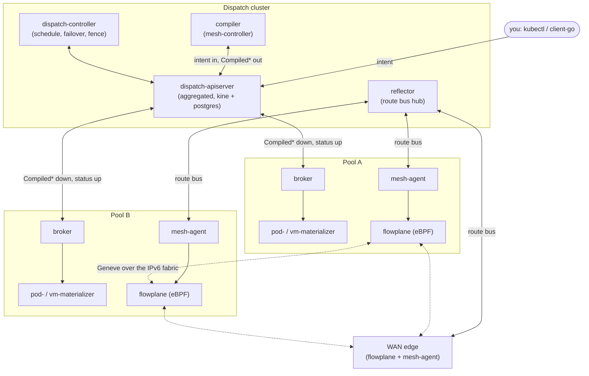

# ectobase

Containers and KubeVirt VMs across many Kubernetes clusters, behind one fleet API and
on one eBPF overlay network. A workload keeps its address wherever it runs and reaches
the rest of its VPC from any cluster.

[Get started :material-arrow-right:](concepts/what-is-ectobase.md){ .md-button .md-button--primary }
[Bring up the lab](guides/lab.md){ .md-button }

Running VMs and containers on several Kubernetes clusters usually means a separate
network per cluster, a separate API per cluster, and glue between them so a workload in
one cluster can reach a workload in another. Moving a VM to a different cluster then
means a new address, a new disk and a round of DNS and firewall changes.

ectobase puts one API in front of the whole fleet. You describe VPCs, network
interfaces, firewalls, load balancers, VMs and containers once, against the
**dispatch**. The dispatch picks a cluster (a **pool**) for each workload, compiles your
intent into a self-contained form, and hands it to that pool, where it becomes a real
Pod or KubeVirt VM. Underneath, a Geneve overlay on a routed IPv6 fabric connects every
workload in every pool, so the cluster a workload lands on doesn't change who it can
reach or what address it has.

## What ectobase is

:material-api: __One fleet API__
{ .card }

Five API groups served by one aggregated apiserver on the dispatch. You write intent
once; the dispatch schedules it onto a pool, and each pool sees only the compiled slice
meant for it.

:material-server-network: __Containers and VMs as peers__
{ .card }

A `Container` becomes a Pod and a `VirtualMachine` becomes a KubeVirt VM, but both own
the same kind of `NetworkInterface`. On the overlay a container and a VM look the same.

:material-lan: __One overlay across clusters__
{ .card }

flowplane, an eBPF dataplane on every node, carries tenant traffic in Geneve over IPv6.
A VPC is fleet-wide: its workloads share one VNI (the overlay's network identifier) and
reach each other whichever pool they run in.

:material-swap-horizontal: __VMs that outlive a cluster__
{ .card }

When a pool is lost, the dispatch fences it and reschedules its VMs elsewhere. A VM can
also be moved on purpose. Either way it keeps its overlay IP, its MAC and its
persistent disk.

## Architecture at a glance

One dispatch cluster runs the fleet control plane. Each pool is an ordinary Kubernetes
cluster that runs the workloads and the dataplane. WAN edges connect the overlay to the
outside world.

```mermaid
flowchart TB
    user(["you: kubectl / client-go"])

    subgraph dispatch["Dispatch cluster"]
        api["dispatch-apiserver<br/>(aggregated, kine + postgres)"]
        compiler["compiler<br/>(mesh-controller)"]
        dctl["dispatch-controller<br/>(schedule, failover, fence)"]
        refl["reflector<br/>(route bus hub)"]
    end

    subgraph poolA["Pool A"]
        brokerA["broker"]
        matA["pod- / vm-materializer"]
        agentA["mesh-agent"]
        fpA["flowplane (eBPF)"]
    end

    subgraph poolB["Pool B"]
        brokerB["broker"]
        matB["pod- / vm-materializer"]
        agentB["mesh-agent"]
        fpB["flowplane (eBPF)"]
    end

    edge["WAN edge<br/>(flowplane + mesh-agent)"]

    user -->|intent| api
    compiler <-->|"intent in, Compiled* out"| api
    dctl <--> api
    api <-->|"Compiled* down, status up"| brokerA & brokerB
    brokerA --> matA
    brokerB --> matB
    agentA --> fpA
    agentB --> fpB
    refl <-->|route bus| agentA & agentB & edge
    fpA <-.->|"Geneve over the IPv6 fabric"| fpB
    fpA & fpB <-.-> edge
```

[The fleet](concepts/fleet.md) explains what each box does and why it runs where it does.

## Explore the docs

-   :material-lightbulb-on: __Concepts__

    ---

    What ectobase is, the dispatch and its pools, how a request becomes a running
    workload, and the container and VM workload model.

    [:octicons-arrow-right-24: Read](concepts/what-is-ectobase.md)

-   :material-sitemap: __Architecture__

    ---

    The components in depth: multi-cluster orchestration, the overlay and route bus,
    storage, failover, VM moves, and HA across restarts.

    [:octicons-arrow-right-24: Read](architecture/overview.md)

-   :material-chip: __The flowplane dataplane__

    ---

    The eBPF programs and their hooks, the BPF maps, the pure Rust core shared with the
    simulator, and the `flowplane` CLI.

    [:octicons-arrow-right-24: Read](architecture/dataplane/index.md)

-   :material-lan-connect: __Networking__

    ---

    Routing and VNIs, the firewall, NAT, load balancing with DSR, VPC peering, the WAN
    edge, QoS, and the DHCP, ARP and ND responders.

    [:octicons-arrow-right-24: Read](features/routing-vni.md)

-   :material-play-circle: __Guides__

    ---

    Narrated walkthroughs that drive the lab: a first VPC, VMs across clusters, WAN
    exposure, NAT egress, failover and moving a VM.

    [:octicons-arrow-right-24: Read](guides/index.md)

-   :material-cog: __Operating__

    ---

    Install the dispatch and pool charts with Helm, the operations runbook, and
    migrating to central IPAM.

    [:octicons-arrow-right-24: Read](operations/deploy-helm.md)

-   :material-book-open-variant: __Reference__

    ---

    How the CRDs relate, the generated API reference for all five groups, Helm values,
    components and generated artifacts.

    [:octicons-arrow-right-24: Read](reference/crd-interactions.md)

-   :material-tools: __Contributing__

    ---

    The Nix dev shell, repository layout, the test tiers and the in-process simulator,
    and how to write these docs.

    [:octicons-arrow-right-24: Read](contributing/index.md)

---

!!! tip "Documentation conventions"

    These pages describe how ectobase works today, checked against the code.

    - A change that alters behavior updates the page that describes it in the same change.
    - Partial or planned work carries a status badge, so the docs never overstate what exists.
    - Pages link to each other instead of repeating each other.
