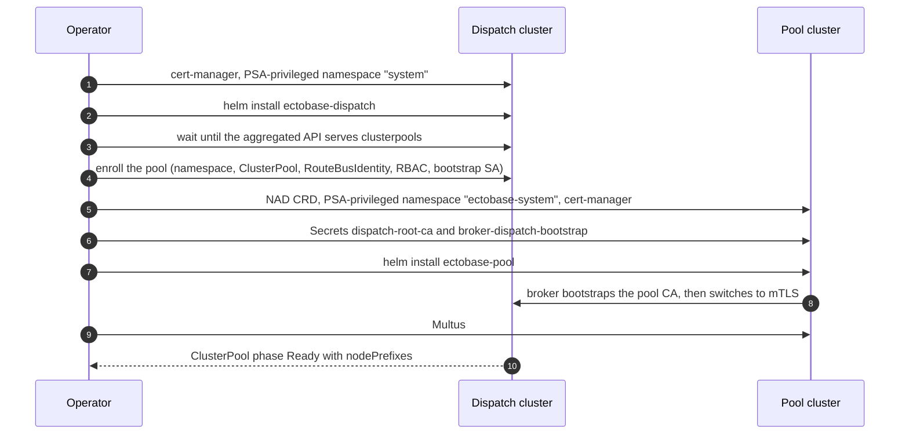
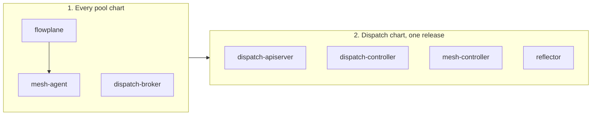

# Deploy with Helm

ectobase installs as two Helm charts: one for the **dispatch** (the fleet control plane) and one
for each **pool** (a compute cluster). This page walks through a first install, the per-pool
enrollment that sits between the two charts, and the order to follow when you upgrade.

The charts are generated deploy artifacts. `make generate` writes their CRDs and RBAC straight
into the chart trees from the API types and the components' RBAC markers, so a chart cannot fall
behind the code it deploys (see [Generated artifacts](../reference/generated-artifacts.md)).

## The two charts

Each chart maps onto one role in the fleet. The dispatch runs once; every pool runs its own copy
of the pool chart.

| Chart | Runs on | Installs |
|---|---|---|
| `charts/ectobase-dispatch` | the dispatch cluster | `dispatch-apiserver` (aggregated apiserver) with kine and postgres, `dispatch-controller`, `mesh-controller` (the compiler), the `reflector`, and the `ectobase-ca` root CA with its `ClusterIssuer` |
| `charts/ectobase-pool` | each pool cluster | the `flowplane` dataplane, `mesh-agent`, the broker (`dispatch-broker`), the `flowplane-cni` installer, `pod-materializer`, the `net` and `compiled` CRDs, two Multus `NetworkAttachmentDefinition`s, and, when enabled, `vm-materializer` and the [Tier-1](../architecture/failover.md#two-tiers) failover objects |

Every value is listed in the [Helm values reference](../reference/helm-values.md). What each
component does is in [Components](../reference/components.md).

The reference install is the lab's deploy code, `test/lab/internal/deploy/ectobase.go`. `make
lab-up` installs both charts the way this page describes, so when this page and that file
disagree, the file is right.



## Before you install

Both charts assume a few things exist already. A missing one shows up as a pod that never
starts or a `helm install` that the API rejects.

| Requirement | Where | Why |
|---|---|---|
| cert-manager | every cluster | Route-bus mTLS and the broker's dispatch credential are cert-manager objects. The lab pins v1.21.1. |
| cert-manager `--cluster-resource-namespace=system` | dispatch | The `ectobase-ca` `ClusterIssuer` reads its CA Secret from cert-manager's cluster-resource namespace, and the chart puts that Secret in the release namespace (`system` by default). |
| A PSA-privileged `system` namespace | dispatch | `dispatch-apiserver` runs `hostNetwork` on port 6444, which the baseline Pod Security level rejects. |
| A StorageClass | dispatch | Only for `postgres.persistence.type=pvc` (the default). Without one, postgres stays `Pending`. |
| A PSA-privileged `ectobase-system` namespace | each pool | `flowplane` is privileged with `hostPID` and host paths; the agent and broker run `hostNetwork`. The chart does not create its release namespace. |
| The `NetworkAttachmentDefinition` CRD | each pool | The chart renders two NADs unconditionally. |
| Multus | each pool | Pods and VMs reach the overlay as a secondary network through Multus and `flowplane-cni`. The lab installs a thin Multus DaemonSet after the pool chart. |
| KubeVirt and CDI | pools with `vmMaterializer.enabled` | `vm-materializer` creates KubeVirt `VirtualMachine`s and CDI `DataVolume`s. The KubeVirt CR also needs the `NetworkBindingPlugins` feature gate and a `flowplane` network binding (`domainAttachmentType: tap`, NAD `ectobase-system/flowplane`); the lab sets both in `test/lab/internal/deploy/kubevirt.go`. |
| medik8s NodeHealthCheck and Self Node Remediation | pools with `tier1Failover.enabled` | The chart renders their custom resources, not the operators. |
| The six ectobase images | every cluster | The charts default to `ghcr.io/trevex/ectobase/<name>:dev`, but CI (`.github/workflows/docker.yml`) publishes only `flowplane`, tagged by commit SHA, `main` or git tag. Build all six with `make lab-app-images`, push them to a registry the nodes can reach, and set `images.*` on both charts. |

Talos enforces the baseline Pod Security level cluster-wide, so on Talos the privileged
namespaces are not optional. A plain kind cluster does not enforce PSA, but labelling the
namespaces costs nothing.

!!! warning "Dev-grade defaults"
    Treat both charts as unhardened. In particular:

    - `kine.password` defaults to `kine`. Postgres reads it only when it initialises an empty
      data directory, so set it before the first install.
    - The five `APIService`s that register the ectobase groups with the dispatch's host
      apiserver use `insecureSkipTLSVerify: true`.
    - The kubeconfig the pool chart writes for `mesh-agent` skips TLS verification of the pool's
      apiserver; it authenticates with the agent's ServiceAccount token.

## Install the dispatch chart

The dispatch chart uses two namespaces. The release namespace (`namespace`, default `system`)
holds `dispatch-apiserver`, `dispatch-controller`, kine, postgres and the root CA. The chart
creates a second, PSA-privileged namespace (`agentNamespace`, default `ectobase-system`) for the
`hostNetwork` compiler and reflector.

```sh
kubectl create namespace system
kubectl label namespace system pod-security.kubernetes.io/enforce=privileged

helm upgrade --install ectobase-dispatch charts/ectobase-dispatch \
  --namespace system \
  --set reflectorAdmin='[fd00:db8:0:1::1]:1339' \
  --set pki.reflectorIP=fd00:db8:0:1::1 \
  --set dispatchApiserver.serviceIP=fd00:db8:0:1::1
```

Replace `fd00:db8:0:1::1` (the chart default) with the dispatch node's address on the underlay.
All three values name the same host, and each one ends up somewhere that is checked:

- `reflectorAdmin` is the reflector's admin port, 1339, which the `dispatch-controller` dials to
  set and lift route fences. It is a separate port from the agent-facing session port, 1338, so
  holding an agent certificate does not reach the fence API.
- `pki.reflectorIP` becomes an IP SAN on the reflector's server certificate.
- `dispatchApiserver.serviceIP` becomes an IP SAN on the apiserver's serving certificate. Brokers
  verify that certificate, so it must equal the host in each pool's `dispatchServer`.

If you run WAN edges, also pass `--set 'pki.fleetIdentities={edge}'`. The signer then trusts the
`edge` identity's own IP ranges; by default it trusts no identity that is not a `ClusterPool`, and
denies `edge` (see [WAN edges](#wan-edges)).

If the dispatch fences Ceph during failover, also pass `--set-string ceph.clusterID=<fsid>`. An
empty `clusterID` leaves the storage fence unable to act: the ceph-csi driver rejects a
`NetworkFence` without one.

Wait until the aggregated API serves before you enroll anything. The lab allows twelve minutes
for this on a cold start:

```sh
kubectl get clusterpools.platform.ectobase.dev
```

Use the fully qualified resource name: short-name discovery on the aggregated API is not
reliable.

### Where postgres keeps the dispatch state

kine stores the aggregated apiserver's data in postgres, so postgres holds all dispatch state.
`postgres.persistence.type` decides where its data directory lives.

| `type` | Data lives in | Use it when |
|---|---|---|
| `pvc` (default) | a ReadWriteOnce `PersistentVolumeClaim` named `postgres-data`, sized by `size`, from `storageClass` (empty means the cluster default) | the cluster has a StorageClass. The claim carries `helm.sh/resource-policy: keep`, so `helm uninstall` leaves it behind; delete it by hand to drop the state. |
| `hostPath` | a node directory, `path`, created if missing | the dispatch is a single node and postgres cannot reschedule elsewhere. The lab uses this, because its dispatch has no StorageClass until `make lab-ceph` runs. |
| `emptyDir` | scratch space that dies with the pod | a throwaway cluster. Every postgres restart, and every change to its pod template, loses all dispatch state. |

Postgres is a single replica with the `Recreate` strategy, because two pods cannot share one
data directory. The kine password comes from `kine.password` through the `kine-db` Secret.
Postgres reads it only when it initialises an empty data directory, so changing it later on
persistent storage locks kine out.

## Enroll a pool on the dispatch

Each pool needs a set of objects on the dispatch before its broker can connect. No chart renders
them, because each one is scoped to a single pool. The lab generates them in
`clusterPoolsManifest` (`test/lab/internal/deploy/ectobase.go`).

| Object | Purpose |
|---|---|
| Namespace `pool-<pool>` | Where the compiler writes this pool's `Compiled*` twins. |
| `ClusterPool` `<pool>` | The pool's inventory entry. Its name must be a DNS-1123 label of at most 58 characters, so that `pool-<pool>` is itself a legal namespace name. Its `spec.underlayPrefix` is required: see below. |
| `RouteBusIdentity` `<pool>` | Carries the pool's intermediate-CA request and the signed certificate. |
| Role and RoleBinding `dispatch-broker` in `pool-<pool>` | The broker's access to this pool's twins. Bound to the user `ectobase:cluster:<pool>`. |
| ServiceAccount `dispatch-broker-bootstrap-<pool>` in `system` | The identity behind the short-lived first-boot token. |
| ClusterRole and ClusterRoleBinding `dispatch-broker-pool-<pool>` | `resourceNames: [<pool>]` access to its own `RouteBusIdentity` (get and update, so it can file its CSR in `spec.request`) and its own `ClusterPool` (read, plus status writes). Bound to both the user and the bootstrap ServiceAccount. |

The verbs each grant carries are listed in
[Architecture overview](../architecture/overview.md#trust-boundaries).

The scoping is the security boundary. A `RouteBusIdentity` holds a pool's intermediate CA, so a
fleet-wide grant would let one pool's credential obtain another pool's CA and mint certificates
for that pool's nodes. The identity is created ahead of time because RBAC cannot scope `create`
by name. Apart from filing its own CSR, a broker writes only status subresources, so it can
never change a workload's spec, create a twin or delete one.

Set `spec.underlayPrefix` on the `ClusterPool` before the pool's broker starts. It is the pool's
underlay aggregate, a CIDR that contains every node's underlay address, for example the pool's
`/48`:

```yaml
apiVersion: platform.ectobase.dev/v1alpha1
kind: ClusterPool
metadata:
  name: k02
spec:
  region: eu
  underlayPrefix: "fd00:cafe:2::/48"
```

The dispatch signer constrains the pool's route-bus intermediate to exactly this prefix, so the
pool can only mint node certificates whose IP SAN lies inside it. A `ClusterPool` without it gets
no intermediate: its `RouteBusIdentity` shows `Signed=False` with the reason, the broker's CSR
times out, and its agents never join the route bus. Setting the prefix afterwards unblocks it
without a restart. The same prefix is what failover fences when the pool is lost; see
[failover](../architecture/failover.md#decide-what-to-fence-coverage).

Do not reuse a fleet identity's name for a pool. A name in the dispatch chart's
`pki.fleetIdentities` (for example `edge`) is signed on its own `spec.permittedUnderlayCIDRs`, and
the signer denies it outright if a `ClusterPool` of the same name exists.

### Decommission a pool

Removing a pool means removing everything enrollment created for it, not only its `ClusterPool`:

- the `ClusterRole` and `ClusterRoleBinding` `dispatch-broker-pool-<pool>`, the `Role` and
  `RoleBinding` `dispatch-broker` in `pool-<pool>`, and the ServiceAccount
  `dispatch-broker-bootstrap-<pool>`;
- the `RouteBusIdentity` `<pool>`;
- the namespace `pool-<pool>`, once its twins are gone.

Nothing revokes the old broker's credentials. Its dispatch client certificate
(`CN=ectobase:cluster:<pool>`, from the dispatch client CA) stays valid for up to 90 days, and so does the pool's intermediate,
which can mint route-bus leaves for `<pool>.routebus.ectobase.dev` inside its old prefix. While the
per-pool grant exists, that certificate still acts as the pool. Do not give a new pool the same
name until the old broker certificate has expired, or unless every grant above was deleted first:
a reused name re-creates the grant, and the old certificate then authenticates as the new pool.

The same holds for the pool's underlay range. The old intermediate is constrained to it and stays
valid for up to 90 days, so a new pool given the same `spec.underlayPrefix` (or one overlapping it)
before then shares its VTEP range with a credential nobody controls. Wait out the old intermediate
before reusing the range.

## Install the pool chart

The pool chart does not manage its release namespace, so create it first:

```sh
kubectl create namespace ectobase-system
kubectl label namespace ectobase-system pod-security.kubernetes.io/enforce=privileged
```

### Fresh-pool enrollment (bootstrap)

The broker's dispatch client certificate is issued by the dispatch signer, and the broker requests
it over its connection to the dispatch. A new pool therefore needs two Secrets in
`ectobase-system` before the broker first starts:

- `dispatch-root-ca`, key `ca.crt`: the `ectobase-ca` root certificate, copied from the
  dispatch's `ectobase-ca` Secret in `system`. The broker verifies the dispatch's serving
  certificate against it.
- `broker-dispatch-bootstrap`, key `kubeconfig`: a kubeconfig for this pool's bootstrap
  ServiceAccount, with the root as `certificate-authority-data` and the server at
  `https://[<dispatch-ip>]:6444`. Mint the token with
  `kubectl create token dispatch-broker-bootstrap-<pool> -n system --duration=1h` on the dispatch.

On first boot the broker generates its client key, files a CSR on its `RouteBusIdentity` through
the bootstrap token, and writes the certificate the signer returns into `broker-dispatch-tls`. It
then switches to mTLS for everything else: the route-bus intermediate (written into the
`pki.intermediateSecret` Secret), and renewals of both. If the dispatch ever stops accepting its
certificate, the broker enrolls again with the bootstrap token, so a pool that has to re-enroll
needs only a fresh token in `broker-dispatch-bootstrap`. The lab (`installPool` in the same file)
creates both Secrets for you, with a fresh token on every deploy.

Then install the chart:

```sh
helm upgrade --install ectobase-pool charts/ectobase-pool \
  --namespace ectobase-system \
  --set broker.clusterName=k02 \
  --set apiserverAddress='https://127.0.0.1:6443' \
  --set reflectorAddress='[fd00:db8:0:1::1]:1338' \
  --set dispatchServer='https://[fd00:db8:0:1::1]:6444' \
  --set underlayWithin='fd00:cafe::/32' \
  --set pki.underlayCIDRs='fd00:cafe:2::/48' \
  --wait --timeout 12m
```

- `broker.clusterName` is required and must match the `ClusterPool` name. The chart refuses to
  render without it.
- `apiserverAddress` is this pool's own apiserver, which the agent reads its `CompiledNIC`s from.
  The agent never talks to the dispatch apiserver; its only link to the dispatch cluster is its
  route-bus session to the reflector. `mesh-agent` is a `hostNetwork` DaemonSet on every node, so
  `127.0.0.1:6443` works only where every node runs an apiserver, as in the lab's single-node
  pools. On a pool with worker nodes, set an address every node can reach over the fabric.
- `reflectorAddress` and `dispatchServer` point at the dispatch: the reflector's session port and
  `dispatch-apiserver` on 6444.
- `underlayWithin` tells `flowplane` which host address is the underlay, past management and
  host-DNS addresses.
- `pki.underlayCIDRs` is advisory. The broker sends it with its CSR, but the signer constrains the
  pool intermediate to the `ClusterPool`'s `spec.underlayPrefix` and ignores it; a range outside
  the prefix is only named in the `RouteBusIdentity`'s `Signed` condition. The flag stays for
  compatibility.

The lab gives `--wait` twelve minutes because the agent's readiness waits on a chain: broker
enrollment, intermediate CSR, dispatch signer, intermediate Secret, pool `Issuer`, then cert-manager
issuing each node's agent certificate.

When both sides are up, the `ClusterPool` reaches phase `Ready` with a non-empty
`status.nodePrefixes`.

### The broker's dispatch credential

The broker authenticates to the dispatch with a client certificate, not a token.
`broker-dispatch-tls` holds a certificate with `CN=ectobase:cluster:<pool>` and
`O=ectobase:brokers`, signed by the dispatch client CA (`ectobase-dispatch-client-ca`) with a
90-day lifetime. The signer forces that subject whatever the CSR asks for. The broker writes the
Secret itself and renews the certificate, with a new key, at two thirds of its lifetime; client-go
reloads the mounted files, so a renewal needs no restart.

The dispatch apiserver accepts client certificates only from that CA. Pool intermediates chain to
`ectobase-ca`, which signs the apiserver's serving certificate but is not trusted for clients.

The broker dials `dispatch-apiserver` directly on port 6444 rather than through the host
kube-apiserver's aggregation layer, because the host apiserver on 6443 serves the host cluster's
CA, not `ectobase-ca`. In-cluster clients on the dispatch keep using aggregation. In the lab the
direct path is `hostNetwork` on the single dispatch node; a production dispatch would put a stable
load-balancer address in front of it.

`pki.enabled` defaults to `true` on both charts and has to stay that way: with it off, the chart
passes the broker no dispatch address and the broker exits at startup.

## WAN edges

No chart deploys the WAN edges. An edge is a router, not a Kubernetes node, so its `flowplane`
(in `--role edge`) and its `mesh-agent` (with `--edge-loopback` and no kubeconfig) run beside the
router. In the lab they are containerlab nodes sharing each VyOS edge's network namespace, and
the lab provisions the edge fleet's route-bus identity, a `RouteBusIdentity` named `edge`, whose
`spec.permittedUnderlayCIDRs` is the edge loopback aggregate. The dispatch signs it only if `edge`
is in the dispatch chart's `pki.fleetIdentities`, which is empty by default; the lab sets it. See
[The WAN edge](../features/ns-edge.md).

## Upgrade order

A rolling fleet runs old and new components side by side for a while. Three rules keep that
window safe; each one exists because the old side lacks something the new side waits for.

1. Upgrade every pool chart before the dispatch chart.
2. Upgrade the dispatch chart's components together, from one `helm upgrade`.
3. Within a pool, `flowplane` must run the new image before `mesh-agent` does.



### Pools first

A planned move and a VM delete both rely on the pool's broker reporting that it has let a
retired `CompiledVM` twin go (`ReportReleases` in `dispatch/pkg/broker/release.go`). An old broker
has no such report, so every move off that pool and every delete of a VM on it waits until the
new broker lands.

### Dispatch components together

`dispatch-apiserver`, `dispatch-controller` and `mesh-controller` come from one release. Don't
patch one image ahead of the others. An old `dispatch-controller` never runs `releaseFencedTwins`
(`dispatch/pkg/failover/failover.go`), so a failover fences a lost pool but never releases its
retired twins, and the VMs it rebinds wait on a release that never comes.

The `reflector` must not lag the controller either. Before the controller lifts a recovered
pool's fence, it asks the reflector (`AnnouncedFrom`) whether that pool still announces any
address now placed on another pool. An old reflector answers `Unimplemented`; the controller
treats that as a failed check and holds the fence until the reflector is upgraded too.
[Runbook](runbook.md#a-pool-that-will-not-let-go) covers what that looks like.

### flowplane before mesh-agent

The agent hands the dataplane routes for its own guests' addresses and relies on `flowplane`
keeping a local guest's self-route on that key. An old `flowplane` lets the route overwrite the
self-route, and a later withdraw deletes it, which cuts the guest off on its own node. A normal
`helm upgrade` of the pool chart can briefly run the new agent against the old dataplane on a
node; the new `flowplane` repairs any self-route damaged that way when it adopts its maps at
startup. Never upgrade the `mesh` image on a pool on its own.

### Moving to operator-declared route-bus constraints

A release whose signer constrains a pool intermediate to its `ClusterPool`'s `spec.underlayPrefix`
adds three ordering hazards on top of the rules above:

1. **Set `spec.underlayPrefix` only after every pool's broker is upgraded.** The prefix also turns
   on aggregate fencing: failover fences the whole prefix. An old broker reports drain per node
   /64 and matches it to the fenced prefix by equality, so it reports the aggregate drained the
   moment the pool is back, while its VMs may still run. A new broker holds the aggregate while
   any node /64 inside it is busy.
2. **Pass `pki.fleetIdentities={edge}` in the same dispatch `helm upgrade`** if you run WAN edges.
   The new signer trusts no identity that is not a `ClusterPool` unless it is named there, and
   denies `edge` otherwise.
3. **A pool without `spec.underlayPrefix` keeps running but is denied at renewal.** Its broker
   already holds an intermediate, so nothing breaks at the upgrade. The signer denies its next
   request, which comes when that intermediate nears expiry, and the pool then drops off the
   route bus. Watch for the `RouteBusIdentityDenied` condition on the `ClusterPool`; the signer
   sets it with the reason whenever it denies the pool's identity:

    ```sh
    kubectl get clusterpools -o 'custom-columns=NAME:.metadata.name,DENIED:.status.conditions[?(@.type=="RouteBusIdentityDenied")].status,WHY:.status.conditions[?(@.type=="RouteBusIdentityDenied")].message'
    ```

Check every existing `ClusterPool`'s `spec.underlayPrefix` against the admission rules (canonical,
no IPv4-mapped form, at least /32 for IPv6 or /16 for IPv4). A prefix stored before those rules is
still served, but the signer denies the pool's intermediate until it is corrected.

The reflector also refuses an intermediate with no IP constraint, which is what a pool installed
with an empty `pki.underlayCIDRs` holds. Such a pool loses its route-bus sessions as soon as the new
reflector runs, until it is re-signed and its agents present the new chain; see
[Where the certificates come from](../architecture/route-bus.md#where-the-certificates-come-from).

### Cutting over to the dispatch client CA

A release whose dispatch apiserver trusts only `ectobase-dispatch-client-ca` for client
certificates is a hard cutover. No release trusts both CAs. The moment the dispatch chart is
upgraded, every broker's old certificate (minted by cert-manager from its pool intermediate) is
rejected, and each pool is off the dispatch until it re-enrolls:

1. Upgrade the dispatch chart.
2. For each pool, write a fresh bootstrap token into `broker-dispatch-bootstrap`, as for a new
   pool (see [Fresh-pool enrollment](#fresh-pool-enrollment-bootstrap)).
3. Delete the pool's old `broker-dispatch-tls` cert-manager Certificate
   (`kubectl -n ectobase-system delete certificates.cert-manager.io broker-dispatch-tls`), so
   cert-manager does not re-mint the Secret the broker now writes.
4. Upgrade the pool chart. The new broker finds no dispatch-issued certificate and enrolls with
   the token.

The lab does all of this on every `lab deploy`.

### Rotating the two roots

Both roots, `ectobase-ca` and `ectobase-dispatch-client-ca`, are cert-manager `Certificate`s with a
ten-year lifetime and no `renewBefore`, so cert-manager renews each at about 6.7 years (two thirds
of its life). A renewal with cert-manager's default `rotationPolicy: Always` gives the root a new
key, and everything issued under the old one stops verifying:

- `ectobase-ca`: every pool intermediate and every agent leaf under it, the edge fleet's
  intermediate, and every pool's copy of the root in `dispatch-root-ca`. cert-manager reissues the
  dispatch's own serving and client certificates.
- `ectobase-dispatch-client-ca`: every broker's client certificate. Brokers get a 401 and enroll
  again only if `broker-dispatch-bootstrap` holds a valid token.

Plan the rotation before that date. On every pool, refresh `dispatch-root-ca` and write a fresh
bootstrap token, then restart the broker: it enrolls again for a client certificate, and adopts the
intermediate the signer re-signs under the new root (the signer replaces any certificate the current
root did not sign). Reissue the agents' leaves as for an
[intermediate without an IP constraint](../architecture/route-bus.md#where-the-certificates-come-from),
and re-provision the edge fleet's CA directory.

## Upgrading an existing release

!!! warning "Never drop the CRDs from a live pool"
    The pool chart renders the `net` and `compiled` CRDs from `templates/crds.yaml` as ordinary
    chart resources, without `helm.sh/resource-policy: keep`. Helm updates them on upgrade and
    deletes any it no longer renders. Never upgrade a live pool to `installCRDs=false`, and never
    `helm uninstall` it: removing the compiled CRDs deletes every twin, and garbage collection
    then deletes the KubeVirt VMs, Pods and DataVolumes the materializers own through their
    controller owner references.

Three one-time steps apply to releases installed by older chart versions.

### Switching Deployments to Recreate

The `postgres` and `reflector` Deployments now use the `Recreate` strategy. A Deployment created
under the default `RollingUpdate` carries an apiserver-defaulted `spec.strategy.rollingUpdate`.
Helm 4's server-side apply does not own that field and never removes it, and the API rejects
`Recreate` next to it, so the upgrade fails:

```text
Error: UPGRADE FAILED: server-side apply failed for object system/postgres apps/v1, Kind=Deployment: Deployment.apps "postgres" is invalid: spec.strategy.rollingUpdate: Forbidden: may not be specified when strategy `type` is 'Recreate'
```

Switch both Deployments once before that upgrade. Use your namespaces if you override
`namespace` or `agentNamespace`:

```sh
kubectl -n system patch deploy postgres --type=merge \
  -p '{"spec":{"strategy":{"type":"Recreate","rollingUpdate":null}}}'
kubectl -n ectobase-system patch deploy reflector --type=merge \
  -p '{"spec":{"strategy":{"type":"Recreate","rollingUpdate":null}}}'
```

The strategy is not part of the pod template, so the patch starts no rollout, and it sets the
value the chart applies, so it never conflicts with Helm afterwards. The lab runs this on every
deploy (`migrateRecreateDeployments`).

### Moving postgres from emptyDir to persistent storage

Changing `postgres.persistence.type` from `emptyDir` to `pvc` or `hostPath` is a separate
one-time transition. Nothing copies the old emptyDir across, so the upgrade starts postgres on an
empty data directory:

1. All dispatch state from before the upgrade is lost, once.
2. kine keeps failing with `relation "kine" does not exist`: it creates its schema only at
   startup and did so against the old emptyDir. Restart it:
   `kubectl -n system rollout restart deploy/kine`.
3. `dispatch-apiserver` keeps serving pre-upgrade objects from its watch cache (a `ClusterPool`
   with yesterday's `creationTimestamp`, say), and nothing converges until it and the
   controllers reading the same objects restart:
   `kubectl -n system rollout restart deploy/dispatch-apiserver deploy/dispatch-controller`
   and `kubectl -n ectobase-system rollout restart deploy/mesh-controller deploy/reflector`.
   Then run the install again so the enrollment objects are recreated against the empty store.

After this transition, a postgres restart keeps all state: deleting the postgres pod on a live
dispatch leaves every `ClusterPool` in place with its lease still renewing.

!!! warning "Any storage reset under a running apiserver needs an apiserver restart"
    The watch-cache problem in step 3 is not specific to this migration. Whenever the store
    behind `dispatch-apiserver` is emptied or replaced while it runs, restart it before trusting
    what it serves.

### imagePullPolicy and mutable tags

`imagePullPolicy` applies to every container in a chart, and the default is `IfNotPresent`. That
is right for immutable tags. The `:dev` tags are mutable, since every rebuild pushes the same tag,
so under `IfNotPresent` a node keeps its cached image and a rollout reports success without
running the new code. The lab therefore sets `imagePullPolicy=Always` along with its registry
overrides (`imageSetArgs` in `test/lab/internal/deploy/ectobase.go`).

Changing `imagePullPolicy` changes every pod template, so that upgrade restarts every pod,
postgres included. With `emptyDir` persistence that restart loses all dispatch state.

## Releasing the charts

!!! note "Status: Planned"
    The charts are used from the repository tree (`charts/ectobase-dispatch`,
    `charts/ectobase-pool`, both at version `0.1.0`). Publishing them as versioned chart
    releases is planned; until then, install from a checkout at the revision you want.

## Where to go next

- [Helm values](../reference/helm-values.md): every value in both charts.
- [Runbook](runbook.md): symptoms, causes and fixes for a running fleet.
- [Bring up the lab](../guides/lab.md): the same install, driven end to end.
- [Multi-cluster orchestration](../architecture/multi-cluster.md): what the broker and the
  per-pool RBAC do once installed.
