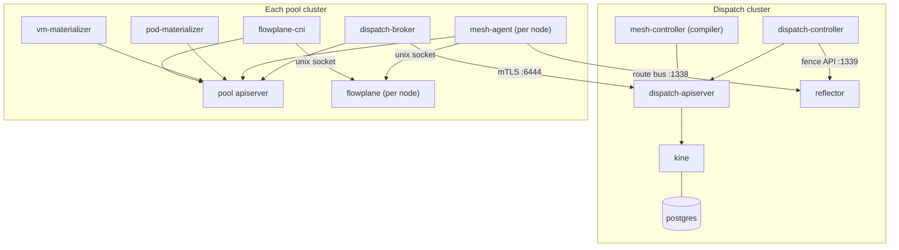

# Components

ectobase is one control plane, the dispatch, driving many compute clusters, the pools, with a
dataplane on every pool node (terms as defined in the
[vocabulary](../concepts/what-is-ectobase.md#vocabulary)). This page lists each running component: what it does,
where it runs and what it talks to. Use it to find the binary behind a behaviour, or to read a
`kubectl get pods` listing.

The dispatch components ship in the `ectobase-dispatch` chart and the pool components in
`ectobase-pool` (see [Helm values](helm-values.md)). There are six ectobase images. The `mesh`
image holds all five binaries under `mesh/cmd/` (`agent`, `controller`, `reflector`,
`pod-materializer`, `vm-materializer`); `dispatch-apiserver`, `dispatch-controller`,
`dispatch-broker`, `flowplane` and `cni` hold one component each.

## Dispatch components

These run once per fleet, in the dispatch cluster.

### dispatch-apiserver

The aggregated apiserver that serves every ectobase API group: `net`, `compute`, `storage`,
`compiled` and `platform`. Users write intent into it and controllers write compiled objects into
it. It stores everything in kine over postgres. With `pki.enabled` it runs `hostNetwork` on port
6444, presents a cert-manager serving certificate from the `ectobase-ca` root, and accepts client
certificates only from the separate dispatch client CA (`ectobase-dispatch-client-ca`), so brokers
(`dispatch-broker`) can reach it directly over mTLS. In-cluster clients reach it through the host
apiserver's aggregation layer. One replica, `Recreate` strategy.

### kine and postgres

kine is an etcd-v3 shim (`rancher/kine`) that the apiserver uses as its etcd. postgres is kine's
backing store and holds all dispatch state; see
[Where postgres keeps the dispatch state](../operations/deploy-helm.md#where-postgres-keeps-the-dispatch-state).
Neither is highly available.

### dispatch-controller

The fleet's own reconcilers, run in one manager (`dispatch/cmd/controller`):

- the `ClusterPool` health reconciler, which derives `status.phase` from the broker's lease
  (stale after 30 seconds);
- the schedulers, which bind unbound `VirtualMachine`s and `Container`s to a pool by writing
  `spec.clusterName`;
- the failover reconciler, which fences a pool that is `Unknown` with a lease more than two
  minutes old (a Ceph `NetworkFence` and a reflector route fence per /64), rebinds its VMs elsewhere, releases the
  retired twins, and lifts the fences once the pool is back and safe;
- the `RouteBusIdentity` signer, which signs each pool's intermediate CA from the `ectobase-ca`
  root, and each pool broker's dispatch client certificate from the dispatch client CA, with a
  subject it forces.

It dials the reflector's admin port, set by `reflectorAdmin`, with a client certificate whose CN
is `dispatch-controller`, issued directly by the root; the reflector accepts admin calls only from
that identity.

### mesh-controller

The compiler (`mesh/cmd/controller`). It lowers intent into the `compiled` group and runs the
central allocators beside the compilers:

| Area | Reconcilers |
| --- | --- |
| Compilers | `CompiledNIC`, `CompiledVM`, `CompiledContainer`, `CompiledVolumeAttachment` |
| Allocators | VNIs for `VPC`s, overlay addresses and MACs for `NetworkInterface`s, `Subnet` and `IPPool` validation, load-balancer addresses, NAT gateway port blocks and public addresses |
| Lifecycle | the release of retired `CompiledVM` twins, the VM placement and disk identity mirrors onto `VirtualMachine` and `Volume`, RBD image reclaim when a `Volume` is deleted, and a periodic orphan sweep of twins whose source is gone |
| Status only | `VPCPeering` consent |

The allocators rely on a single writer, so the manager runs with leader election. It is a
`hostNetwork` singleton on the control-plane node with the `Recreate` strategy, and its metrics
listener is off so a restart cannot collide on a host port.

### reflector

The reflector (`mesh/cmd/reflector`) is the hub of the route bus. Agents open
`routebus.v1` sessions to it on port 1338, announce their routes, and receive the routes of the
VNIs (virtual network identifiers) they subscribe to. The `dispatch-controller` uses a separate admin port, 1339, to set and
clear route fences and to ask what a fenced prefix still announces (`AnnouncedFrom`). It runs
`hostNetwork` on the control-plane node, one replica, `Recreate` strategy. See
[The route bus](../architecture/route-bus.md).

## Pool components

These run in every pool cluster, in namespace `ectobase-system`.

### flowplane

The eBPF dataplane (`flowplane serve`), a privileged DaemonSet with `hostNetwork` and `hostPID`.
It loads the tcx programs, pins their maps under `/sys/fs/bpf/flowplane` so a restart can adopt
them, and serves the `DataplaneNode` gRPC API on the unix socket
`/run/flowplane/dataplane.sock`. The agent and the CNI drive it through that socket. Its readiness
probe waits for the socket, which `flowplane` creates only once the datapath is loaded and
serving. See [The flowplane dataplane](../architecture/dataplane/index.md).

### mesh-agent

The per-node control loop (`mesh/cmd/agent`), a `hostNetwork` DaemonSet. It reads the node's
`CompiledNIC`s from the pool's own apiserver, programs `flowplane` over the socket, and announces
and learns overlay routes over the route bus. It stamps the node's underlay /64 onto the `Node`
object. With `pki.enabled` it creates its own cert-manager `Certificate` (CN = node name, IP SAN =
its underlay address) from the pool's `ectobase-pool-ca` `Issuer`, so the reflector can tie each
route's nexthop to the node that announced it. It never talks to the dispatch apiserver; its
only link to the dispatch cluster is its route-bus session to the reflector.

### flowplane-cni

The overlay CNI plugin (`cni/plugin`). The `flowplane-cni-install` DaemonSet copies the binary and
a kubeconfig onto each node; Multus calls it as a secondary network. On ADD it finds the
interface's `CompiledNIC`: by the pod's `net.ectobase.dev/network-interface` annotation for a
container, or by the MAC in the Multus networks annotation for a KubeVirt launcher pod, which
carries no such annotation. It then asks `flowplane` to attach the interface. See
[Attaching workloads](../architecture/attaching-workloads.md).

### dispatch-broker

One per pool (`dispatch/cmd/broker`), a `hostNetwork` Deployment on the control-plane node with
the `Recreate` strategy. It talks to two apiservers: it watches the compiled objects in
`pool-<name>` on the dispatch and reconciles them onto the pool's apiserver, and it reports the
pool's lease, capacity, node prefixes, drain state, VM placement, disk identity and twin releases
back up. It requests its own dispatch client certificate from the dispatch signer, enrolling with a
short-lived bootstrap token on first boot, and the pool's intermediate CA (see
[Fresh-pool enrollment](../operations/deploy-helm.md#fresh-pool-enrollment-bootstrap)).

### pod-materializer

Turns each `CompiledContainer` into a `Pod` (`mesh/cmd/pod-materializer`), with the Multus
annotation for the `flowplane-overlay` network and the annotation naming its NIC. The pool's
kube-scheduler picks the node. It works against the pool's apiserver only and never touches the
datapath, so it does not need `hostNetwork`.

### vm-materializer

Turns each `CompiledVM` into a KubeVirt `VirtualMachine` and each `CompiledVolumeAttachment` into
a CDI `DataVolume`, and reports each provisioned disk's identity back onto its attachment
(`mesh/cmd/vm-materializer`). Deployed only with `vmMaterializer.enabled`, on pools that run
KubeVirt and CDI. See [Storage and VMs](../architecture/storage-and-vms.md).

## WAN edge components

No chart deploys the WAN edges. Each edge runs `flowplane serve --role edge`, which attaches
`wan_rx` to the WAN-facing interface, and a `mesh-agent` with `--edge-loopback` and no
kubeconfig. The edge agent mints its own route-bus certificate from the edge fleet's
intermediate. With `--health-addr` set, it answers `/readyz` with 200 only once its route-bus
session has converged, meant for holding back the edge's anycast advertisement until it has the
load-balancer tables; nothing in the lab gates the edge's advertisement on it yet. In the lab both run
as containerlab nodes in each edge's network namespace. See [The WAN edge](../features/ns-edge.md).

## Deployment map

| Component | Image | Chart | Kind | Scope |
| --- | --- | --- | --- | --- |
| `dispatch-apiserver` | `dispatch-apiserver` | dispatch | Deployment | dispatch |
| `kine`, `postgres` | `rancher/kine`, `postgres` | dispatch | Deployment | dispatch |
| `dispatch-controller` | `dispatch-controller` | dispatch | Deployment | dispatch |
| `mesh-controller` | `mesh` | dispatch | Deployment | dispatch |
| `reflector` | `mesh` | dispatch | Deployment | dispatch |
| `flowplane` | `flowplane` | pool | DaemonSet | every pool node |
| `mesh-agent` | `mesh` | pool | DaemonSet | every pool node |
| `flowplane-cni-install` | `cni` | pool | DaemonSet | every pool node |
| `dispatch-broker` | `dispatch-broker` | pool | Deployment | one per pool |
| `pod-materializer` | `mesh` | pool | Deployment | one per pool |
| `vm-materializer` | `mesh` | pool (opt-in) | Deployment | one per pool |
| edge `flowplane`, edge `mesh-agent` | `flowplane`, `mesh` | none | containers | each WAN edge |

## Where to go next

- [Architecture overview](../architecture/overview.md): how the components work together.
- [CRD interactions](crd-interactions.md): the objects each component reads and writes.
- [Deploy with Helm](../operations/deploy-helm.md): installing them.
- [Repository layout](../contributing/repository-layout.md): where each binary's code lives.
