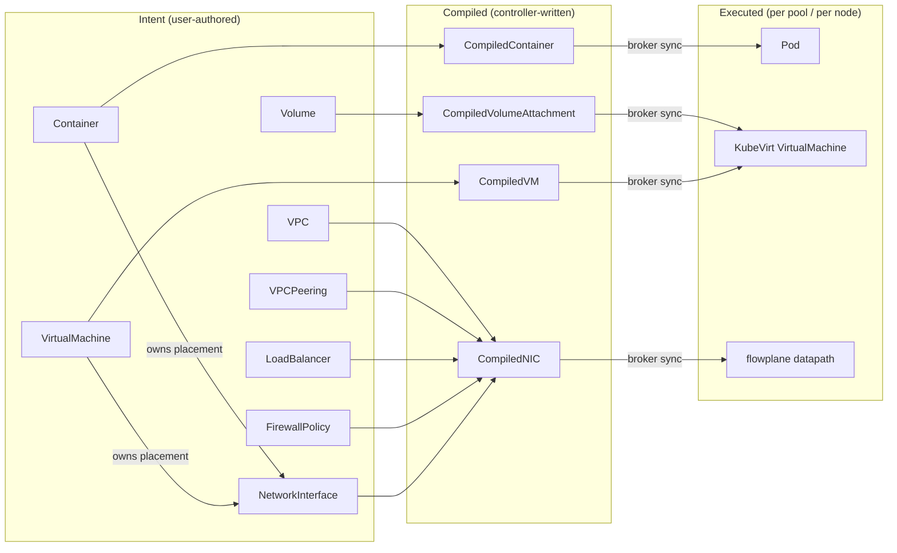

# CRD interactions

The generated per-field API pages describe each Custom Resource in isolation. This
page is the connective tissue they lack: how the resources relate, and how a
user's declared **intent** becomes a **compiled** object and is finally
**executed** on a node.

## The five API groups

ectobase splits its API surface into five groups, each with a distinct role in
the lifecycle. All live under `*.ectobase.dev` and are served at version
`v1alpha1`.

| Group | Written by | Kinds |
| --- | --- | --- |
| [`net.ectobase.dev`](api/net.md) | users | VPC, NetworkInterface, FirewallPolicy, LoadBalancer, NATGateway, FloatingIP, VPCPeering |
| [`compute.ectobase.dev`](api/compute.md) | users | VirtualMachine, Container |
| [`storage.ectobase.dev`](api/storage.md) | users | Volume |
| [`compiled.ectobase.dev`](api/compiled.md) | controllers | CompiledNIC, CompiledVM, CompiledContainer, CompiledVolumeAttachment |
| [`platform.ectobase.dev`](api/platform.md) | hub controller | ClusterPool |

The **net**, **compute** and **storage** groups are *authored* — a user (or a
higher-level system) declares desired state in them. The **compiled** group is
*derived* — no human writes it; the netplane compiler produces it. The
**platform** group is *operational* — it models the fleet of pool clusters that
workloads can be scheduled onto.

## Intent, compiled, executed

The core idea is a three-stage lowering. Users declare high-level intent; a
compiler flattens the graph of related resources into a small, self-contained
per-workload object; a per-pool broker ships that object to the cluster that owns
the workload; and node-local executors turn it into real datapath and platform
objects.

### 1. Workloads own placement; NICs derive it

A workload — a **Container** or **VirtualMachine** — is the placement authority.
It declares *where* it runs (which pool). Its **NetworkInterface**s do not decide
placement themselves; they inherit it from the workload that owns them. This keeps
a workload and all of its NICs co-located on the same node and pool without the
user having to restate placement per interface.

### 2. The compiler lowers the intent graph

The netplane compiler (the `netplane-controller`) watches the authored groups and
flattens each workload's slice of the graph into a single compiled object:

- **NetworkInterface + FirewallPolicy + LoadBalancer + VPCPeering → CompiledNIC.**
  The compiler resolves the interface's VPC membership, folds in the firewall
  rules that apply to it, the load-balancer backends it participates in, and the
  peer route imports from any VPCPeering — producing one self-contained policy
  object per NIC. The agent reads only this; it never reads the raw net-group
  resources. NAT allocation (from **NATGateway**, and public addresses from
  **FloatingIP**) is resolved centrally and lands here too.
- **VirtualMachine → CompiledVM.** Boot / interface / placement facts flattened
  for the VM materializer.
- **Container → CompiledContainer.** The same, for containers, consumed by the
  pod materializer.
- **Volume → CompiledVolumeAttachment.** The storage attachment a workload needs.

The compiler writes the `compiled.ectobase.dev` objects with a `spec.clusterName`
identifying the pool that owns the workload.

### 3. The broker syncs compiled objects to the owning pool

Each pool cluster runs a **hub-broker** (a kubelet-analog). It watches the
compiled objects in the hub apiserver, filtered to its own `spec.clusterName`,
and set-reconciles them onto the pool cluster's local apiserver. This is the seam
that keeps the hub authoritative while giving each pool a local, node-reachable
copy of exactly the compiled objects it owns.

### 4. Executors realize the compiled objects

Inside the pool, node-local executors turn compiled objects into real state:

- **netplane agent** consumes CompiledNIC and programs the node's flowplane
  datapath (firewall, NAT, LB, VNI, peer route imports) — one agent per node.
- **pod-materializer** turns CompiledContainer into a `v1.Pod` attached to the
  flowplane overlay.
- **vm-materializer** turns CompiledVM (and CompiledVolumeAttachment) into a
  KubeVirt `VirtualMachine`.

## Intent → compiled → executor summary

| Intent kind(s) | Compiled kind | Executor | Produces |
| --- | --- | --- | --- |
| NetworkInterface + FirewallPolicy + LoadBalancer + VPCPeering (+ VPC, NATGateway, FloatingIP) | CompiledNIC | netplane agent (per node) | flowplane datapath programming (firewall / NAT / LB / VNI / peer routes) |
| VirtualMachine | CompiledVM | vm-materializer (per pool) | KubeVirt VirtualMachine |
| Container | CompiledContainer | pod-materializer (per pool) | Pod on the flowplane overlay |
| Volume | CompiledVolumeAttachment | vm-materializer (per pool) | volume attachment on the VM |

## Where placement lives: ClusterPool

**ClusterPool** (`platform.ectobase.dev`) is the fleet inventory: one object per
pool cluster. The hub controller reconciles it (seeding a new pool's lifecycle
phase), and its `clusterName` is what the compiler stamps onto compiled objects
and what each pool's broker filters on. It is the anchor that ties a workload's
placement decision to a concrete cluster.

## See also

- [net API reference](api/net.md)
- [compute API reference](api/compute.md)
- [storage API reference](api/storage.md)
- [compiled API reference](api/compiled.md)
- [platform API reference](api/platform.md)
- [Components](components.md) — the binaries that implement each stage
- [Generated artifacts](generated-artifacts.md) — how the CRDs and RBAC stay DRY
