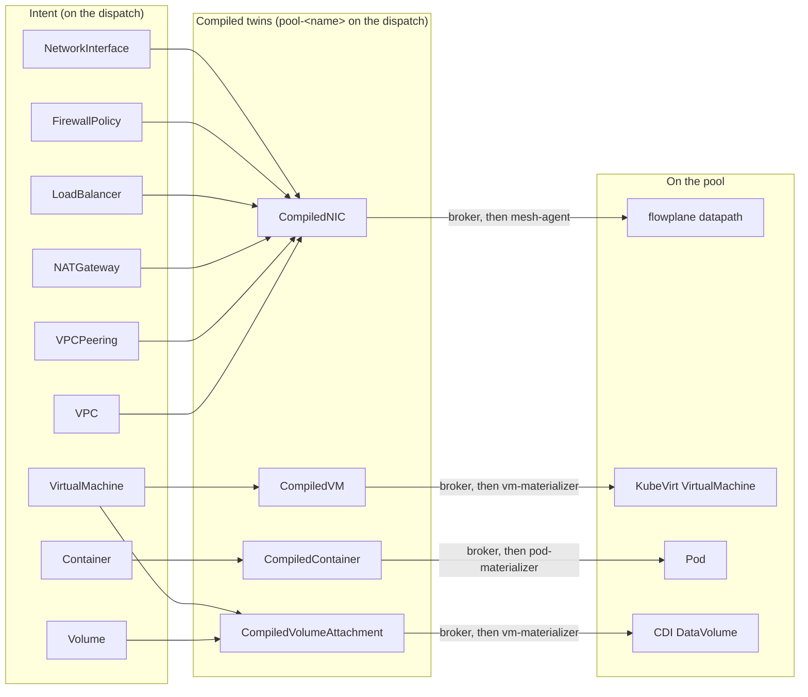

# CRD interactions

The generated API pages describe each kind on its own. This page describes how the kinds relate:
which ones users write, how the compiler turns them into compiled objects, which component acts
on each compiled object, and where addresses and placement come from. Terms such as dispatch,
pool, compiler and twin are defined in the [vocabulary](../concepts/what-is-ectobase.md#vocabulary).

All ectobase kinds are version `v1alpha1` in groups under `ectobase.dev`, and the
dispatch's aggregated apiserver (`dispatch-apiserver`) serves all of them
(`dispatch/cmd/apiserver/main.go`).

## The five API groups

The groups split the API by who writes it and when.

| Group | Written by | Kinds |
| --- | --- | --- |
| [`net.ectobase.dev`](api/net.md) | users, except `IPAllocation` | `VPC`, `Subnet`, `NetworkInterface`, `FirewallPolicy`, `LoadBalancer`, `IPPool`, `NATGateway`, `VPCPeering`, `FloatingIP`, `IPAllocation` |
| [`compute.ectobase.dev`](api/compute.md) | users | `VirtualMachine`, `Container` |
| [`storage.ectobase.dev`](api/storage.md) | users | `Volume` |
| [`compiled.ectobase.dev`](api/compiled.md) | the compiler | `CompiledNIC`, `CompiledVM`, `CompiledContainer`, `CompiledVolumeAttachment` |
| [`platform.ectobase.dev`](api/platform.md) | the operator at enrollment, then controllers and brokers on status | `ClusterPool`, `RouteBusIdentity` |

`net`, `compute` and `storage` hold intent: what the user wants. `compiled` is derived: the
compiler (the mesh-controller) produces it and nobody edits it by hand. `platform` describes the
fleet itself.

`IPAllocation` is the one `net` kind that users don't write. The allocators create one per
address they hand out of an `IPPool`, and it lives beside the pool because its name is what
enforces uniqueness there (see [Where addresses come from](#where-addresses-come-from)).

!!! note "Status: Planned"
    `FloatingIP` is served but is a scaffold: its spec and status are empty, and nothing compiles
    or reconciles it. The dataplane has a floating-IP DNAT path, but it is not driven from this
    kind yet.

The `compiled` kinds also exist as CRDs on every pool, because that is where the twins land.
The pool chart installs the `net` CRDs too, but no pool component reads them: the agent, the CNI
and the materializers read only compiled kinds.

## From intent to a running workload

[From intent to a running workload](../concepts/intent-to-running.md) tells the story of a request
end to end. This section is the lookup: which compiled kind each intent kind becomes, and which
component acts on it in the pool.

```mermaid
flowchart LR
    subgraph intent["Intent (on the dispatch)"]
        VM[VirtualMachine]
        CT[Container]
        NIC[NetworkInterface]
        VOL[Volume]
        FW[FirewallPolicy]
        LB[LoadBalancer]
        NAT[NATGateway]
        PEER[VPCPeering]
        VPC[VPC]
    end

    subgraph compiled["Compiled twins (pool-&lt;name&gt; on the dispatch)"]
        CNIC[CompiledNIC]
        CVM[CompiledVM]
        CCT[CompiledContainer]
        CVA[CompiledVolumeAttachment]
    end

    subgraph exec["On the pool"]
        DP[flowplane datapath]
        KVM[KubeVirt VirtualMachine]
        POD[Pod]
        DV[CDI DataVolume]
    end

    NIC & FW & LB & NAT & PEER & VPC --> CNIC
    VM --> CVM
    CT --> CCT
    VM & VOL --> CVA

    CNIC -->|broker, then mesh-agent| DP
    CVM -->|broker, then vm-materializer| KVM
    CCT -->|broker, then pod-materializer| POD
    CVA -->|broker, then vm-materializer| DV
```

### Intent to compiled

The compiler writes one compiled object per source object.

| Intent | Compiled | What it carries |
| --- | --- | --- |
| `NetworkInterface`, plus the `VPC`, `FirewallPolicy`s, `LoadBalancer`s, `NATGateway` and `VPCPeering`s that apply to it | `CompiledNIC` | VNI, overlay addresses, MAC, firewall rules, NAT sources, load-balancer memberships, peer route imports, QoS |
| `VirtualMachine` | `CompiledVM` | boot and interface facts for `vm-materializer` |
| `Container` | `CompiledContainer` | the same, for `pod-materializer` |
| `VirtualMachine` and each `Volume` it references | `CompiledVolumeAttachment` | one per entry in `spec.volumeRefs`: the disk to provision or adopt |

Each twin lives in the namespace `pool-<clusterName>` on the dispatch and carries the pool in
`spec.clusterName`. It is named `<sourceNamespace>-<sourceName>`; a `CompiledVolumeAttachment`
is named `<vmNamespace>-<vmName>-<volume>`. A finalizer on the source object tears its twins
down. A `CompiledNIC` is emitted only once the NIC is `Allocated` by central IPAM, and a source
that drops out of `Allocated` keeps its last compiled object (see
[IPAM migration](../operations/ipam-migration.md#keep-last-good-a-bad-edit-does-not-tear-down-a-workload)).

### Compiled to running

The broker (`dispatch-broker`) copies each twin from `pool-<name>` on the dispatch into the
pool, back into its source namespace. On the compiled objects and its `ClusterPool` it writes
only status subresources: the lease, node prefixes, drain state, VM placement and disk identity.

| Compiled | Executor | Produces |
| --- | --- | --- |
| `CompiledNIC` | `mesh-agent`, one per node | datapath state in `flowplane` (interfaces, firewall, NAT, load balancing, routes) and route announcements on the [route bus](../architecture/route-bus.md) |
| `CompiledContainer` | `pod-materializer` | a `Pod` attached to the overlay through Multus and `flowplane-cni` |
| `CompiledVM` | `vm-materializer` | a KubeVirt `VirtualMachine` |
| `CompiledVolumeAttachment` | `vm-materializer` | a CDI `DataVolume`: an RBD-backed PVC, imported from a boot image or blank |

## Where addresses come from

Three allocators in the compiler assign addresses, each from the scope the address means
something in.

| Address | Comes from | Recorded in |
| --- | --- | --- |
| Overlay IP of a NIC | a `Subnet` of the NIC's VPC (`spec.subnetRef`, or the VPC's only `Subnet`) | `NetworkInterface.status.allocatedIPs` |
| MAC of a NIC | derived from the NIC's UID, or its pinned `spec.mac`, unique in the VPC | `NetworkInterface.status.allocatedMAC` |
| Load-balancer address | the `IPPool` in `LoadBalancer.spec.poolRef` | one `IPAllocation`, and `LoadBalancer.status.allocatedIP` |
| NAT gateway public addresses | the `IPPool` in `NATGateway.spec.poolRef`, or the literal `spec.publicIPs` when no pool is set | one `IPAllocation` per address, and `NATGateway.status.allocations` |

A `Subnet` belongs to a VPC because an overlay address only means something inside its VPC. An
`IPPool` belongs to no VPC, because the ranges it hands out are fabric- or internet-wide.

An `IPPool` is typed. `spec.type` is `public` (reachable from outside the fabric) or `internal`
(never leaves the fabric), and a consumer is refused a pool of the wrong type. A `LoadBalancer`
pointed at an `internal` pool goes `Invalid` rather than `Pending`: an internal range advertised
to the WAN would be unreachable, so the intent is wrong, not early.

Each allocated address is one `IPAllocation` named `<pool>-<encoded address>`. `192.0.2.1` in pool
`demo-pool` becomes `demo-pool-192-0-2-1`; IPv6 addresses are written out in full, never
compressed, so the name splits back into pool and address one way only. The name is the claim.
Object names are unique in a namespace, so creating one is a compare-and-swap: two allocators
racing for the last free address cannot both win, and neither needs to know the other exists.
That is what lets load balancers and NAT gateways draw from the same pool.

Two consequences follow from that choice:

- It costs one API object per address. A fully allocated /16 is about 65,000 objects in one
  namespace. Public pools are a handful of prefixes, so that is acceptable there, and it is why
  `Subnet` does not work this way.
- Reclaiming is asynchronous. An `IPAllocation` has its consumer as controller owner, so deleting
  the `LoadBalancer` frees the address through ordinary garbage collection, with no sweeper.
  Until the collector runs, the address still counts as used, and a full pool refuses a new
  consumer. That consumer parks in `Exhausted`, and the deletion of an `IPAllocation` re-enqueues
  it, so the window costs a retry, not an outage.

`IPPool.status` reports `state` (`Pending`, `Ready`, `Invalid`, or `Conflict` for the later of
two pools whose prefixes overlap in one namespace), `total` and `allocated`. `allocated` is for operators
only. No allocator reads it back: a counter cannot say which addresses are free, and a stale one
would invite a double allocation.

## Where placement lives: ClusterPool

A `ClusterPool` is the fleet's inventory entry for one pool cluster. Its name is what the
scheduler writes into `spec.clusterName` and what names the pool's `pool-<name>` namespace, so it
must be a DNS-1123 label of at most 58 characters, leaving `pool-<name>` a legal namespace name
(`api/validate/clustername.go`).

The spec is set by the operator at enrollment: `region`, `endpoint`, and optionally
`underlayPrefix`, the aggregate that contains every node's underlay address. Declaring it lets
failover fence the whole pool by one prefix instead of the node /64s it has seen. The status is
written by others. The broker reports `lease`, `allocatable`, `nodePrefixes` and `nodeDrain`; the
`dispatch-controller` derives `phase` (`Pending`, `Ready` or `Unknown`) from the lease and records
`fencedPrefixes` when it fences the pool.

A `RouteBusIdentity`, named after its pool, carries that pool's intermediate-CA request
(`spec.request`) and the signed certificate (`status.certificate`). The `dispatch-controller`
signs it, name-constrained to `spec.permittedUnderlayCIDRs`. The WAN edge fleet has one too,
named `edge`.

## Where to go next

- [From intent to a running workload](../concepts/intent-to-running.md): the same pipeline,
  told as a story.
- [Multi-cluster orchestration](../architecture/multi-cluster.md): the broker, per-pool RBAC
  and the release handshake.
- [Components](components.md): the binaries behind each step.
- [IPAM migration](../operations/ipam-migration.md): adopting existing addresses into the
  allocators.
