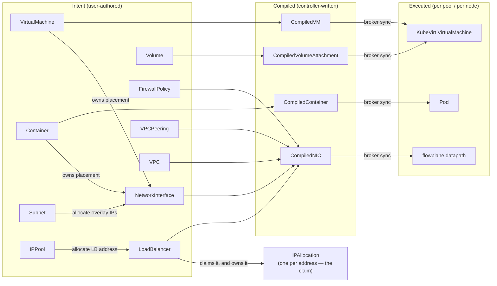

# CRD interactions

The generated per-field API pages describe each Custom Resource in isolation. This
page describes how the resources relate, and how a user's declared intent becomes a
compiled object and is finally executed on a node.

## The five API groups

ectobase splits its API surface into five groups, each with a distinct role in
the lifecycle. All live under `*.ectobase.dev` and are served at version
`v1alpha1`.

| Group | Written by | Kinds |
| --- | --- | --- |
| [`net.ectobase.dev`](api/net.md) | users | VPC, Subnet, NetworkInterface, FirewallPolicy, LoadBalancer, IPPool, NATGateway, FloatingIP, VPCPeering, IPAllocation *(allocator-written)* |
| [`compute.ectobase.dev`](api/compute.md) | users | VirtualMachine, Container |
| [`storage.ectobase.dev`](api/storage.md) | users | Volume |
| [`compiled.ectobase.dev`](api/compiled.md) | controllers | CompiledNIC, CompiledVM, CompiledContainer, CompiledVolumeAttachment |
| [`platform.ectobase.dev`](api/platform.md) | dispatch controller | ClusterPool |

The net, compute and storage groups are authored: a user (or a higher-level system)
declares desired state in them. The compiled group is derived: the mesh compiler
produces it, and no human writes it. The platform group is operational: it models the
fleet of pool clusters that workloads can be scheduled onto.

The one exception is `IPAllocation`, which sits in the authored net group but is written
by the allocators rather than by a user: it is the record of one address being held out of
one `IPPool`, and it lives beside the pool because that is the namespace its uniqueness is
enforced in. See [Where addresses come from](#where-addresses-come-from-ippool-and-ipallocation).

## Intent, compiled, executed

Lowering runs in three stages. Users declare high-level intent; a compiler flattens
the graph of related resources into a small, self-contained per-workload object; a
per-pool broker ships that object to the cluster that owns the workload; and
node-local executors turn it into real datapath and platform objects.

```mermaid
flowchart LR
    subgraph intent["Intent (user-authored)"]
        VM[VirtualMachine]
        CT[Container]
        NIC[NetworkInterface]
        VOL[Volume]
        FW[FirewallPolicy]
        LB[LoadBalancer]
        PEER[VPCPeering]
        VPC[VPC]
        SUBNET[Subnet]
        POOL[IPPool]
    end

    ALLOC["IPAllocation<br/>(one per address — the claim)"]

    subgraph compiled["Compiled (controller-written)"]
        CNIC[CompiledNIC]
        CVM[CompiledVM]
        CCT[CompiledContainer]
        CVA[CompiledVolumeAttachment]
    end

    subgraph exec["Executed (per pool / per node)"]
        POD[Pod]
        KVM[KubeVirt VirtualMachine]
        DP[flowplane datapath]
    end

    VM & CT -->|owns placement| NIC
    SUBNET -->|allocate overlay IPs| NIC
    POOL -->|allocate LB address| LB
    LB -->|claims it, and owns it| ALLOC
    NIC & FW & LB & PEER & VPC --> CNIC
    VM --> CVM
    CT --> CCT
    VOL --> CVA

    CNIC -->|broker sync| DP
    CVM -->|broker sync| KVM
    CCT -->|broker sync| POD
    CVA -->|broker sync| KVM
```

### 1. Workloads own placement; NICs derive it

A workload, a Container or VirtualMachine, is the placement authority. It declares
where it runs (which pool). Its NetworkInterfaces, named in the workload's
`spec.interfaceRefs`, inherit placement from the workload that owns them rather than
deciding it. This keeps a workload and all of its NICs co-located on the same node
and pool without the user having to restate placement per interface.

### 2. The compiler lowers the intent graph

The mesh compiler (the `mesh-controller`) watches the authored groups and
flattens each workload's slice of the graph into a single compiled object:

- NetworkInterface + FirewallPolicy + LoadBalancer + VPCPeering → CompiledNIC.
  The compiler resolves the interface's VPC membership, folds in the firewall
  rules that apply to it, the load-balancer backends it participates in, and the
  peer route imports from any VPCPeering — producing one self-contained policy
  object per NIC. The agent reads only this; it never reads the raw net-group
  resources. Address allocation is resolved centrally and lands here too: overlay
  IPs from the interface's VPC-scoped Subnet, LB addresses from the IPPool the
  LoadBalancer names, NAT from NATGateway, and public addresses from FloatingIP.
- VirtualMachine → CompiledVM. Boot / interface / placement facts flattened
  for the VM materializer.
- Container → CompiledContainer. The same, for containers, consumed by the
  pod materializer.
- Volume → CompiledVolumeAttachment. The storage attachment a workload needs.

Central IPAM gates compilation. The compiler emits a CompiledNIC only once the
interface's addresses are finalized: `NetworkInterface.status.state` is `Allocated`,
`status.observedGeneration` matches the spec generation, and `status.allocatedIPs`
is populated (CompiledNIC's overlay IPs are sourced from `status.allocatedIPs`, never
`spec.ips`). It carries a LoadBalancer's membership only once that LB reaches
`Allocated` with an assigned `status.allocatedIP`. A resource that regresses out of
`Allocated` suppresses re-emission but keeps its last compiled object.

The same is true of L2: the IPAM reconciler allocates a MAC in the same status write, and
`CompiledNIC.spec.mac` is sourced from `status.allocatedMAC` — a stable, VPC-unique,
locally-administered address — falling back to `spec.mac` only for a NIC not yet
MAC-allocated. A pinned `spec.mac` is still honoured, but by route of the allocator: it is
validated for format and VPC-uniqueness and adopted into `status.allocatedMAC` (an invalid or
already-taken pin makes the NIC `Invalid`, and nothing compiles).

The compiler writes the `compiled.ectobase.dev` objects with a `spec.clusterName`
identifying the pool that owns the workload, into that pool's `pool-<clusterName>` namespace
on the dispatch, named `<sourceNamespace>-<sourceName>` after the object they were compiled
from.

### 3. The broker syncs compiled objects to the owning pool

Each pool cluster runs a dispatch-broker (a kubelet-analog). It watches the compiled objects
in its own `pool-<clusterName>` namespace on the dispatch apiserver — the only namespace its
RBAC authorizes — and set-reconciles them onto the pool cluster's local apiserver, back into
each object's source namespace. This is the seam that keeps the dispatch authoritative while
giving each pool a local, node-reachable copy of exactly the compiled objects it owns.

### 4. Executors realize the compiled objects

Inside the pool, node-local executors turn compiled objects into real state:

- mesh agent consumes CompiledNIC and programs the node's flowplane
  datapath (firewall, NAT, LB, VNI, peer route imports) — one agent per node.
- pod-materializer turns CompiledContainer into a `v1.Pod` attached to the
  flowplane overlay.
- vm-materializer turns CompiledVM (and CompiledVolumeAttachment) into a
  KubeVirt `VirtualMachine`.

## Intent → compiled → executor summary

| Intent kind(s) | Compiled kind | Executor | Produces |
| --- | --- | --- | --- |
| NetworkInterface + FirewallPolicy + LoadBalancer + VPCPeering (+ VPC, Subnet, IPPool, NATGateway, FloatingIP) | CompiledNIC | mesh agent (per node) | flowplane datapath programming (firewall / NAT / LB / VNI / peer routes) |
| VirtualMachine | CompiledVM | vm-materializer (per pool) | KubeVirt VirtualMachine |
| Container | CompiledContainer | pod-materializer (per pool) | Pod on the flowplane overlay |
| Volume | CompiledVolumeAttachment | vm-materializer (per pool) | volume attachment on the VM |

## Where addresses come from: IPPool and IPAllocation

Overlay IPs come from a `Subnet`, which is VPC-scoped because an overlay address only
means anything inside its VPC. Every other address — a load-balancer address today, a NAT
gateway's public addresses next — comes from an `IPPool`, which belongs to no VPC because
the ranges it hands out are fabric- or internet-wide.

An `IPPool` is **typed**. `spec.type` is `public` (internet-routable: LB addresses, NAT
addresses) or `internal` (a range that never leaves the fabric), and a consumer states the
type it needs and is refused a pool of any other type. A `LoadBalancer` pointed at an
`internal` pool goes `Invalid` rather than `Pending`, because an LB address handed out of
an internal range would be advertised to the WAN and be unreachable — that is the intent
being wrong, not a wait. The type is what stops one operator's internal range from being
spent as somebody else's public address.

Allocation is recorded as an object: **one `IPAllocation` per address**, named
`<pool>-<encoded address>` (`192.0.2.1` in pool `demo-pool` becomes
`demo-pool-192-0-2-1`; IPv6 is expanded, never compressed, so the name splits
unambiguously). The name is the point. Object names are unique within a namespace, so
creating one is a compare-and-swap: two allocators racing for the last free address cannot
both win, and neither has to assume it is the only writer. That is what lets a NAT gateway
and a load balancer draw from the same pool without either knowing the other exists — the
previous design scanned other `LoadBalancer` statuses for a used-set, which is only correct
while exactly one controller allocates.

Two consequences are worth stating rather than discovering:

- **It is one API object per address.** A fully-allocated `/16` is roughly 65,000
  `IPAllocation` objects in one namespace. That is acceptable at the address counts in
  play — a public pool is a handful of prefixes, not a datacenter's worth of RFC1918 — but
  it is a real property of the choice, and it is why `Subnet` does *not* work this way.
- **Reclamation is asynchronous.** An `IPAllocation` carries an ownerReference to its
  consumer, so deleting the `LoadBalancer` frees the address through ordinary Kubernetes
  garbage collection; nothing has to run a sweeper. But the collector runs on its own
  schedule, so between the consumer's deletion and the collection there is a window in
  which the address still counts as used, and a pool at capacity will refuse a new consumer
  during it. The refused consumer parks in `Exhausted` and a delete-only watch on
  `IPAllocation` re-enqueues it the moment the claim actually disappears, so the window
  costs a retry, not an outage. Deleting an allocation whose owner merely *looks* gone
  would be a second allocator racing the collector, so nothing does it.

`IPPool.status` reports `state` (`Pending`, `Ready`, `Invalid`, or `Conflict` when two
pools in a namespace overlap), `total`, and `allocated`. The last is a convenience for
operators, derived on each sync — no allocator reads it back, because a counter cannot say
*which* addresses are free and a stale one would be a licence to double-allocate.

## Where placement lives: ClusterPool

ClusterPool (`platform.ectobase.dev`) is the fleet inventory: one object per
pool cluster. The dispatch controller reconciles it (seeding a new pool's lifecycle
phase), and its name is what the compiler stamps onto compiled objects as
`spec.clusterName` and what names the `pool-<clusterName>` namespace each pool's broker is
scoped to. It is validated as a DNS-1123 label of at most 58 characters so that derived
namespace is itself legal (`api/validate/clustername.go`). It is the anchor that ties a
workload's placement decision to a concrete cluster.

## See also

- [net API reference](api/net.md)
- [compute API reference](api/compute.md)
- [storage API reference](api/storage.md)
- [compiled API reference](api/compiled.md)
- [platform API reference](api/platform.md)
- [Components](components.md) — the binaries that implement each stage
- [Generated artifacts](generated-artifacts.md) — how the CRDs and RBAC stay DRY
