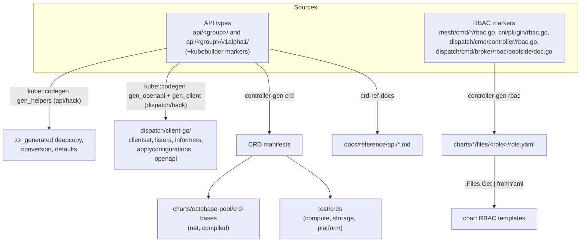

# Generated artifacts

A large part of the repository is generated rather than written by hand. The Go API types and a
set of RBAC markers are the source; `make generate` derives everything downstream of them:
deepcopy and conversion code, the typed client and OpenAPI model, CRD manifests, per-component
RBAC, and the API reference pages. This page lists each output, where it lands, and what it is
generated from, so you know which files never to edit.

The rule is short: change the source and run `make generate`. Then commit the regenerated files
with the change that caused them.



## The API package layout

Each API group has two Go packages:

- an internal package, `api/<group>/`, with the types the dispatch apiserver works with, plus
  their REST strategies (`*_rest.go`) and validation (`*_validate.go`);
- a versioned package, `api/<group>/v1alpha1/`, with the on-the-wire types and their kubebuilder
  markers.

Clients and CRDs speak the versioned types. The apiserver works against the internal ones, and
the conversions between them are generated, never written. The `api` module stays free of the
apiserver framework, so the mesh, the CNI and the broker can import it;
`api/apicheck/invariant_test.go` enforces that.

## Deepcopy, conversion and defaults

`make generate` first runs `api/hack/update-codegen.sh`, which calls `kube::codegen::gen_helpers`
from `k8s.io/code-generator`. It writes:

- `zz_generated.deepcopy.go` in both the internal and the versioned package of every group;
- `zz_generated.conversion.go` in each versioned package;
- `zz_generated.defaults.go` where a group declares defaulters, which today is only `platform`.

## Typed client and OpenAPI

`dispatch/hack/update-codegen.sh` then generates the typed client under `dispatch/client-go/` and
the OpenAPI model the apiserver serves. In-tree callers and tests reach the aggregated apiserver
through this client instead of the dynamic one.

| Output | Path | Role |
| --- | --- | --- |
| Clientset | `dispatch/client-go/clientset/` | Typed CRUD client, with a `fake` clientset for tests. |
| Listers and informers | `dispatch/client-go/listers/`, `dispatch/client-go/informers/` | Cache-backed list and watch. |
| Apply configurations | `dispatch/client-go/applyconfigurations/` | Server-side-apply builders. |
| OpenAPI | `dispatch/client-go/openapi/zz_generated.openapi.go` | The schema the apiserver serves, with `api_violations.report` beside it. |
| Model names | `api/<group>/v1alpha1/zz_generated.model_name.go` | OpenAPI model names for each type. |

The script temporarily points `k8s.io/api` and `k8s.io/apimachinery` at local clones under
`dispatch/bin/.modules` (through `dispatch/hack/use-local-modules.sh`) and restores `go.mod` on
exit. A kind's `+genclient` marker drives all of it, so a new kind gets a client on the next run.

## CRDs

`controller-gen crd` writes the CRD manifests, split by where each group is used:

| Groups | Output | Why |
| --- | --- | --- |
| `net`, `compiled` | `charts/ectobase-pool/crd-bases/` | Installed on each pool with `installCRDs`. The pool chart's `crds.yaml` template includes every file in that directory, so a changed field reaches the chart with no manual edit. |
| `compute`, `storage`, `platform` | `test/crds/` | Shipped in no chart; the dispatch apiserver serves these groups itself. The copies exist for the envtest suites in `mesh/controllers` and `dispatch/test`. |

The aggregated apiserver serves all five groups from the Go types, not from these manifests.

## RBAC

Each component's ClusterRole is declared as `+kubebuilder:rbac` markers next to its code.
`controller-gen rbac` writes one `role.yaml` per component into the chart that deploys it:

| Markers in | Generated into | Chart |
| --- | --- | --- |
| `mesh/cmd/controller/rbac.go` | `files/mesh-controller/role.yaml` | dispatch |
| `dispatch/cmd/controller/rbac.go` | `files/dispatch-controller/role.yaml` | dispatch |
| `mesh/cmd/agent/rbac.go` | `files/mesh-agent/role.yaml` | pool |
| `mesh/cmd/pod-materializer/rbac.go` | `files/pod-materializer/role.yaml` | pool |
| `mesh/cmd/vm-materializer/rbac.go` | `files/vm-materializer/role.yaml` | pool |
| `cni/plugin/rbac.go` | `files/flowplane-cni/role.yaml` | pool |
| `dispatch/cmd/broker/rbac/poolside/doc.go` | `files/dispatch-broker/role.yaml` | pool |

The chart templates splice those rules in, for example:

```yaml
rules:
  {{- (.Files.Get "files/mesh-controller/role.yaml" | fromYaml).rules | toYaml | nindent 2 }}
```

So the ClusterRole a component runs with is exactly the set of markers on its code.

!!! note "The broker's dispatch-side permissions are not generated"
    The broker needs two identities. Its pool-side role, for writing twins into the pool, comes
    from the markers in `dispatch/cmd/broker/rbac/poolside`, a package nothing imports. Its
    dispatch-side permissions are per pool by construction (a `Role` in `pool-<name>` and a
    `ClusterRole` scoped by `resourceNames`), so they are created at enrollment, not shipped in a
    chart. See [Deploy with Helm](../operations/deploy-helm.md#enroll-a-pool-on-the-dispatch).

## API reference pages

The last step of `make generate` is `make docs-crd-ref`. It runs `crd-ref-docs` (configured by
`crd-ref-docs.yaml`) over each versioned package and writes one page per group:

- [`api/net.md`](api/net.md)
- [`api/compute.md`](api/compute.md)
- [`api/storage.md`](api/storage.md)
- [`api/compiled.md`](api/compiled.md)
- [`api/platform.md`](api/platform.md)

It then escapes square brackets that are not links, so a field description such as
`Enum: [a b]` is not read as a Markdown link. The field descriptions on those pages are the Go
doc comments on the types: to fix wording there, edit the comment in `api/<group>/v1alpha1/` and
regenerate. [CRD interactions](crd-interactions.md) adds the cross-kind picture the generated
pages leave out.

## Other generated code

Two more generators run separately from `make generate`:

| Target | Output | Source |
| --- | --- | --- |
| `make proto-go` | `cni/gen/dataplanev1/` | `api/proto/dataplane/v1/dataplane.proto`, the `DataplaneNode` service |
| `make proto-routebus` | `mesh/gen/routebusv1/` | `api/proto/routebus/v1/routebus.proto`, the route bus |

The Rust side compiles its own protobuf code at build time.

## What not to edit

Don't edit a file that matches any of these; change its source and regenerate instead:

- `zz_generated.*` anywhere under `api/` or `dispatch/client-go/`;
- anything under `dispatch/client-go/`;
- `charts/ectobase-pool/crd-bases/` and `test/crds/`;
- `charts/*/files/<role>/role.yaml`;
- `docs/reference/api/`;
- `cni/gen/` and `mesh/gen/`.

## Where to go next

- [Development](../contributing/development.md): the `make` targets around generation.
- [Repository layout](../contributing/repository-layout.md): where each source lives.
- [CRD interactions](crd-interactions.md): how the generated kinds relate.
