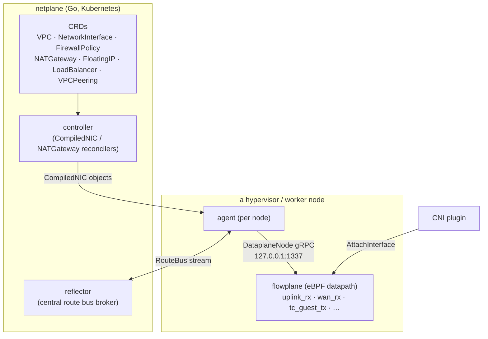

# Overview: the two planes

ectobase is a Kubernetes-native, multi-cluster IaaS networking layer for running
**containers and KubeVirt VMs** on a shared eBPF/XDP overlay. It is built from two
cleanly separated planes:

- **`flowplane`** — the **eBPF/XDP dataplane** (Rust / [aya](https://aya-rs.dev)). A
  map-driven kernel overlay that gives every workload an address on a shared IPv6
  underlay, and performs routing, stateful NAT, load balancing, a deny-by-default
  firewall, DHCP/ARP/ND, NAT64, and rate metering — all inside the Linux kernel.
- **`netplane`** — the **Kubernetes control plane** (Go). CRDs describe intent; per-node
  agents, a central route reflector, and controllers compile and distribute that intent
  down to each node's `flowplane` datapath.

The guiding principle is a **dumb datapath, smart control plane**. `flowplane` makes no
distributed decisions of its own: every forwarding action is a per-flow-keyed table
lookup — the shape a SmartNIC `rte_flow` rule would encode. All policy — which interface
gets which VNI and IPs, which routes exist, which firewall rules apply, which NAT block a
node owns — is decided in `netplane` and pushed into BPF maps.

## How the planes interact

The seam between the two planes is a small, local gRPC contract plus a route bus:

- **`DataplaneNode` gRPC** (`127.0.0.1:1337`) — the only interface into `flowplane`. The
  node agent (and the CNI plugin on pod ADD) call it to attach/detach interfaces and to
  program routes, firewall rules, NAT blocks, VIPs, and LB backends. `flowplane serve`
  translates each call into BPF map writes and interface lifecycle (veth/tap + IPAM).
  The dataplane never talks to the Kubernetes API server directly.
- **The route bus** — agents open a bidirectional `RouteBus` stream to the central
  **reflector**, which reflects per-VNI overlay routes, NAT-block records, and edge
  identities between nodes. This is the overlay's routing-distribution mechanism: a
  custom pub/sub bus, **not** BGP. (BGP appears only at the WAN edge, to announce
  public prefixes upstream.) See
  [Control/data split & the route bus](../controlplane/route-bus.md).

The control plane splits into three long-running components:

- **agent** (per node) — reconciles the node's `NetworkInterface`s and `CompiledNIC`s,
  programs the local dataplane over gRPC, and announces/learns overlay routes and NAT
  blocks over the route bus.
- **reflector** (central) — the route broker described above.
- **controller** (central) — controller-runtime reconcilers that lower high-level CRDs
  into per-node work: the **NATGateway** port-block allocator and the **CompiledNIC**
  compiler that resolves `NetworkInterface` + `FirewallPolicy` into concrete per-NIC
  firewall rules, NAT blocks, and routes for the agent to program. See
  [Compilers](../controlplane/compilers.md).

## Workload scope: containers and VMs

ectobase attaches two kinds of workloads to the same overlay:

- **Containers** — the CNI plugin (`cni/`) resolves a pod's VNI and overlay IPs from the
  CRDs and calls `AttachInterface`, which creates the pod veth and programs the datapath.
- **KubeVirt VMs** — VMs attach through a tap interface driven by the same
  `AttachInterface` path.

In both cases the workload sees an ordinary L2/L3 interface with an overlay IP; the
guest edge program (`tc_guest_tx`) intercepts its egress on the host-side veth/tap,
applies firewall + NAT, encapsulates, and redirects onto the fabric uplink. The datapath
does not distinguish container from VM traffic — both are just guest interfaces on a VNI.

## Lineage

`flowplane` began as an eBPF/XDP reimplementation of IronCore's DPDK-based
[`dpservice`](https://github.com/ironcore-dev/dpservice) — the motivation being an
**offload-ready** dataplane built on the XDP-offloadable helper subset (fixed-shape map
lookups, `bpf_xdp_adjust_head`, `bpf_redirect`, `bpf_fib_lookup`) that could later be
JIT-offloaded to a SmartNIC, replacing DPDK's Graph Framework + `rte_flow` path. Several
datapath models are inherited directly from dpservice — the Maglev load-balancer with
underlay-forwarding, distributed NAT-gateway return via neighbor-NAT, and the IP-in-IPv6
overlay format.

ectobase has since grown its **own** Kubernetes control plane (`netplane`), CRD API,
route-distribution bus, and CNI, and now targets containers and KubeVirt VMs directly.
The old dpservice-compatible gRPC surface and its vendored conformance suite have been
removed: `flowplane serve` exposes only `DataplaneNode`, and metalnet/ironcore
compatibility is no longer a design constraint. The lineage remains visible in the
datapath algorithms, not in any external contract.

## Where to go next

- [The overlay: IPv6 underlay + IP-in-IPv6](overlay.md) — the packet format and
  encap/decap.
- [Repository layout & crates](layout.md) — how the code is organized.
- [Datapath programs](../dataplane/programs.md) — the eBPF programs and the packet path.
- [The pure-core seam](../dataplane/pure-core.md) — how the same datapath code runs in
  the kernel, in the simulator, and in unit tests.
