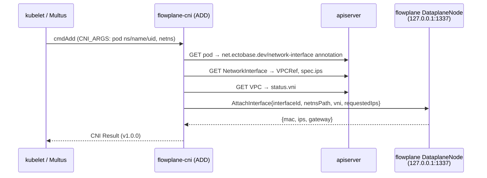

# CNI plugin

The CNI plugin (`cni/plugin`) is how a pod — typically a KubeVirt `virt-launcher`
pod — is wired into the `flowplane` overlay. It is deployed as the **Multus default
delegate**: when the pod's sandbox is created, Multus invokes this plugin as the
pod's primary network. On `ADD` it resolves the pod's overlay identity from the CRDs
and calls the node-local `flowplane` `DataplaneNode` gRPC to attach the interface
into the eBPF datapath.

## Configuration

The plugin is configured through its CNI netconf (`main.go`, `netConf`):

| Field | Default | Meaning |
|---|---|---|
| `kubeconfig` | `/etc/cni/net.d/dataplane-kubeconfig` | On-node SA-token kubeconfig used to read the pod + CRDs. |
| `dataplaneAddr` | `127.0.0.1:1337` | The node-local `flowplane` `DataplaneNode` gRPC address. |

The `flowplane` DaemonSet runs with `hostNetwork`, so from the host netns the plugin
reaches the datapath over plain TCP at `dataplaneAddr` (`dialDataplane`).

## ADD: resolve, then attach

`cmdAdd` (`main.go`) runs the whole flow under a 30-second timeout so a hung apiserver
or unreachable datapath cannot stall sandbox creation indefinitely.

1. **Parse pod identity.** Multus forwards the pod coordinates in the `;`-separated
   `CNI_ARGS` string; `parseCNIArgs` (`attach.go`) extracts `K8S_POD_NAMESPACE`,
   `K8S_POD_NAME`, `K8S_POD_UID`.

2. **Find the NetworkInterface.** `resolvePodInterfaceRef` (`attach.go`) reads the pod
   via the on-node kubeconfig and reads the
   `net.ectobase.dev/network-interface: <ns>/<name>` annotation, which names the
   `NetworkInterface` CR bound to this pod.

3. **Resolve the overlay identity.** `resolve` (`resolve.go`) gets that
   `NetworkInterface`, follows its `spec.vpcRef` to the `VPC`, and returns
   `{vni, ips}` — the VPC's `status.vni` plus the interface's user-specified
   `spec.ips`. A missing VPC ref, an unallocated VNI (`status.vni == 0`), or a missing
   NIC is a hard error. `resolve` takes an injected `client.Client`, so it unit-tests
   against a controller-runtime fake (`resolve_test.go`).

4. **Attach into the datapath.** The plugin builds an interface id of
   `<pod-uid>/<ifName>` and calls `DataplaneNode.AttachInterface` (`attach.go`) with
   the netns path, VNI, and requested IPs. `flowplane` creates the veth/tap, programs
   the datapath (allocates the underlay `/128`, seeds the maps), and returns the MAC,
   the assigned IPs, and the gateway.

5. **Return a CNI Result.** `buildResult` (`main.go`) turns the attach response into a
   CNI v1.0.0 `Result`. A Multus default network must yield at least one IP, so an
   empty IP list is an error. Each returned IP becomes an `IPConfig` (with the gateway
   attached when present); a bare address is treated as a host route.

## DEL: best-effort detach

`cmdDel` (`main.go`) is best-effort and keyed off the pod UID. It reconstructs the
`<pod-uid>/<ifName>` interface id and calls `DataplaneNode.DetachInterface`
(`detach`, `attach.go`), ignoring not-found and transport errors so teardown is
idempotent and never blocks:

- if the pod UID is missing there is nothing to detach → success;
- if the datapath is unreachable, DEL still returns success rather than blocking
  sandbox teardown.

`cmdCheck` is a no-op success: the plugin holds no per-interface state to validate.

## Why this shape

Keeping the plugin thin — resolve, then one gRPC call — means it owns no forwarding
policy. It defers **identity** to the CRDs (`NetworkInterface` → `VPC`) and the actual
**interface plumbing** (veth/tap creation, IPAM, map programming) to `flowplane`
behind the `DataplaneNode` API. That is the same API the per-node agent uses for
routes, firewall, LB, and QoS, so the CNI and the agent share one control surface onto
the datapath.

## See also

- [The CRD API](./crd-api.md) — the `NetworkInterface` / `VPC` types the plugin reads.
- [Control/data split & the route bus](./route-bus.md) — the agent that continues
  driving the same `DataplaneNode` API after attach.
- [The flowplane CLI](../dataplane/cli.md) — the `serve` daemon that answers
  `AttachInterface`.
