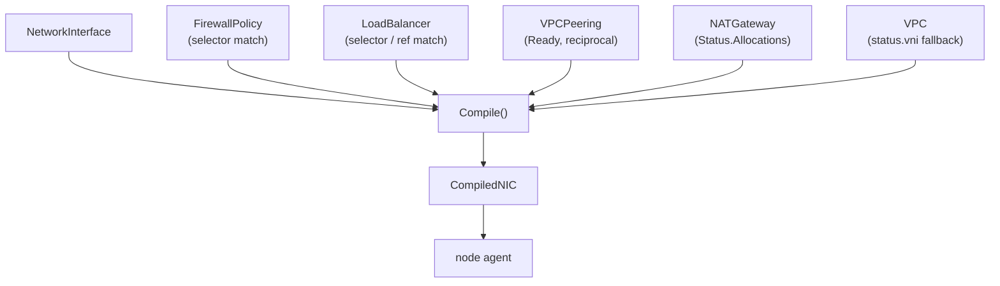

# Compilers: CompiledNIC

The user-facing CRDs describe *intent* with selectors, references, and cross-object relationships —
convenient to author, but not what a per-node agent wants to consume. The **`CompiledNIC`** object is
the lowered form: for each `NetworkInterface`, a single self-contained bundle of everything the
dataplane needs for that interface. The node agent reads **only** `CompiledNIC` objects — never the
raw `NetworkInterface`, `VPC`, `FirewallPolicy`, `LoadBalancer`, or `NATGateway`.

This is deliberate. Keeping the agent's input to one object type per interface:

- shrinks the member-node data dependency to a single kind, and
- is the foundation for **brokering only `CompiledNIC` objects** out to member clusters — the member
  cluster never needs the full central CRD set.

## What a CompiledNIC contains

`CompiledNICSpec` (in `api/v1alpha1/compilednic_types.go`) is:

| Field | Meaning |
|-------|---------|
| `nodeName` | the node this NIC is scheduled on |
| `nicRef` | the source `NetworkInterface` name |
| `vni` | the effective VNI (resolved from the NIC's `status.vni`, falling back to the VPC's) |
| `port` | the allocated dataplane port (tap / VF) |
| `underlayRoute` | the NIC's allocated underlay `/128` (copied from the NIC's `status.underlayRoute`) |
| `overlayIPs` | the guest overlay IP addresses |
| `firewall` | compiled ingress/egress rules (from matching `FirewallPolicy` objects) |
| `nat` | a list of `CompiledNATSource{sourceIP, natIP, portMin, portMax}` — one per allocated overlay IP |
| `lb` | the load balancers this NIC backs (forwarding membership only) |
| `peerImports` | peer VPC VNIs + import prefixes (from Ready `VPCPeering`s) |

Everything the agent programs — overlay host routes, egress SNAT sources, NAT-block announcements,
firewall rules, LB memberships, QoS, and route-bus subscriptions — is derivable from this spec. The
one thing *not* captured is dynamic routes learned from the route bus at runtime.

## The compiler

`CompiledNICReconciler` (in `netplane/controllers/compilednic.go`) watches `NetworkInterface` and
everything that feeds a NIC's compiled form, and upserts one `CompiledNIC` per NIC via `Compile()`:



`Compile(nic, vni, policies, lbs, peerings, natBySource)` is a pure function:

- **VNI** is resolved by the reconciler (NIC status, else VPC status) and passed in, so the compiled
  object is self-contained.
- **UnderlayRoute** is copied from the NIC's `status.underlayRoute`. (Nothing in the Go code writes
  that status field yet — the attach path is its intended writer; the compiler simply copies whatever
  is present, and the agent falls back to the node underlay while it is empty.)
- **Firewall**: each `FirewallPolicy` whose `interfaceSelector` matches the NIC's labels contributes
  `CompiledFwRule`s. An unpolicied NIC gets a single allow-all rule; a policied NIC gets *only* its
  policy rules (deny-by-default for everything else). See [Distributed firewall](../features/firewall.md).
- **NAT**: for each of the NIC's overlay IPs that a `NATGateway` has allocated a block to (looked up
  in `natBySource`, keyed by source overlay IP), a `CompiledNATSource` is appended. See [NAT
  gateway](../features/nat.md).
- **LB** and **PeerImports** are resolved from matching `LoadBalancer`s and Ready `VPCPeering`s.

The reconciler watches `NATGateway` and `VPC` with the default predicate (their relevant changes land
in `.status`, which does not bump `.metadata.generation`), and watches `FirewallPolicy`/`LoadBalancer`
by generation. A no-op recompile (identical spec) writes nothing, avoiding resourceVersion churn.

## How the agent consumes it

The agent's reconcile loop lists the `CompiledNIC`s scheduled to its node and derives, per NIC:

- **routes** — each `overlayIP` as a host route (`/32` or `/128`) with `underlayRoute` as the nexthop;
- **NAT** — each `CompiledNATSource` programmed via `AddNatSource` and announced as a NAT block on the
  route bus (owner = `underlayRoute`);
- **subscriptions** — the union of the NICs' VNIs, peer VNIs, egress VNIs, and the public VNI.

Firewall, LB, QoS, and peer imports are programmed by the matching agent reconcilers, all reading the
same `CompiledNIC` set.

## Generated artifacts

`CompiledNIC` (and every other type in `api/v1alpha1`) has its deepcopy and CRD manifest generated by
`controller-gen`. After any change to the API types, regenerate both with:

```
make generate
```

which runs `controller-gen object` (deepcopy) and `controller-gen crd` (the manifests under
`charts/ectobase-pool/crd-bases` for the net + compiled groups, and `test/crds` for the
hub-aggregated-only compute/storage/platform groups). These files are **not** hand-maintained.
