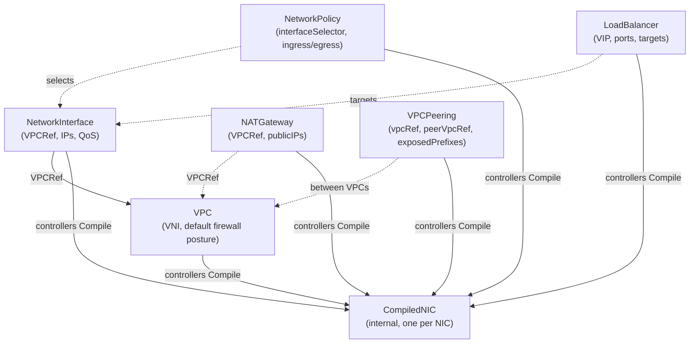

# The CRD API

All intent in ectobase is expressed as Kubernetes custom resources in the
`net.ectobase.dev/v1alpha1` API group (`api/v1alpha1/`). Users author a handful of
declarative types; central controllers compile them into a single internal,
node-local type — `CompiledNIC` — that the per-node agent programs onto the datapath.

The design leans on a few deliberate choices:

- **Thin `NetworkInterface`.** A NIC is identity plus IPs, nothing more. Policy, load
  balancing, NAT, and peering attach to it from the *outside* via selectors and refs,
  rather than being embedded in the NIC.
- **User-specified overlay IPs.** The platform does not allocate overlay addresses;
  the user names them on the `NetworkInterface`. IPAM validity is the user's
  responsibility. (The underlay `/128` per NIC *is* platform-allocated.)
- **VNI as a central-allocated global space.** A `VPC` gets a VXLAN network
  identifier from a single global pool, either pinned or auto-allocated.
- **Selector/ref-based attachment.** `NetworkPolicy`, `LoadBalancer`, and
  `VPCPeering` select or reference NICs rather than being fields on them, which keeps
  the NIC stable as policy changes.



## Generation

The deepcopy methods (`zz_generated.deepcopy.go`) and the CRD YAML manifests
(`config/crd/bases`) are **generated by controller-gen**, not hand-maintained:

```sh
make generate   # controller-gen object + crd, from api/v1alpha1
```

After editing any `*_types.go`, run `make generate` so both the deepcopy and the CRD
schema stay in sync with the Go types.

## User-facing types

### VPC

An isolation domain — one overlay network, identified by a VNI on the shared
underlay (`vpc_types.go`).

| Field | Meaning |
|---|---|
| `spec.vni` | Optionally pins the VNI. Nil/0 → allocated from the global VNI space. |
| `spec.defaultPolicy` | `Allow` (k8s semantics: NICs open until a policy selects them) or `Deny` (VPC-wide default-deny). |
| `status.vni` | The effective, allocated VNI. The CNI and agent resolve a NIC's VNI through here. |
| `status.state` | Lifecycle (`Pending`, `Ready`). |

### NetworkInterface

A thin NIC attached to a pod or VM: identity plus the user's overlay IPs
(`networkinterface_types.go`).

| Field | Meaning |
|---|---|
| `spec.vpcRef` | The VPC this NIC belongs to (VNI is resolved from it). |
| `spec.ips` | User-specified overlay IPs (v4 and/or v6). Not platform-allocated. |
| `spec.nodeName` | The node the NIC is scheduled onto (set by the scheduler). |
| `spec.qos` | Optional per-interface traffic control (see below). Nil = unlimited. |
| `status.vni` | Effective VNI resolved from the VPC. |
| `status.underlayRoute` | The allocated underlay `/128` from the host's underlay `/64`. |
| `status.port` | The dataplane port (`tap` or `vf`) allocated for this NIC. |

`InterfaceQoS` splits into an EDT-shaped **egress** rate (smoothed at the uplink `fq`
qdisc, with an optional policed `publicMbps` sub-cap for external/NATed traffic) and a
token-bucket-policed **ingress** rate. All programmed via `DataplaneNode.ConfigureQoS`.
See [QoS: EDT shaping & policing](../features/qos.md).

### NetworkPolicy

Selector-based distributed firewall rules (`networkpolicy_types.go`).

| Field | Meaning |
|---|---|
| `spec.interfaceSelector` | Label selector choosing the NICs this policy applies to. |
| `spec.ingress` / `spec.egress` | Ordered lists of `NetworkPolicyRule`. |

Each `NetworkPolicyRule` is `{cidr, proto, port, action}`, where `cidr` is the source
(ingress) or destination (egress) match, `proto` is `TCP`/`UDP`/`ICMP`/`""`(any), and
`action` is `Allow` or `Deny`. The datapath is deny-by-default; the compiler
materializes k8s "open-until-selected" as an explicit allow-all for any NIC no policy
selects. See [Distributed firewall](../features/firewall.md).

### LoadBalancer

A virtual IP fronting a set of backend NICs (`loadbalancer_types.go`).

| Field | Meaning |
|---|---|
| `spec.vip` | The VIP (v4 or v6). It is the LB's identity and the `AddLbVip` id. |
| `spec.ports` | Service `(port, proto)` tuples. |
| `spec.targetSelector` | Label-select backend NICs (mutually exclusive with `targetRefs`). |
| `spec.targetRefs` | Name backend NICs explicitly. |

LB membership is **pure forwarding** — it grants no firewall permission. Because
forwarding is DSR (the inner destination stays the VIP), traffic to a backend's VIP
is *not* covered by a policy written for that backend's own overlay IP; an explicit
`VIP:port` allow rule is required. See
[Load balancing](../features/loadbalancer.md).

### NATGateway

Drain-safe egress SNAT for a VPC's sources, using deterministic
`(public-IP, port-block)` allocation (`natgateway_types.go`).

| Field | Meaning |
|---|---|
| `spec.vpcRef` | The VPC whose interfaces egress through this gateway. |
| `spec.publicIPs` | The pool of public IPv4s sources are mapped onto. |
| `spec.portsPerSource` | Deterministic port-block size per source (RFC 7422 / GCP-static style; default 1024). |
| `status.allocations` | The published deterministic `source → (publicIP, portMin, portMax)` table. |

The `spec.edgeUnderlay` field is deprecated and ignored: the edge fleet
self-advertises the egress default (and `64:ff9b::/96` for NAT64) via `EDGE_UNDERLAY`
public records over the route bus. See [NAT gateway](../features/nat.md).

### VirtualIP

A floating/movable virtual IP. Currently a scaffold type (`virtualip_types.go`) —
registered in the API surface with empty spec/status.

### VPCPeering

One direction of a mutual-consent peering between two VPCs (`vpcpeering_types.go`).

| Field | Meaning |
|---|---|
| `spec.vpcRef` | This side's VPC (same namespace as the peering object). |
| `spec.peerVpcRef` | The other VPC (namespace + name; peering may be cross-namespace). |
| `spec.exposedPrefixes` | The CIDR allow-list **this** side offers the peer. Empty = expose nothing (fail-closed). |
| `status.state` | `Pending` (awaiting the reciprocal), `Ready` (both sides consent), or `Invalid`. |

A peering is **reachability only** — it never grants firewall permission (that comes
solely from `NetworkPolicy`, a deliberate two-step). A mutual peering requires a
reciprocal pair (A→B and B→A). See [VPC peering](../features/vpc-peering.md).

## The internal type: CompiledNIC

`CompiledNIC` (`compilednic_types.go`) is the fully lowered, node-local bundle of all
**static** per-NIC dataplane configuration — everything the agent needs for a single
NIC except the dynamic routes learned over the route bus. It is written by controllers
(the `Compile()` function), one per `NetworkInterface`, and is not authored by users.

`CompiledNICSpec` carries:

- `nodeName`, `nicRef`, `vni`, `port`, `overlayIPs` — identity and placement;
- `firewall` — the resolved ingress/egress rules (from selected `NetworkPolicy`s,
  plus the materialized default posture);
- `nat` — the `(natIP, portMin, portMax)` block for this NIC, if any;
- `lb` — the VIPs (and ports) this NIC backs (forwarding membership only, no firewall
  grant);
- `peerImports` — peer VNIs to subscribe to plus the importer-side prefix filter
  (reachability only, no firewall grant).

Because `CompiledNIC` is the single interface between the control plane and the
datapath, it is also the fixture the in-process simulator consumes — the Go compiler's
JSON is lowered straight into sim maps, so the compile→datapath path is exercised
without touching a real interface. See
[Compilers: CompiledNIC](./compilers.md) and [The in-process sim](../testing/sim.md).
