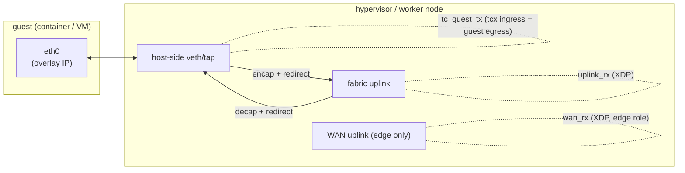

# Datapath programs

`flowplane` attaches a handful of eBPF programs to the fabric uplink and to each guest
interface. Together they implement the overlay: guest egress is intercepted on the guest
edge (tc/tcx), encapsulated, and redirected onto the fabric; fabric ingress is
intercepted on the uplink (XDP), processed, and decapsulated to the local guest.

The program bodies are deliberately thin — each is glue that builds the `Pkt`/`Maps`
trait impls and calls into [`flowplane-core`](pure-core.md). The tables below name the
real entry points in `flowplane-ebpf/src/`.

## Attachment map

| Program | Hook | Where it attaches | Direction |
|---|---|---|---|
| `uplink_rx` | XDP | every fabric uplink | fabric → local guest |
| `wan_rx` | XDP | WAN uplink (edge role only) | internet → overlay return |
| `tc_guest_tx` | tcx (tc ingress) | each guest's host-side veth/tap | guest → fabric |
| `tc_guest_dhcp` | tcx (tail-call target) | — | guest DHCP responder |
| `tc_guest_nat64` | tcx (tail-call target) | — | guest NAT64 egress |
| `xdp_pass` | XDP | redirect-target veth peers | pass-through enabler |
| `xdp_inspect` | XDP | any interface (debug) | packet dump |

## `uplink_rx` — the fabric-ingress workhorse

`uplink_rx` (XDP, `ingress::try_uplink_rx`) handles everything arriving from the fabric.
For an encapsulated overlay frame it:

1. **Resolves the destination interface** from the *outer* IPv6 destination via the
   `UNDERLAY` map — yielding the VNI, tap ifindex, and guest MAC. Keying on the underlay
   `/128` (not the inner IP) is what makes overlapping overlay IPv4 across VNIs safe.
2. Handles several branches *before* plain delivery, in order:
   - **Edge local-deliver** — if the resolved entry carries the `UNDERLAY_LOCAL_DELIVER`
     sentinel tap, decap and hand the inner packet to the local kernel (the WAN edge's
     VyOS, which masquerades it to the real internet).
   - **Load balancing** — Maglev-select a backend underlay for the VIP. If the backend is
     remote, **reforward** the still-encapped frame straight to the backend node without
     decapping (DSR: the inner destination stays the VIP). See
     [Load balancing](../features/loadbalancer.md).
   - **NAT return** — a conntrack lookup for a `CT_REWRITE_DST` entry restores the guest's
     inner destination (and, for NAT64, expands an IPv4 reply back to IPv6).
   - **Neighbor NAT** — if the packet targets a `nat_ip` owned by *another* node,
     reforward it to the owning node's underlay (distributed NAT-gateway return).
   - **In-datapath ICMP echo reply** — echo requests to a NAT IP or an LB VIP are
     answered by the datapath itself and re-encapped back out, without involving any VM.
3. Applies the **firewall** (deny-by-default) and touches/creates **conntrack** state.
4. **Decaps** — strips the outer Ethernet+IPv6, rewrites the inner Ethernet
   (dst = guest MAC, src = gateway MAC), and redirects to the guest tap (via the
   `GUEST_DEV` devmap).

`uplink_rx` runs on *every* fabric uplink a host has, so a dual-homed host decaps returns
arriving via either ToR.

## `tc_guest_tx` — the guest edge (egress)

`tc_guest_tx` (tcx on the guest's host-side veth/tap ingress, which *is* guest egress)
processes everything a guest emits:

1. **DHCP / NAT64 dispatch** — DHCPv4/DHCPv6 requests tail-call the `tc_guest_dhcp`
   responder; overlay-egress traffic to a NAT64 prefix (`64:ff9b::/96`) tail-calls
   `tc_guest_nat64`. The tail calls run through the `GUEST_PROGS_TC` program array (tc
   classifiers can only tail-call other tc programs), each getting a fresh verifier stack
   budget.
2. **Firewall** (deny-by-default, egress direction) and **conntrack** creation.
3. **VIP / SNAT** rewrites and, if configured, **rate metering** (srTCM token bucket).
4. **Route + deliver decision** (`egress::forward_decision_v4` / `_v6`): an exact-match
   lookup in `ROUTES`/`ROUTES6` for the guest's VNI yields either:
   - **Local** — the destination is on the same host: redirect the inner frame directly
     to the local tap (the same-host fast path);
   - **Encap** — write the outer Ethernet+IPv6 header and redirect out the fabric uplink;
   - **Pass** — no route: hand to the kernel.

The heavy per-protocol logic (DHCP, NAT64, route lookup, encap) all lives in
`flowplane-core`; `tc_guest_tx` and its tail-call targets are the tc-context glue.

## `wan_rx` — the WAN-edge return path

On an **edge** node (`serve --role edge`, sharing VyOS's netns), `wan_rx` (XDP,
`ingress::try_wan_rx`) is attached to the WAN-facing uplink. It catches internet return
traffic destined to a registered `nat_ip` and **encapsulates it back toward the owning
hypervisor** over the fabric (`encap::encap_and_redirect_via_devmap`), completing the
distributed NAT-gateway loop. The reverse direction — overlay egress *to* the internet —
is delivered on the far host by the `uplink_rx` edge local-deliver branch described above.
Both directions reuse the same encap/decap core. See
[North-South WAN edge](../features/ns-edge.md).

## DHCP / ARP / ND responders

The datapath answers L2/L3 control-plane requests locally, so a guest never needs an
external DHCP or discovery service:

- **DHCPv4 / DHCPv6** — `tc_guest_dhcp` (tail-call target, slot `GUEST_PROG_DHCP`)
  parses the request and writes a fixed-layout reply offering the guest's overlay
  address, gateway, MTU, and DNS servers (from `DHCP_CONFIG` + per-interface `DHCP_META`).
  It also learns the guest MAC.
- **ARP** (IPv4) and **IPv6 ND** — answered inline for the configured overlay gateway
  address, presenting the gateway at the interface's own MAC.

See [DHCP / ARP / IPv6 ND responders](../features/dhcp-arp-nd.md).

## Debug / support programs

- **`xdp_pass`** — a trivial `XDP_PASS` program. XDP `bpf_redirect` *into* a veth only
  delivers if the veth peer has an XDP program attached; `xdp_pass` (and the `GUEST_DEV`/
  `UPLINK_DEV` devmaps) satisfy that requirement in the containerlab veth harness.
  Production NICs are unaffected.
- **`xdp_inspect`** — attaches to any interface and dumps the first packet bytes into the
  `INSPECT` map on a timer; a debugging aid, not part of the datapath.

## Where to go next

- [The pure-core seam](pure-core.md) — how these programs share code with the simulator.
- [BPF maps & state model](maps.md) — the maps every program reads and writes.
- [The flowplane CLI](cli.md) — how the programs get attached.
