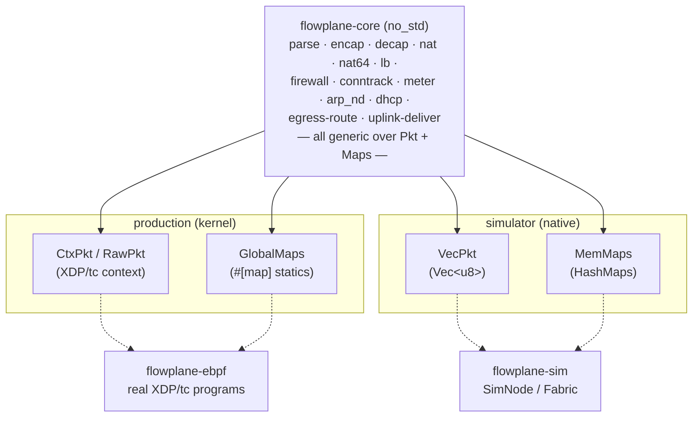

# The pure-core seam (Pkt / Maps traits)

The single most important structural decision in the dataplane is that **the datapath
logic is written once, in `flowplane-core`, and runs in three places**: the real eBPF
programs, the in-process simulator, and unit tests. This is the *pure-core seam*.

`flowplane-core` is a `no_std` crate whose functions are **generic over two traits** —
`Pkt` (byte access to a packet) and `Maps` (typed access to the datapath maps). It never
depends on aya, the kernel, or `std`. Every concrete environment supplies its own trait
impls and calls the same functions.

## The two traits

**`Pkt`** — bounds-checked byte access to a frame. It is deliberately a *trait*, not a
`&mut [u8]`: the eBPF verifier requires raw-pointer access with manual bounds checks, so
forcing a slice through the eBPF path would not verify. Typed reads/writes are
**fixed-size** (const-generic `N`) so the eBPF impl lowers each to a single fixed-width
load/store instead of a byte loop — keeping large in-place rewriters (SNAT, encap) inside
the verifier's single-function budget. `grow_head`/`shrink_head` model
`bpf_xdp_adjust_head` (encap headroom / decap); `logical_len()` returns the wire length
(`skb->len` on tc) so a non-linear skb encapsulates with the correct outer length.

**`Maps`** — one method per logical map operation the core needs (`local`, `underlay_get`,
`route4_get`/`route6_get`, `fw_meta`/`fw_rule`, `conntrack_get`/`conntrack_insert`,
`lb_get`/`maglev_get`, `nat_get`, `dhcp_config`/`dhcp_meta`, `meter_get`/`meter_update`,
…). It is monomorphized (generics, not `dyn`) so the eBPF impl compiles down to zero-cost
wrappers over the map globals and stays verifier-friendly.

## The two impls

| Impl | Crate | Backs `Pkt` with | Backs `Maps` with |
|---|---|---|---|
| **Production** | `flowplane-ebpf` (`coreimpl.rs`) | `CtxPkt` over an XDP context (raw ptr + bounds checks against `data_end`), and `RawPkt` over a `(data, data_end)` window for tc | `GlobalMaps` — zero-cost wrappers over the `#[map]` statics |
| **Sim** | `flowplane-sim` | `VecPkt` over a `Vec<u8>` | `MemMaps` — `HashMap`-backed stand-ins |

Because both impls satisfy the same traits, `flowplane_core::firewall::fw_eval_dir`,
`encap::write_outer_v6`, `uplink::decap_and_rewrite`, and every other core function
execute identical logic whether they run in the kernel or in a native test.

## The hard rule: call the core, never fork it

> **Production eBPF must *call* the extracted core function.** It may never keep a
> parallel copy of datapath logic that the tests then exercise separately.

The point of the seam is that the *same code* runs under test as in production. If the
eBPF program reimplemented, say, firewall evaluation inline and a test exercised a
separate `flowplane-core` copy, the test would be validating code the kernel never runs —
worthless. So the discipline is strict:

- The eBPF wrappers shrink to glue: build `CtxPkt`/`GlobalMaps`, call the core fn, act on
  the returned `Action`/`Deliver`/verdict. See the guest-egress route decision
  (`egress::forward_decision_v4` calls `flowplane_core::egress::route4` + `deliver`), the
  uplink tail (`flowplane_core::uplink::decap_and_rewrite`), and the firewall
  (`flowplane_core::firewall::fw_eval_dir`), all invoked directly from `flowplane-ebpf`.
- If the eBPF verifier *cannot* accept the seam for some path (e.g. a variable-offset
  parse that blows the stack), the resolution is to move the *test* to a level that can
  exercise the real program (a `BPF_PROG_TEST_RUN` anchor or a live e2e) — **not** to keep
  a parallel core guarded only by a byte-parity check. A parallel core means the test
  suite runs code production doesn't.

## Fidelity: byte-parity anchors

The seam guarantees the sim runs the *same source* as production, but the eBPF toolchain
still compiles that source to bytecode. To prove the compiled bytecode has not drifted,
each ported path carries a **`BPF_PROG_TEST_RUN` byte-parity anchor**: it loads the real
compiled program, populates the real maps from the same fixture, runs the same crafted
packet through both the kernel program and the native `SimNode`, and asserts the output
bytes are **identical**. Anchors are privileged (they load real bytecode) and kept few —
one per representative path — but every ported feature adds one. See
[The in-process sim](../testing/sim.md) and the
[conformance coverage map](../testing/conformance-map.md).

## Adding a datapath feature

The seam dictates the workflow for every new datapath capability:

1. **Port the function into `flowplane-core`**, generic over `Pkt`/`Maps`; add any new
   accessor to the `Maps` trait.
2. **Wire the eBPF side** — call the new fn from `flowplane-ebpf` via the existing
   `CtxPkt`/`GlobalMaps` impls in `coreimpl.rs`. (Do not reimplement it inline.)
3. **Implement the `MemMaps` accessor** in `flowplane-sim`.
4. **Add a sim test** — a `SimNode`- or `Fabric`-based scenario asserting behavior.
5. **Add a `BPF_PROG_TEST_RUN` anchor case** asserting native-core output equals real
   bytecode output.

## Where to go next

- [Datapath programs](programs.md) — the glue wrappers that call the core.
- [BPF maps & state model](maps.md) — the maps the `Maps` trait abstracts.
- [Testing strategy](../testing/strategy.md) — the levels the seam enables.
