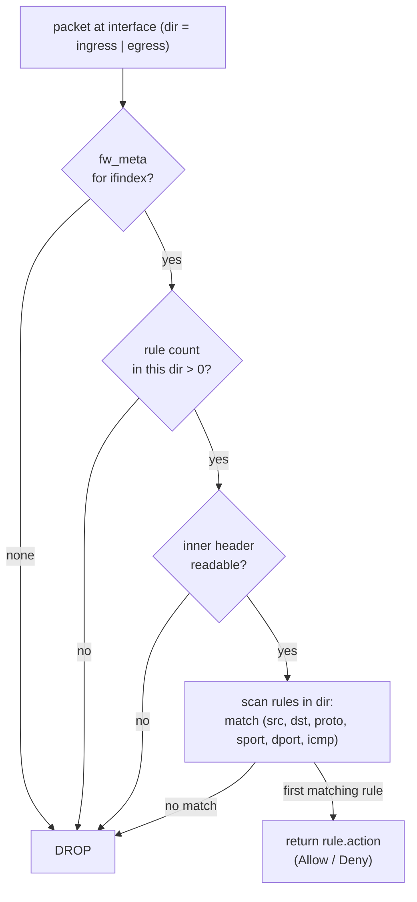

# Distributed firewall

`flowplane`'s firewall is **always-on and deny-by-default**. It is enforced in the
datapath on every guest interface, in both directions, and derives entirely from
`FirewallPolicy` intent lowered by the control plane. There is no "firewall off" mode: a
packet is forwarded only when an explicit allow rule matches it.

## Deny-by-default

The evaluator, `flowplane_core::firewall::fw_eval_dir`, returns `ACCEPT` only when a rule
in the packet's direction explicitly matches with an accept action. **Every** other
outcome is `DROP`:

- no per-interface firewall metadata at all → drop;
- zero rules in this direction → drop;
- an unreadable inner header → drop;
- rules present but none match → drop.

The drop is unconditional. This is a hard invariant of the datapath — the control plane is
responsible for materializing any "default-allow" behavior as **explicit** allow rules.



Each rule matches on the packet's 5-tuple selectors (`src`, `dst`, `proto`, `sport`,
`dport`) plus ICMP type/code. Rules are scanned in order; the first matching rule's action
wins.

## From FirewallPolicy to datapath

`FirewallPolicy` is a Kubernetes-native intent object with an `interfaceSelector` and
ordered `ingress` / `egress` rule lists (each rule a `{CIDR, Proto, Port, Action}`). The
control plane compiles it into per-NIC rules the agent programs into BPF maps.

### The compiler: FirewallPolicy → CompiledNIC.Firewall

The `CompiledNICReconciler` produces one `CompiledNIC` per `NetworkInterface`. Its
`Compile()` function:

1. For every `FirewallPolicy` whose `interfaceSelector` matches the NIC's labels, translates
   its ingress and egress rules into `CompiledFwRule`s on
   `CompiledNIC.Spec.Firewall.{Ingress,Egress}`.
2. **Materializes k8s default-allow per direction.** k8s semantics are "a NIC no policy
   selects is fully open" — but the datapath is deny-by-default, so an empty direction
   would drop everything. `Compile()` therefore emits an explicit allow-all
   (`0.0.0.0/0`, any proto, any port, `Allow`) for **any direction that ends up with no
   rules**. A direction a `FirewallPolicy` *does* govern keeps only that policy's rules.

The direction that a peer CIDR describes follows k8s semantics, applied by the agent when
it lowers each `CompiledFwRule`:

- an **ingress** rule's CIDR is the **source** (who may reach us);
- an **egress** rule's CIDR is the **destination**;
- the port is always the destination port.

### The agent: CompiledNIC.Firewall → fw maps

The agent's `ReconcileFirewall` lists every `CompiledNIC` scheduled to this node and
installs its rules on the dataplane over the `DataplaneNode` gRPC (`AddFwRule` /
`DelFwRule`). It is **level-triggered and diffing**: it tracks the last-applied rule set,
leaves unchanged rules alone (the dataplane rejects duplicate rule ids, so blindly
re-adding would error every loop), deletes rules that vanished or changed, and (re-)adds
new or changed ones. Failures are collected, not fatal, so the loop retries only the ops
that didn't land.

Each `CompiledFwRule` becomes a dataplane `FwRule` with the proto number, destination-port
range, allow/deny bit, and direction, keyed per interface. Those land in the per-interface
firewall maps (`fw_meta` + the rule table) that `fw_eval_dir` reads.

## The two-step: reachability vs. permission

A recurring, deliberate design point: **learning a route grants reachability, not firewall
permission.** These are two independent gates a packet must pass:

1. **Reachability** — is there an overlay [route](routing-vni.md) to the destination? Routes
   are distributed by the route bus and may enter a tenant's table via VPC peering imports.
2. **Permission** — does an explicit allow rule admit the packet? This comes **solely** from
   `FirewallPolicy`.

So importing a [peered VPC](vpc-peering.md)'s prefixes makes those destinations reachable
but does **not** by itself let any traffic flow — a matching `FirewallPolicy` is still
required. Likewise, [load-balancer](loadbalancer.md) membership is pure forwarding data: a
NIC being an LB backend adds **no** firewall rule. This is why LB traffic can be silently
dropped if only the backend's own overlay IP is allowed (see the DSR gotcha below).

## The DSR gotcha

Load balancing uses **direct server return**: the inner destination address stays the VIP
all the way to the backend (see [Load balancing](loadbalancer.md)). The backend's ingress
firewall therefore sees `dst = VIP`, **not** the backend's own overlay IP. A
`FirewallPolicy` written for the backend's overlay IP will not match LB-delivered traffic —
deny-by-default then drops it. The fix is an **explicit `VIP:port` allow rule** in the
backend's ingress policy. LB membership never generates this rule; it must be authored as
policy.

## How it's wired

```
FirewallPolicy { interfaceSelector, ingress[], egress[] }
        │  CompiledNICReconciler.Compile()
        │    · match selector → NIC labels
        │    · translate ingress/egress rules
        │    · materialize allow-all for any empty direction
        ▼
CompiledNIC.Spec.Firewall { Ingress[], Egress[] }
        │  agent.ReconcileFirewall() — diff vs. applied, per node
        ▼
DataplaneNode gRPC: AddFwRule / DelFwRule (per interface, per rule id)
        │
        ▼
BPF fw maps (fw_meta + rule table, keyed by ifindex)
        │
        ▼
datapath: fw_eval_dir(pkt, ifindex, dir) → ACCEPT only on explicit match, else DROP
```

- **CRD → compiler.** `FirewallPolicy` selectors resolve to concrete rules per NIC;
  unpolicied directions get an explicit allow-all so the deny-by-default datapath stays
  permissive where k8s intends.
- **Compiler → agent.** The agent reads only `CompiledNIC.Spec.Firewall` — never the raw
  `FirewallPolicy` — and diffs it against what it has already installed.
- **Agent → dataplane.** Rules are written per interface and evaluated in both directions
  by `fw_eval_dir` on every guest ingress and egress.

## Related

- [Routing & multi-VNI tenancy](routing-vni.md) — the reachability half of the two-step.
- [Load balancing (Maglev + DSR)](loadbalancer.md) — why DSR needs explicit VIP rules.
- [VPC peering](vpc-peering.md) — imports grant reachability, not permission.
- [Compilers: CompiledNIC](../controlplane/compilers.md)
