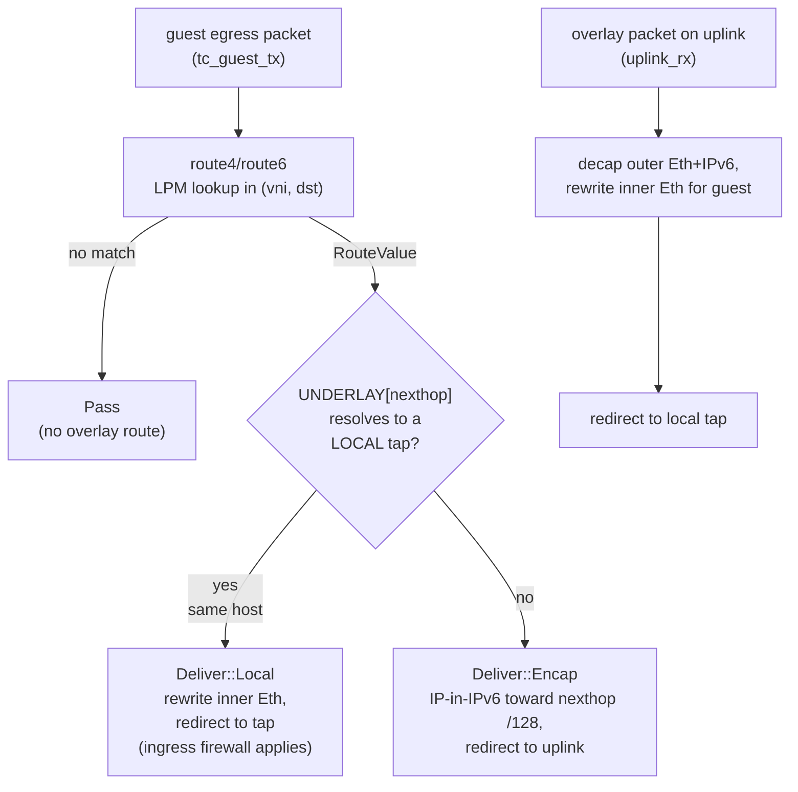

# Routing & multi-VNI tenancy

Every overlay forwarding decision in `flowplane` is a per-VNI route lookup. Tenants are
**VNIs** (VXLAN network identifiers); a VNI is a self-contained routing domain — its own
VRF. Routes never cross VNIs implicitly, so two tenants may use overlapping overlay
address space without collision. The only sanctioned way for a route to appear in another
tenant's table is an explicit [VPC peering](vpc-peering.md) import, and even then
reachability is a separate concern from firewall permission (see below).

## The route table: an LPM trie per VNI

Overlay routes live in a single BPF `LPM_TRIE` map, `ROUTES` (and its IPv6 sibling
`ROUTES6`). The VNI is folded into the key so one physical map holds every tenant's
table without them ever aliasing:

- The trie key is `RouteLpmData { vni: [u8; 4] (big-endian), ipv4: [u8; 4] }` — the VNI in
  the **high** 32 bits, the overlay address in the low bits.
- Because the VNI is stored big-endian and matched MSB-first, it acts as a fully specified
  32-bit **VRF discriminator**: the trie can only match an entry whose VNI bits agree
  completely, so a lookup in VNI *A* can never resolve to a route in VNI *B*.
- Stored routes use `prefix_len = 32 + ipv4_prefix_len` (for IPv4; `128 + ipv6_prefix_len`
  for IPv6). A `/32` host route is just a max-length entry that always wins.
- Lookups use the full key length (`64` for IPv4, `160` for IPv6). The trie returns the
  value of the **longest** matching prefix — standard longest-prefix-match — so a specific
  host route beats a covering supernet.

The matched value is a `RouteValue { nexthop_ipv6: [u8; 16], is_external, .. }`: the
**underlay `/128`** of the node (or edge) that owns the destination.

> LPM tries must be created with `BPF_F_NO_PREALLOC`; the program load fails otherwise.

## Host routes and the underlay-`/128` nexthop

Each workload interface gets an overlay address and an underlay `/128` on its host node's
`/64`. The node announces a **host route** for every overlay IP it owns:

- IPv4 overlay IP → a `/32` route.
- IPv6 overlay IP → a `/128` route.

The nexthop of that host route is the owning NIC's **underlay `/128`**. This is the pivot
of the whole overlay: a remote node encapsulates a packet toward that `/128` on the IPv6
underlay, and the owning node's `UNDERLAY` map resolves the `/128` back to a local tap and
guest MAC for delivery. (Wider routes — alias prefixes, external defaults, imported peer
prefixes — are the same shape: a prefix pointing at some underlay `/128`.)

## Routing in the datapath

Routing is split across the two guest-facing programs. The map-driven lookup and the
local-vs-encap decision are shared, pure-core code (`flowplane_core::egress`), so the same
logic runs in the kernel, in the simulator, and in unit tests.



- **`route4` / `route6`** look up `(vni, dst)` in `ROUTES` / `ROUTES6`. No match means the
  destination has no overlay route, and the wrapper returns `Pass`.
- **`deliver`** turns a matched route into an action. If the nexthop `/128` resolves in the
  local `UNDERLAY` map to a live tap (`tap_ifindex != 0`), the destination is **on this
  same host** — the packet is delivered locally without ever touching the wire (the
  same-host fast path), subject to the destination's ingress firewall. Otherwise the
  packet is **encapsulated** IP-in-IPv6 toward the nexthop `/128` and redirected to the
  uplink. If there is no local node identity at all, the result is `Pass`.
- On the receiving node, `uplink_rx` decapsulates the outer Eth+IPv6 tunnel header,
  rewrites the inner Ethernet for the target guest, and redirects to its tap.

See [The overlay: IPv6 underlay + IP-in-IPv6](../architecture/overlay.md) for the exact
encap format and [Datapath programs](../dataplane/programs.md) for the full program flow.

## How routes are learned and announced: the route bus

`flowplane` never discovers routes on its own. Route distribution is the job of the
**route bus** — a custom, per-VNI publish/subscribe channel between the per-node agents
and the central reflector. It is metalbond-analog pub/sub, **not** BGP; BGP appears only
at the [WAN edge](ns-edge.md) for announcing public prefixes upstream.

Each node agent, driven purely by the [`CompiledNIC`](../controlplane/compilers.md)
objects scheduled to it:

1. **Subscribes** to the VNI of every local NIC (plus the reserved public VNI, to learn
   external defaults, and any peer VNIs it imports).
2. **Announces** a host route for every overlay IP its NICs own, nexthop = that NIC's
   underlay `/128`.
3. **Learns** the routes other nodes announce for the same VNI (reflected by the
   reflector) and programs them into its own `ROUTES` / `ROUTES6` trie.

Because the nexthop is always the owning NIC's `/128`, a learned route is
self-describing: it tells the receiver exactly which underlay address to encapsulate
toward. When a NIC moves, disappears, or a new one attaches, the agent re-announces and
the reflector fans the delta out to subscribers — no central routing table, no BGP in the
hot path.

## Reachability is not permission

Learning a route only makes a destination **reachable**. It does **not** grant the
firewall permission to send to it. The [distributed firewall](firewall.md) is
deny-by-default and evaluated independently: a packet is forwarded only if a route exists
**and** an explicit allow rule matches. This two-step split is what lets, for example, a
peered VPC's routes be imported for reachability while traffic still requires an explicit
`NetworkPolicy` to be admitted.

## How it's wired

```
NetworkInterface (overlay IPs, VPCRef)
        │  CompiledNICReconciler resolves the VPC's VNI, copies overlay IPs
        ▼
CompiledNIC.Spec { VNI, OverlayIPs, UnderlayRoute }
        │  agent.Desired() — for each CompiledNIC on this node
        ▼
route-bus announce: Route{ Vni, Prefix=/32 or /128, Nexthop=NIC underlay /128 }
        │  reflector fans out per-VNI to subscribers
        ▼
peer agents program ROUTES / ROUTES6 (LPM trie, keyed by vni++addr)
        │  DataplaneNode gRPC → BPF map write
        ▼
datapath: route4/route6 lookup → deliver (local tap | encap to /128)
```

- **CRD → compiler.** The `CompiledNICReconciler` resolves each `NetworkInterface`'s
  effective VNI (from the NIC's `status.vni`, falling back to its VPC's `status.vni`) and
  stamps `VNI`, `OverlayIPs`, and the NIC's `UnderlayRoute` into a `CompiledNIC`.
- **Compiler → agent.** The agent reads only `CompiledNIC`s (never the raw
  `NetworkInterface`/`VPC`). For each local NIC it announces one host route per overlay IP
  and subscribes to that VNI.
- **Agent → dataplane.** Announced and learned routes are written into `ROUTES`/`ROUTES6`
  via the `DataplaneNode` gRPC. Alias prefixes (a CIDR routed to an interface) are the same
  mechanism with a shorter prefix length.

## Related

- [The overlay: IPv6 underlay + IP-in-IPv6](../architecture/overlay.md)
- [Control/data split & the route bus](../controlplane/route-bus.md)
- [Distributed firewall](firewall.md)
- [VPC peering](vpc-peering.md)
- [North-South WAN edge](ns-edge.md)
