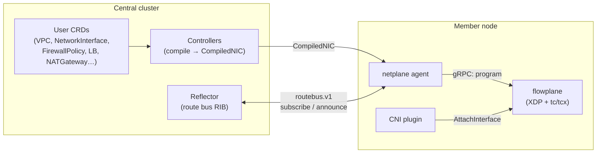

# Introduction

**ectobase** is a multi-cluster networking stack for an IaaS platform. It gives containers and
KubeVirt virtual machines a tenant-isolated overlay network that runs on a plain IPv6 fabric, with
per-endpoint firewalling, load balancing, NAT, and North-South internet egress — all implemented in
eBPF and driven by a Kubernetes-native control plane.

The stack has two planes:

- **flowplane** — the eBPF **dataplane**. Rust, built on [aya](https://aya-rs.dev/). It attaches XDP
  programs to the fabric uplink and `tc`/`tcx` programs to guest edges, and forwards packets over an
  IP-in-IPv6 overlay. It is deliberately *dumb*: it holds no policy of its own and exposes a small
  per-node gRPC surface (`DataplaneNode`) that the control plane programs.
- **netplane** — the Kubernetes **control plane**. Go, built on controller-runtime. It turns a small
  set of user-facing CRDs (`VPC`, `NetworkInterface`, `FirewallPolicy`, `LoadBalancer`, `NATGateway`,
  `FloatingIP`, `VPCPeering`) into concrete per-NIC dataplane configuration and distributes overlay
  routes between nodes over a custom **route bus**.

A [CNI plugin](./controlplane/cni.md) wires pods and VM launcher pods into the dataplane at sandbox
creation time.

## The shape of the system

The control plane **compiles** the user's declarative intent for each interface into a single
[`CompiledNIC`](./controlplane/compilers.md) object — a fully lowered, node-local bundle of that
NIC's VNI, underlay address, firewall rules, NAT sources, LB memberships, and peer imports. The node
agent reads **only** `CompiledNIC` objects (never the raw CRDs) and programs the local dataplane and
the route bus from them. This keeps the member-node footprint small and is the foundation for
brokering just the compiled objects out to member clusters.

Overlay reachability is distributed by the [route bus](./controlplane/route-bus.md): a
metalbond-style pub/sub RIB, **not** BGP in the hot path. BGP appears only at the
[WAN edge](./features/ns-edge.md), where the overlay meets the internet.

## What runs where

| Layer | Language | Lives in | Attaches / runs as |
|-------|----------|----------|--------------------|
| Dataplane programs | Rust (`#![no_std]` eBPF) | `flowplane/flowplane-ebpf` | XDP on the uplink, `tcx` on guest edges |
| Dataplane loader / agent / CLI | Rust | `flowplane/flowplane` | `flowplane` binary (per node) |
| Pure datapath logic | Rust (`#![no_std]`) | `flowplane/flowplane-core` | shared by eBPF **and** the simulator |
| Control plane | Go | `netplane` | agent (per node), reflector + controllers (central) |
| CNI plugin | Go | `cni` | invoked by the container runtime |
| CRDs | Go | `api/v1alpha1` | `net.ectobase.dev/v1alpha1` |

## Lineage

The dataplane began as a port of [ironcore dpservice](https://github.com/ironcore-dev/dpservice)'s
model onto eBPF and has since diverged: the dpservice DPDK/gRPC compatibility layer has been removed,
and the control plane is a from-scratch Kubernetes-native design. The conformance suite still tracks
dpservice's behavioral coverage — see the [conformance map](./testing/conformance-map.md).

## How to read this book

- Start with **[Architecture → Overview](./architecture/overview.md)** for the two-plane model and
  the **[overlay](./architecture/overlay.md)** for the wire format.
- **Dataplane** and **Control plane** describe the two halves in depth.
- **Datapath features** documents each capability (firewall, NAT, LB, VPC peering, QoS, the WAN edge)
  and traces it end-to-end from CRD to packet.
- **Testing & conformance** explains how the datapath is verified without a live fabric.
- **Operations** covers running the clab fabric, HA/restart, and the runbook of hard-won gotchas.
- **Contributing** is the dev-environment and code-conventions guide.

> The dated design documents under `docs/superpowers/{specs,plans}` are the historical decision
> record — point-in-time and sometimes superseded. **This book is the current source of truth.** See
> [Design history](./contributing/design-archive.md).
