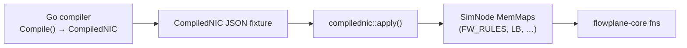

# The in-process sim

`flowplane-sim` is a native, in-process datapath simulator. It runs the **real**
`flowplane-core` forwarding functions over heap-backed packet and map
implementations, with no kernel, no clab, and no root. It is the everyday dev and
regression loop (`make sim`) and the source of truth for byte-level datapath
behavior.

The sim is not a reimplementation. `SimNode`'s methods compose the same
`flowplane-core` fns the eBPF programs call — `write_outer_v6`, `lb_select_forward`,
`fw_eval_dir`, `ct_create_default`, `decap_and_rewrite`, `snat_egress`, `route4`,
`deliver`, the NAT64 and DHCP/ARP/ND cores — in the exact order and gating of the
corresponding eBPF program. Where the eBPF wrapper has dispatch glue (e.g. the LB
tail), the sim composes the same glue, and a `BPF_PROG_TEST_RUN` anchor guards that
the native output equals the real bytecode.

## The trait impls: VecPkt and MemMaps

`flowplane-core` is generic over two traits, `Pkt` (packet access + resize) and `Maps`
(the BPF map accessors). The sim supplies in-memory implementations:

- **`VecPkt`** (`pkt.rs`) — a `Vec<u8>`-backed packet with real `grow_head` /
  `shrink_head` / `set_tail` semantics, modeling `bpf_xdp_adjust_head` /
  `bpf_skb_adjust_room` byte-for-byte.
- **`MemMaps`** (`maps.rs`) — `HashMap`/`HashSet`-backed mirrors of every BPF map the
  datapath uses: `UNDERLAY`, `ROUTES`/`ROUTES6` (LPM tries), `CONNTRACK`, `LB` +
  `MAGLEV`, `NAT` + `NAT_IPS`, `FW_META`/`FW_RULES`, `DHCP_CONFIG`/`DHCP_META`, and the
  per-interface `METER` state.

Adding a datapath feature means adding the new `Maps` accessor to the trait, its
real-kernel impl in `coreimpl.rs`, and its in-memory impl in `MemMaps` — the sim then
runs the same core fn the eBPF program runs.

## SimNode: one node's datapath

`SimNode` (`sim.rs`) models a single node: its `MemMaps`, its underlay identity
(`Local`), a controllable monotonic clock (`now`, modeling `bpf_ktime_get_ns`), and an
optional recorded EDT departure timestamp (`last_tstamp`) so tests can assert pacing
intervals without kernel FQ. Its methods map one-to-one onto the eBPF entry points:

| `SimNode` method | eBPF path modeled |
|---|---|
| `edge_encap` | encap IP-in-IPv6 (`write_outer_v6`) |
| `guest_tx` | `tc_guest_tx` IPv4 egress: firewall → route → SNAT → conntrack → meter → deliver/encap |
| `guest_tx_nat64` | NAT64 egress (v6→v4 translate + encap) |
| `uplink` | `uplink_rx` LB + base ingress: LB-select → ingress FW → conntrack → decap |
| `uplink_nat_return` | `uplink_rx` reverse-DNAT (network NAT return) |
| `uplink_nat64_ingress` | NAT64 ingress reply reconstruction |
| `wan_rx` | edge WAN-VIP ingress (Maglev-select + encap) |
| `guest_arp_nd` | guest-facing ARP / IPv6 ND responder |
| `guest_dhcp4` | guest DHCPv4 OFFER/ACK responder |

Each returns a `SimOut { action, pkt }` — the verdict (`Redirect`/`Drop`/`Pass`) plus
the resulting frame bytes — so a test asserts on exact output. The method docs in
`sim.rs` state precisely which core fns are composed and which interleaved steps are
*not* modeled (e.g. an established-flow `ct_apply` refresh that does not change the
emitted bytes), keeping the seam's scope explicit.

## The CompiledNIC fixture bridge

The sim closes the loop with the control plane. `flowplane_sim::compilednic`
(`compilednic.rs`) is a serde mirror of the Go compiler's `CompiledNIC` JSON, and
`apply()` lowers a `CompiledNIC` — its firewall rules, LB membership, VNI, underlay —
directly into a node's `MemMaps`:



This makes the **control-plane → datapath** path testable end-to-end in-process: the
same compiler output that programs a real node is lowered into sim maps, so a policy
that compiles to an allow-all, or an LB membership that generates no firewall grant,
is validated on the actual forwarding core without a real interface.

## Fabric: whole flows across nodes

`Fabric` (`fabric.rs`) owns several `SimNode`s plus an underlay-`/128` → node table.
`Fabric::deliver` runs a program on the ingress node, then **follows encap/redirect
across the fabric** — resolving each encapped frame's outer IPv6 destination to the
owning node and re-running that node's `uplink_rx` — until the frame is delivered to a
guest tap, dropped, or passed. It returns a `Trace` of every hop (a bounded 8-hop
loop guard catches reforward loops).


This runs multi-node scenarios in-process that would otherwise need netns or clab:

- **North-South** — external → edge `wan_rx` → backend host delivery.
- **East-West load balancing** — including the relay **reforward** hop to a remote
  backend (`bpf_redirect` semantics).
- **The LB-DSR firewall gotcha** — `lb_scenario_test.rs` reproduces the "LB packets
  dropped" failure *synthetically* and pins the fix: because LB is DSR (the inner
  destination stays the VIP), a policy written for a backend's own overlay IP does not
  cover its LB traffic, so an explicit `VIP:port` allow rule is required. The dataplane
  is deny-by-default and LB membership never generates firewall rules; the control
  plane materializes k8s open-until-selected as explicit allow-all for unpolicied NICs.

## Running it

```sh
make sim          # fast in-process tests — the everyday dev loop (no root, no clab)
make sim-anchor   # privileged BPF_PROG_TEST_RUN: native core output == real bytecode output
```

## See also

- [Strategy: test at the right level](./strategy.md) — where the sim sits among the
  test levels and the one-core rule it enforces.
- [Conformance coverage map](./conformance-map.md) — every datapath behavior mapped to
  its named sim/anchor/e2e test.
- [The CRD API](../reference/crd-interactions.md) — the `CompiledNIC` type the fixture
  mirrors.
