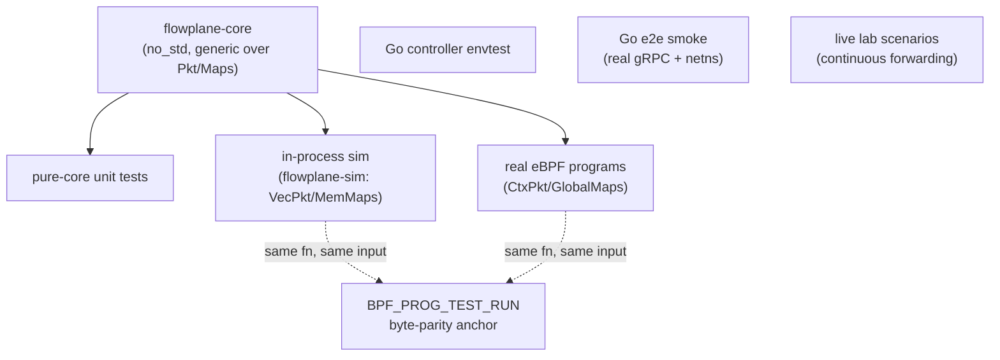

# Strategy: test at the right level

ectobase asserts each concern at the **cheapest level that can actually observe it**.
A datapath byte layout is proven in a native, in-process test in microseconds; the
real gRPC attach and veth redirect are proven in a Go end-to-end smoke; a zero-drop
forwarding guarantee across a restart is proven only under real continuous traffic in
the clab fabric. Nothing is pushed to a heavier level than it needs, and no property
is asserted at a level that cannot see it.

The levels, in order of cost:

| Level | Command | Proves |
|---|---|---|
| Pure-core unit tests | `make test` | `flowplane-core` fn logic, `#[repr(C)]` POD layouts. No root. |
| In-process sim | `make sim` | Byte-level datapath behavior over `VecPkt`/`MemMaps`; whole flows across a `Fabric`. No root, no clab. |
| Byte-parity anchors | `make sim-anchor` | The real eBPF bytecode emits **identical** output to the native core for the same input (`BPF_PROG_TEST_RUN`). Sudo. |
| Go controller envtest | `go test` (in devShell) | Controllers against a real in-process apiserver (`KUBEBUILDER_ASSETS`). |
| Go e2e smoke | `make e2e` | Real program load/attach, real veth redirect, real `DataplaneNode` gRPC, real DHCP client exchange, graceful-restart state survival. Sudo. |
| Live lab scenarios | `make lab-test` | Behaviors that only appear under sustained kernel forwarding — most importantly zero-drop across a graceful restart, and native-XDP-only paths. The Go live suite (`test/lab/livetest/`) runs against the Talos + containerlab fabric. Sudo. |

## The load-bearing pattern: one core, run everywhere

The real datapath logic lives in **`flowplane-core`** — a `no_std` crate whose
functions are generic over the `Pkt` and `Maps` traits. That same code runs in three
contexts:

- **eBPF** — `CtxPkt`/`GlobalMaps` (`flowplane-ebpf/src/coreimpl.rs`) bind the traits
  to the real XDP packet context and kernel BPF maps.
- **Native sim** — `VecPkt`/`MemMaps` (`flowplane-sim`) provide heap-backed,
  in-process implementations.
- **Unit tests** — call the same functions directly.

The **hard rule** is that production eBPF must *call the extracted `flowplane-core`
function* — a real seam — so the exact same code path runs under test. It is never
acceptable to keep a parallel reimplementation in the sim that is guarded only by a
byte-parity anchor: that tests code the production datapath does not actually run. If
a function is byte-identical between eBPF and sim, the anchor proves it; but the
function itself is shared, not duplicated.

When the verifier blocks the seam — i.e. the shared core cannot be expressed within
the eBPF verifier's constraints — the correct move is **not** to fork the core, but to
move the assertion up a level (e.g. to a Go live test) so the tested code is
still the code that ships.

## Why DHCPv6 stays in eBPF

Some behavior legitimately cannot be a pure, generic core function. DHCPv6 reply
construction needs variable-offset packet writes that the eBPF **verifier ceiling**
rejects when expressed generically over the `Pkt` trait. Rather than fork a parallel
core to satisfy the anchor, DHCPv6 stays as hand-written eBPF and is validated at a
higher level (a live client exchange) — the code that runs in production is the code
under test. This is the same principle applied in reverse: keep the seam honest, and
when it can't be a seam, test the real thing where it runs.

## What each anchor guarantees

A `BPF_PROG_TEST_RUN` anchor (`flowplane/tests/anchor_*.rs`) feeds one crafted frame
to both the native core (via the sim) and the real compiled bytecode, and asserts the
output bytes and verdict match. Anchors are deliberately narrow: they exist to catch a
*drift* between the two execution environments (compiler codegen, endian handling,
adjust-room semantics), not to re-test logic the sim already covers. The sim owns
byte-level behavior; the anchor owns "the bytecode agrees with the sim."

## See also

- [The in-process sim](./sim.md) — `SimNode`/`Fabric`, `MemMaps`/`VecPkt`, and the
  CompiledNIC fixture bridge.
- [Conformance coverage map](./conformance-map.md) — the per-feature mapping of every
  datapath behavior to its named native test.
- [The pure-core seam (Pkt / Maps traits)](../architecture/dataplane/pure-core.md) — the trait
  boundary that makes one core runnable everywhere.
